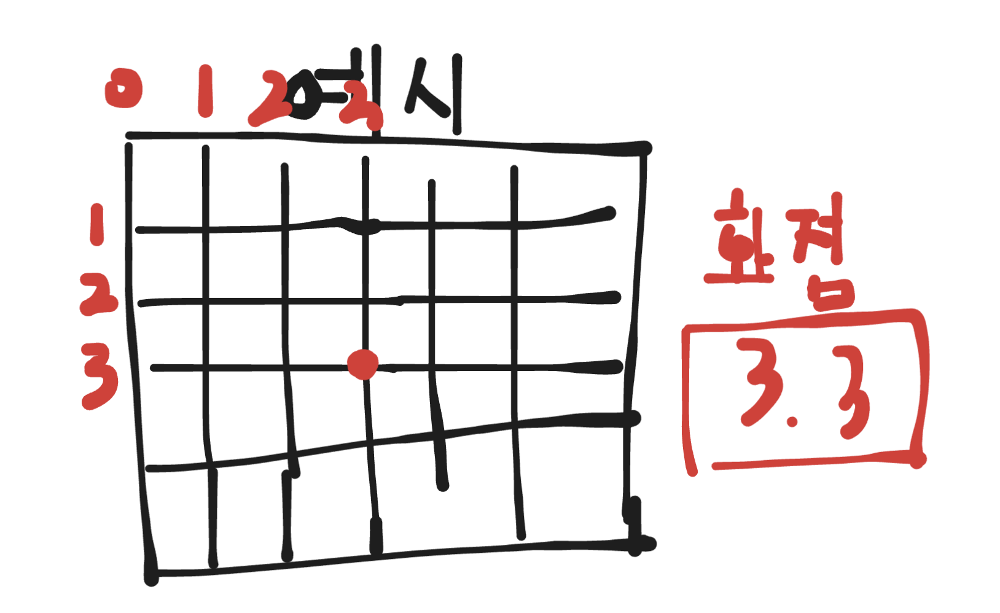
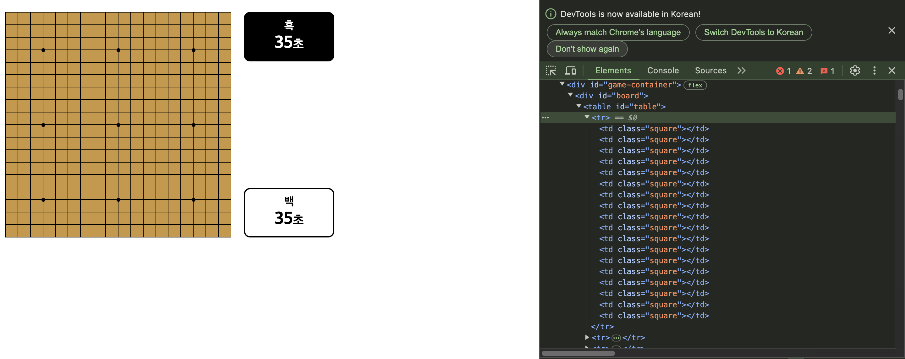
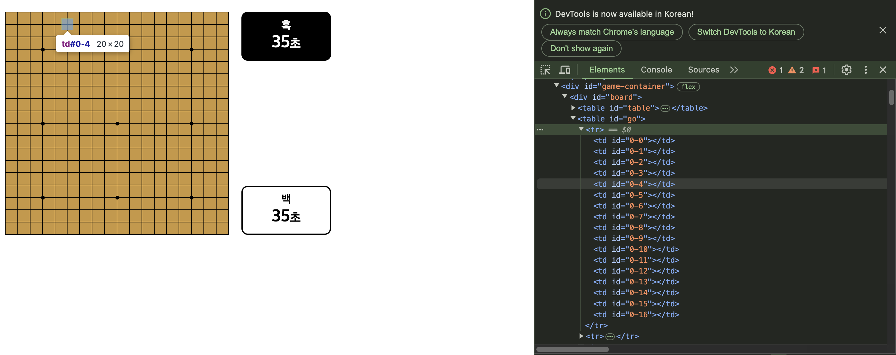
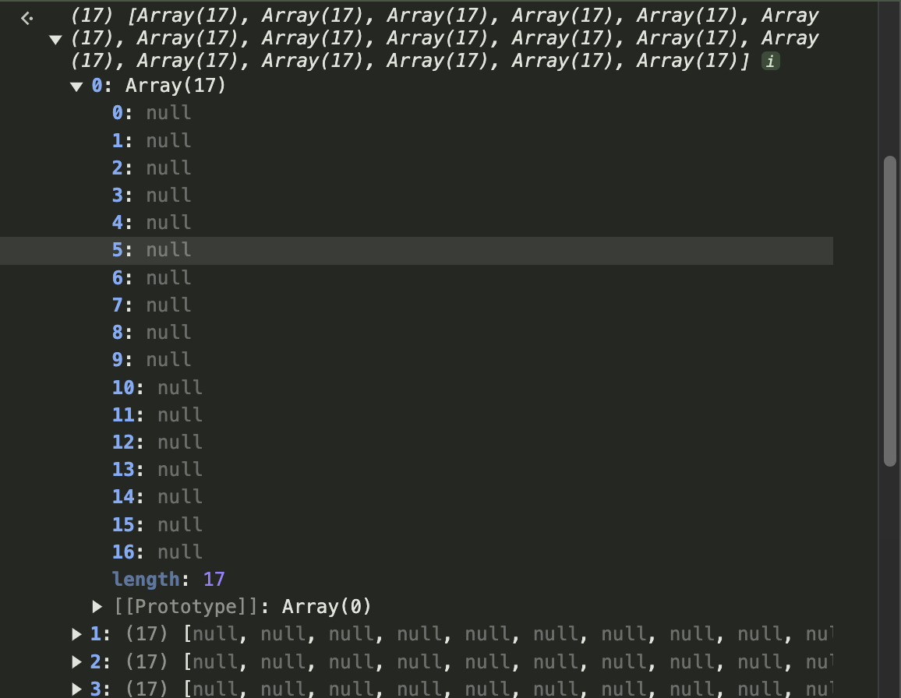
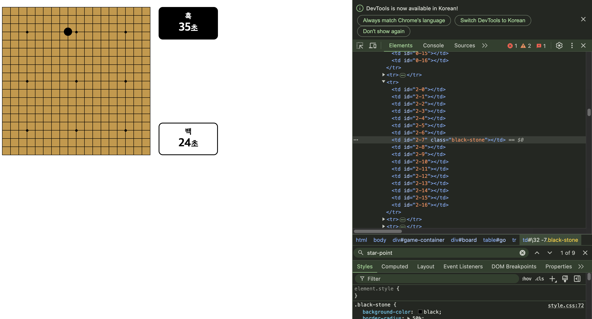
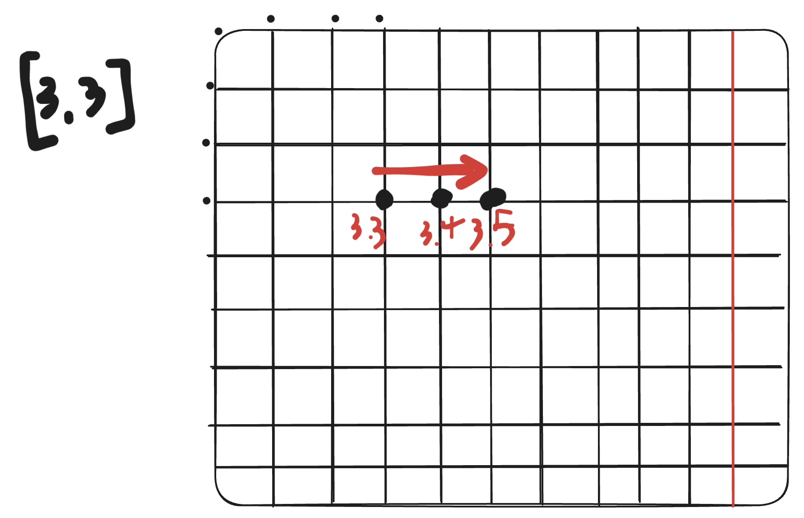
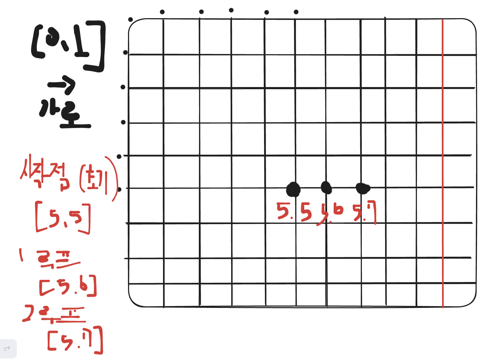
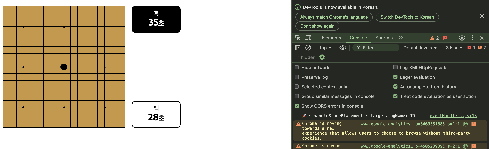
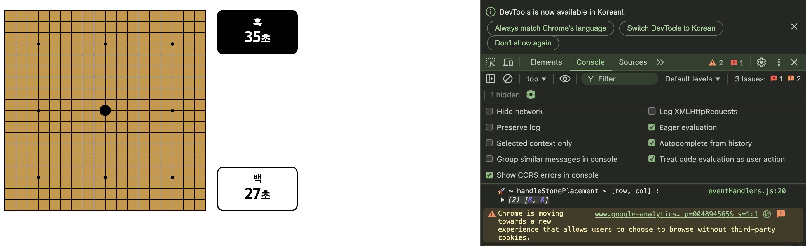
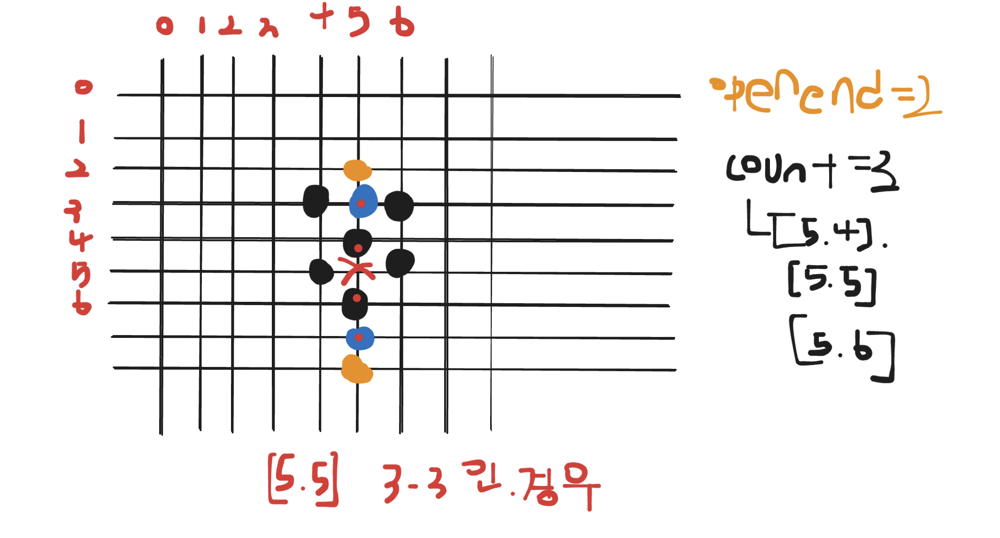

## 코드 중간 점검

JavaScript 코드를 제대로 이해하고 파악하면서 작성을 했는지 구체적으로 확인해 보려고 한다.

#### main.js

```javascript
const table = document.getElementById('table'); // 시각적인 오목판
const go = document.getElementById('go'); // 바둑돌이 놓일 위치를 표시하는 판

// 화점 위치
const starPoints = [
  [3, 3],
  [3, 9],
  [3, 15],
  [9, 3],
  [9, 9],
  [9, 15],
  [15, 3],
  [15, 9],
  [15, 15],
];

// 게임 초기화
initializeGame();

// 게임 초기화
function initializeGame() {
  table.innerHTML = '';
  go.innerHTML = '';
  resetBoardState();
  resetTimers();
  createCheckerboard(table, starPoints);
  createPlacementBoard(go);
  addEventListeners(go);
}
```

- `table`은 시각적으로 보이는 판, `go`는 바둑돌이 놓일 위치를 표시하는 판이다.

- `starPoints`는 화점의 위치들을 표시한 것인데 오목판(table)을 18x18로 만들기 때문에 화점의 위치를 고정적으로 표시해 놓은 변수이다. [행, 열]이라고 생각하면 된다.

- `initializeGame` 함수는 게임을 초기화하는 함수이다.
  먼저 (오목판) table과 (바둑돌) go을 초기화 시키기 위해 HTML을 초기화시켜준다.
  게임 초기화 함수안에 함수들은 차근차근 설명하겠다.

#### view.js

```javascript
// 오목판 생성 함수
export function createCheckerboard(table, starPoints) {
  table.innerHTML = '';
  for (let i = 0; i < 18; i++) {
    const tr = document.createElement('tr'); // 행
    for (let j = 0; j < 18; j++) {
      const td = document.createElement('td'); // 셀
      td.setAttribute('class', 'square');

      // 화점 위치에 점 추가
      if (starPoints.some(([x, y]) => x === i && y === j)) {
        const point = document.createElement('div');
        point.setAttribute('class', 'star-point');
        td.appendChild(point);
      }

      tr.appendChild(td);
    }
    table.appendChild(tr);
  }
}

// 돌이 놓일 판 생성 함수
export function createPlacementBoard(go) {
  go.innerHTML = '';
  for (let i = 0; i < 17; i++) {
    const tr = document.createElement('tr');
    for (let j = 0; j < 17; j++) {
      const td = document.createElement('td');
      td.setAttribute('id', `${i}-${j}`);
      tr.appendChild(td);
    }
    go.appendChild(tr);
  }
}
```

- `createCheckerboard` 함수는 오목판(table)과 화점을 생성 및 보여주기 위한 함수이다.

  먼저 HTML에 한번 초기화 시켜준다.(혹시 다른 요소가 있을 수 있으니 초기화 먼저)

  그리고 행과 열을 표시해 주기 위해 이중 for 문을 사용한다.

  첫 번째 for 문에서는 행이 만들어진다.

  두 번째 for 문에서는 열이 만들어지고, 열에 `setAttribute`을 사용해서 `class`, `square`를 부여한다.

  square은 경계선을 그리는 css이다.

  그리고 table - css에 `border-collapse: collapse;`을 주어서 경계선이 겹칠 수 있도록 해줍니다.

  화점 위치는 `starPoints` 지정한 배열 변수를 이용해서 배열 내장 함수인 `some` 함수를 사용해 [행(x), 열(y)]이 for 문에 행(i) 열(j)이랑 같은지를 판별한다.

  

  예를 들어서 첫 번째인 [3,3]의 화점을 찍는다고 하면 그림처럼 된다.

  그리고 tr에 td table에 tr를 넣어주면 밑에 사진처럼 바둑판이 그려진다.

  

- `createPlacementBoard` 함수는 돌이 놓아질 판이기에 17x17로 만들어준다.

  돌의 위치를 알기 위해 `setAttribute`를 사용해서 고윳값을 지정해 준다.

  

  [border-collapese](https://developer.mozilla.org/en-US/docs/Web/CSS/border-collapse)

  [Array_some](https://developer.mozilla.org/ko/docs/Web/JavaScript/Reference/Global_Objects/Array/some)

#### gameLogic.js

```javascript
// 게임 상태 변수
let boardState; // 17x17 바둑판의 상태를 저장하는 배열
let currentPlayer = 'black'; // 현재 플레이어 ('black'부터 시작)
let blackTimer = 35; // 흑돌 플레이어의 남은 시간 (초 단위)
let whiteTimer = 35; // 백돌 플레이어의 남은 시간 (초 단위)
let timerInterval = null; // 현재 실행 중인 타이머의 ID
let timerRunning = false; // 타이머가 실행 중인지 확인하는 변수

// 게임 상태 초기화 함수
export function resetBoardState() {
  // 17x17 배열 생성, 모든 셀을 null로 초기화 (돌이 놓이지 않음)
  boardState = Array(17)
    .fill(null)
    .map(() => Array(17).fill(null));

  // 바둑판의 모든 셀에 초기 스타일 적용
  const cells = go.querySelectorAll('td');
  cells.forEach((cell) => {
    cell.className = '';
    cell.style.backgroundColor = '';
  });

  currentPlayer = 'black'; // 현재 플레이어를 흑돌로 초기화
}

// 다음 플레이어로 전환
export function switchPlayer() {
  currentPlayer = currentPlayer === 'black' ? 'white' : 'black';
}

// 타이머 시작 함수
export function startTimer() {
  clearInterval(timerInterval); // 이전 타이머가 있으면 정지

  // 현재 플레이어의 타이머 엘리먼트 선택 및 초기화
  const activeTimerElement =
    currentPlayer === 'black' ? document.getElementById('black-time') : document.getElementById('white-time');

  // 상대 플레이어의 타이머 엘리먼트 선택 및 초기화
  const inactiveTimerElement =
    currentPlayer === 'black' ? document.getElementById('white-time') : document.getElementById('black-time');

  if (currentPlayer === 'black') {
    whiteTimer = 35;
    inactiveTimerElement.textContent = whiteTimer; // 백돌 타이머 초기화 UI 업데이트
  } else {
    blackTimer = 35;
    inactiveTimerElement.textContent = blackTimer; // 흑돌 타이머 초기화 UI 업데이트
  }

  // 현재 플레이어의 타이머
  let currentTimer = currentPlayer === 'black' ? blackTimer : whiteTimer;

  // 타이머 실행 상태 설정
  timerRunning = true;

  // 1초마다 타이머 감소
  timerInterval = setInterval(() => {
    currentTimer--; // 1초 감소
    activeTimerElement.textContent = currentTimer; // UI 업데이트

    if (currentTimer <= 0) {
      // 타이머 종료 시
      clearInterval(timerInterval);
      timerRunning = false;
      alert(`${currentPlayer === 'black' ? 'Black' : 'White'} 타임아웃입니다.`);
      resetBoardState(); // 게임 초기화
      resetTimers(); // 타이머 초기화
    }
  }, 1000);

  // 현재 플레이어의 타이머 변수 업데이트
  if (currentPlayer === 'black') {
    blackTimer = currentTimer;
  } else {
    whiteTimer = currentTimer;
  }
}

// 타이머 초기화 함수
export function resetTimers() {
  blackTimer = 35;
  whiteTimer = 35;
  document.getElementById('black-time').textContent = blackTimer; // UI 업데이트
  document.getElementById('white-time').textContent = whiteTimer; // UI 업데이트
  clearInterval(timerInterval); // 타이머 정지
  timerRunning = false;
}

// 승리 조건 확인 함수
export function checkWin(row, col, player) {
  const directions = [
    [0, 1],
    [1, 0],
    [1, 1],
    [1, -1], // 가로, 세로, 대각선 ↘, 대각선 ↙
  ];

  for (const [dx, dy] of directions) {
    let count = 1;
    count += countStones(row, col, dx, dy, player);
    count += countStones(row, col, -dx, -dy, player);

    if (count >= 5) return true; // 5개 이상의 돌이 연속되면 승리
  }

  return false;
}

// 특정 방향으로 연속된 돌 개수 계산 함수
function countStones(row, col, dx, dy, player) {
  let count = 0;
  let x = row + dx;
  let y = col + dy;

  while (x >= 0 && x < 17 && y >= 0 && y < 17 && boardState[x][y] === player) {
    count++;
    x += dx;
    y += dy;
  }

  return count;
}

export { boardState, currentPlayer, timerRunning, timerInterval };
```

- `resetBoardState` => 게임 상태를 초기화 시키는 함수인데 ` boardState = Array(17).fill(null).map(() => Array(17).fill(null));`을 사용하면

  

  사진처럼 되는 걸 확인할 수 있다.

  17x17 전체에 null을 두어서 돌이 놓이지 않았다는 걸 볼 수 있다.

  

  `cells` 변수는 go에 있는 td를 `querySelectorAll`로 모두 가져와서 class를 초기화하고 backgroundColor를 초기화 시킨다.

  위에 사진을 보면 돌을 놓이면 class가 지정이 되는데 이걸 초기화 시키는 작업이다.

  그리고 `currentPlayer = 'black';`을 흑돌로 초기화 시킨다. (흑돌이 먼저 시작이기 때문이다.)

- `switchPlayer` 함수는 변수명 그대로 플레이어를 전화하는 함수이다. 흑돌이 두면 백돌로, 백돌이 두면 흑돌로

- `startTimer` 함수는 타이머를 시작하는 함수로써 `clearInterval(timerInterval);`을 사용하여 이전에 타이머가 있으면 정지시키고, `activeTimerElement`, `inactiveTimerElement` 두 개의 변수로 나눈 이유는 `activeTimerElement` 현재 플레이어 타이머가 감소되면 매초 마다 UI를 업데이트하기 위해서이고, 반대로 `inactiveTimerElement` 상대방 플레이어 타이머는 현재 플레이어 타이머 시작 시 초기화하기 위해서이다.

  두 개의 변수를 분리함으로써 각각의 타이머가 어떤 작업을 수행하는지 명확하게 표현할 수 있다.

  `currentPlayer === 'black'`이면 `whiteTimer = 35;`으로 초기화시켜주고 `inactiveTimerElement.textContent = whiteTimer;` 백돌 타이머를 초기화하고 UI 업데이트를 진행, 백돌이면 반대로 진행

  `let currentTimer = currentPlayer === 'black' ? blackTimer : whiteTimer;` 현재 플레이어의 타이머를 가리키는 변수

  `timerRunning = true;` 타이머 실행 상태를 설정(즉 타이머가 true 이면 실행되고 있다.)

  `timerInterval`변수에 `setInterval` 함수를 사용해 `currentTimer--;`현재 플레이어의 타이머를 1초씩 감소시키고, `activeTimerElement.textContent = currentTimer;`현재 플레이어 타이머에 매초 UI를 업데이트 한다.

  `currentTimer < 0` `currentTimer`가 0 보다 작아지면 종료됐다는 뜻이고, 타이머가 종료하면 `clearInterval(timerInterval);` `clearInterval`함수로 `timerInterval`변수를 정지시킨다.

  `timerRunning = false;` 타이머가 종료되었기에 타이머 실행 상태를 false로 끝내주고, `alert` 함수로 타임아웃이란 걸 알린다.

  `resetBoardState`, `resetTimers` 타이머 종료 시 초기화되어야 하기 때문에 게임 타이머를 초기화하는 함수를 실행시킨다.

- `resetTimers` 타이머 초기화 함수는 말 그대로 처음 상태를 원상복구 시키는 작업이다.

- `checkWin` 승리 조건 함수는 매개변수로 row(행),col(열),player(흑 & 백)을 받는다.

  `directions` 변수는 방향 [0, 1]은 가로, [1, 0]은 세로, [1, 1] 대각선 ↘, [1, -1] 대각선 ↙ 을 가리킨다.

  [dx, dy] => dx는 행의 변화 dy는 열의 변화로 즉 dx는 수직, dy는 수평이다.

  

  쉽게 예시를 들어보면 [3, 3]에서 시작했다고 가정을 하면 가로 방향인즉 [0, 1]을 반복적으로 더하면 [3, 4], [3, 5] 이런 식으로 수평으로 오른쪽으로 이동하여 가로가 됩니다.

  마찬가지로 세로 대각선 방향도 가로와 비슷한 예제로 가능.

  `directions`으로 for 문을 돌리는데 `countStones`함수로 특정 방향과 돌 개수를 확인해서 돌 개수를(`count`)라고 했을 때 5개이면 승리하면 true를 반환하는 함수이다.

- `countStones`함수는 `checkWin`에서 사용되었는데 특정 방향으로 연속되는 돌 개수를 계산하여 알아내는 함수이다.

  `countStones`의 매개변수로는 (row(행), col(열), dx, dy(dx, dy `directions`변수의 방향), player(현재 돌을 놓은 플레이어))`x` 와 `y`는 현재 돌의 위치에서 한 칸 이동한 새로운 좌표를 초깃값으로 가집니다.(즉 다음 위치를 나타낸다.)

  다시 설명하자면 매개변수에 row, col은 시작 좌표(돌의 현재 위치) dx, dy는 다음 방향으로 이동하는 방법을 결정한다.

  while 문의 조건문으로는 보드 바깥으로 나가지 않기 위함을 방지하기 위해서, 그리고 해당 돌 위치의 돌이 현재 플레이어의 돌인지 확인한다.

  `x += dx;`, `y += dy;` 루프가 반복될 때마다 `x` 와 `y`는 지정된 방향으로 이동하기 위해 `dx`와 `dy`를 업데이트된다.

  

  예시를 들여보면 시작 위치가 [5, 5]를 가정하고 탐색하려는 방향은 -> 오른쪽 [0, 1]이다/

  `let x = row + dx; // x = 5 + 0 = 5 let y = col + dy; // y = 5 + 1 = 6`으로 다음 위치는 [5, 6] 그러면 이게 초기 할당이고, 다음 루프를 돌면 `x += dx; // x = 5 + 0 = 5 y += dy; // y = 6 + 1 = 7`으로 [5, 7] 이런 식으로 조건이 실패할 때까지 반복한다.

  그리고 `count`를 반환하고 현재 개수의 (`count = 1`)이랑 `countStones`에서 구한 `count`를 더해서 5개면 게임 승리한다.

  [web API 타이머 함수](https://likedev.tistory.com/entry/Javascript-setInterval-setTimeout-%EC%B0%A8%EC%9D%B4)

#### eventHandler.js

```javascript
export function handleStonePlacement(e) {
  const target = e.target;
  if (target.tagName !== 'TD') return;

  const [row, col] = target.id.split('-').map(Number); // 클릭된 셀의 행, 열 좌표

  // 이미 돌이 놓인 경우
  if (boardState[row][col] !== null) {
    alert('이미 돌이 놓인 자리입니다!');
    return;
  }

  // 흑돌의 경우 3-3 또는 4-4 규칙 위반 여부 확인
  if (currentPlayer === 'black' && isForbiddenMove(row, col)) {
    alert('이 동작은 3-3 또는 4-4 규칙을 위반합니다. 다른 위치를 선택하세요.');
    return;
  }

  // 보드 상태와 UI 업데이트
  boardState[row][col] = currentPlayer;
  target.classList.add(`${currentPlayer}-stone`); // 흑/백 돌 스타일 적용

  // 타이머가 실행 중이 아니면 시작
  if (!timerRunning) {
    startTimer();
  }

  // 승리 조건 확인
  if (checkWin(row, col, currentPlayer)) {
    clearInterval(timerInterval); // 타이머 정지
    setTimeout(() => {
      alert(`${currentPlayer === 'black' ? '흑' : '백'}이 승리했습니다!`);
      resetBoardState(); // 게임 초기화
      resetTimers(); // 타이머 초기화
    }, 100);
    return;
  }

  switchPlayer(); // 다음 플레이어로 전환
  startTimer(); // 새로운 플레이어의 타이머 시작
}

export function addEventListeners(go) {
  go.addEventListener('click', (e) => handleStonePlacement(e));
}
```

- 먼저 밑에 있는 `addEventListeners` 함수를 보면 돌을 두는 오목판에 `addEventListener`으로 click 이벤트로 `e`인자를
  `handleStonePlacement`함수에 넘겨주고 있다.

- `handleStonePlacement`함수는 클릭 이벤트를 인자를 받는다.

  

  사진과 같이 오목돌을 두면 `target.tagName` 이 "TD"라고 반환한다.

  만약 "TD"가 아니라면 return한다.

  

  `const [row, col] = target.id.split('-').map(Number);`은 클릭된 셀의 행과 열을 Number 타입으로 반환한다.

  `boardState[row][col] !== null` boardState 초깃값이 다 null로 있음(04.png 참조) 만약에 null이 아니라면 그 자리에는 돌이 있다는 뜻으로 alert로 "이미 돌이 놓인 자리입니다."라고 띄어줍니다.

  `currentPlayer === 'black' && isForbiddenMove(row, col)` 조건은 흑돌인 경우이면서 3-3, 4-4 규칙을 보는 것이다.

  `isForbiddenMove` 함수는 rules.js 에서 확인.

  `boardState[row][col] = currentPlayer;` 은 현재 플레이어의 돌을 boardState의 행과 열의 업데이트
  `target.classList.add(`${currentPlayer}-stone`);` target을 찍으면 태그를 가져오고, class를 흑, 백 돌인지 스타일 적용해 준다. (CSS에 black-stone, white-stone 있음)

  ```javascript
  if (!timerRunning) {
    startTimer();
  }
  ```

  타이머가 실행중이 아니면 시작하는 조건.

  ```javascript
  if (checkWin(row, col, currentPlayer)) {
    clearInterval(timerInterval); // 타이머 정지
    setTimeout(() => {
      alert(`${currentPlayer === 'black' ? '흑' : '백'}이 승리했습니다!`);
      resetBoardState(); // 게임 초기화
      resetTimers(); // 타이머 초기화
    }, 100);
    return;
  }
  ```

  `checkWin`를 확인하여 승리한 돌이 나왔다면 진행 중인 타이머를 정지한다.

  `setTimeout` webAPI를 사용한 이유는 JavaScript가 단일 스레드(순차 실행) 이기 때문이다.

  예를 들어서 `alert`가 발생하면 대화 상자가 뜨는데 사용자가 닫거나 확인을 클릭하기 전까지 `resetBoardState`, `resetTimers` 와 같은 함수들은 실행이 중단되기 때문에 사용합니다.

  `switchPlayer();`은 다음 플레이어로 전환하는 함수

  `startTimer();`은 새로운 플레이어의 타이머를 시작하는 함수

#### rules.js

```javascript
import { boardState } from './gameLogic.js';

// 3-3,4-4 규칙 위반 확인 함수
export function isForbiddenMove(row, col) {
  boardState[row][col] = 'black';
  const isThreeThree = checkDoubleThree(row, col);
  const isFourFour = checkDoubleFour(row, col);
  boardState[row][col] = null;
  return isThreeThree || isFourFour;
}

// 3-3 규칙 확인 함수
function checkDoubleThree(row, col) {
  let threeDirections = []; // 열린 삼(Open Three)의 방향 저장
  const directions = [
    [0, 1],
    [1, 0],
    [1, 1],
    [1, -1], // 가로, 세로, 대각선 ↘, 대각선 ↙
  ];

  for (const [dx, dy] of directions) {
    if (isOpenThree(row, col, dx, dy)) {
      threeDirections.push([dx, dy]); // 열린 삼 발견 시 방향 추가
    }
    if (threeDirections.length >= 2) return true; // 두 방향 이상 발견 시 3-3 규칙 위반
  }

  return false; // 3-3 규칙 위반 아님
}

// 열린 삼(Open Three) 확인 함수
function isOpenThree(row, col, dx, dy) {
  let count = 1; // 현재 돌 포함 돌 개수
  let openEnds = 0; // 열린 끝부분 개수

  // 앞쪽 방향 탐색
  let x = row + dx;
  let y = col + dy;
  while (x >= 0 && x < 17 && y >= 0 && y < 17 && boardState[x][y] === 'black') {
    count++;
    x += dx;
    y += dy;
  }
  if (x >= 0 && x < 17 && y >= 0 && y < 17 && boardState[x][y] === null) {
    openEnds++; // 열린 끝 발견 시 증가
  }

  // 뒤쪽 방향 탐색
  x = row - dx;
  y = col - dy;
  while (x >= 0 && x < 17 && y >= 0 && y < 17 && boardState[x][y] === 'black') {
    count++;
    x -= dx;
    y -= dy;
  }
  if (x >= 0 && x < 17 && y >= 0 && y < 17 && boardState[x][y] === null) {
    openEnds++; // 열린 끝 발견 시 증가
  }

  // 정확히 3개의 돌이 있고 양쪽 끝이 열려 있는지 확인
  return count === 3 && openEnds === 2;
}

// 4-4 규칙 확인 함수
function checkDoubleFour(row, col) {
  let fourCount = 0; // 정확한 사(4)의 개수
  const directions = [
    [0, 1],
    [1, 0],
    [1, 1],
    [1, -1],
  ];

  for (const [dx, dy] of directions) {
    if (isExactFour(row, col, dx, dy)) {
      fourCount++;
    }
    if (fourCount >= 2) return true; // 두 방향 이상 발견 시 4-4 규칙 위반
  }

  return false; // 4-4 규칙 위반 아님
}

// 정확한 사(4) 확인 함수
function isExactFour(row, col, dx, dy) {
  let count = 1; // 현재 돌 포함 돌 개수

  // 앞쪽 방향 탐색
  let x = row + dx;
  let y = col + dy;
  while (x >= 0 && x < 17 && y >= 0 && y < 17 && boardState[x][y] === 'black') {
    count++;
    x += dx;
    y += dy;
  }

  // 뒤쪽 방향 탐색
  x = row - dx;
  y = col - dy;
  while (x >= 0 && x < 17 && y >= 0 && y < 17 && boardState[x][y] === 'black') {
    count++;
    x -= dx;
    y -= dy;
  }

  return count === 4; // 정확히 4개의 돌이 있는지 반환
}
```

- `isForbiddenMove` 함수는 3-3, 4-4 규칙을 위반을 확인하는 함수이다.

  인자로는 row 현재 돌을 놓으려는 위치 행, col 현재 돌을 놓으려는 위치 열 좌표를 받고 있다.

  놓인 돌은 흑 돌이여야 하고, `checkDoubleThree`, `checkDoubleFour`를 확인하고, `boardState[row][col] = null;` 규칙 위반 여부를 확인한 후, 임시로 놓은 돌을 제거한다.

  `return isThreeThree || isFourFour;` 둘 중 하나라도 true에 해당한다면 규칙 위반 적용

- `checkDoubleThree` 함수는 3-3 규칙을 확인하는 함수이다.

  인자는 `isForbiddenMove`함수와 동일하다.

  `let threeDirections = [];` 열린 삼이 발견된 방향을 저장하는 배열

  `const directions = [[0, 1], [1, 0], [1, 1], [1, -1]];` 가로, 세로, 대각선 ↘, 대각선 ↙

  ```javascript
  for (const [dx, dy] of directions) {
    if (isOpenThree(row, col, dx, dy)) {
      threeDirections.push([dx, dy]); // 열린 삼 발견 시 방향 추가
    }
    if (threeDirections.length >= 2) return true; // 두 방향 이상 발견 시 3-3 규칙 위반
  }

  return false; // 3-3 규칙 위반 아님
  ```

  `isOpenThree`가 true를 반환하면, 해당 방향 [dx, dy]를 `threeDirections` 배열에 추가한다.

  `threeDirections.length >= 2` 열린 삼이 두 방향 이상 발견되면 3-3 규칙 위반이므로 true를 반환

- `isOpenThree` 함수 열린 삼을 확인하는 함수로써 인자로는 row(돌을 놓은 위치의 행), col(돌을 놓은 위치의 열), dx,dy(탐색할 방향) 예를 들어 `dx = 0, dy = 1` 오른쪽 -> 방향

  `count` => 현재 돌을 포함하여 해당 방향으로 연속된 돌의 개수를 담는 변수

  `openEnds` => 양쪽 끝이 비어 있는지 여부 계산해서 담는 변수

  **앞쪽 방향**

  `let x = row + dx;` => 현재 위치에서 지정된 방향으로 한 칸 이동한 행 좌표

  `let y = col + dy;` => 현재 위치에서 지정된 방향으로 한 칸 이동한 열 좌표

  조건으로는 `x`와 `y`가 돌을 놓는 오목판 경계를 벗어나지 않을 것, `boardState[x][y] === 'black'` 해당 위치에 흑돌이 있을 것

  조건이 만족되면 count를 1 증가, 방향에 따라 다음 위치로 계속 이동 `x += dx, y += dy`

  결과로는 흑돌이 연속된 개수를 센다.

  `x >= 0 && x < 17 && y >= 0 && y < 17 && boardState[x][y] === null` 마지막으로 멈춘 위치(x, y)가 보드 안에 있고 비어 있다면`boardState[x][y] === null` 열린 끝이 하나 있다고 간주하고, `openEnds++` 끝이 비어 있기에 하나 카운터 해줍니다.

  **뒤쪽 방향**
  앞쪽 방향의 변수를 - 하면 유사합니다.

  즉 앞쪽, 뒤쪽 방향을 모두 확인하고 양쪽 끝이 비어있는지 확인합니다.

  그리고 `return count === 3 && openEnds === 2;` `count(연속된 돌)` 과 `openEnds(양쪽 끝)`이 3개의 돌이 있고, 양쪽 끝이 2 열려있다면 `threeDirections` 열린 삼 배열에 추가합니다.

- `checkDoubleFour` 4-4 규칙을 확인하는 함수 인자는 `checkDoubleThree`과 동일

  `fourCount` => 정확한 사(4)의 개수를 담는 변수

  `directions` => 탐색할 방향

  각 방향에 대해 `isExactFour` 호출하여 반환값이 true인 경우, `fourCount` 증가. `fourCount` 2개 이상이면 4-4 규칙 위반

- `isExactFour` 함수는 `isOpenThree` 유사하고 동일하지만 양쪽 끝을 확인하지 않고 돌이 정확하게 연속으로 4개인지만 확인하는 함수

#### 3-3 예시



- [5, 5] 가 3-3인 이유

  dx = 0, dy = 1 수평 검색을 한다고 하면 정방향인 [5, 5]를 시작으로 [5, 6] -> [5, 7] 이동하고 [5, 8]은 null이기에 중지

  openEnds 개수가 1 증가

  역방향인 [5, 5] 기준으로 [5, 4] -> [5, 3] 이동하고 [5, 2]는 null이기에 중지

  count(돌) => [5, 4], [5, 5], [5, 6]

  openEnds => [5, 2], [5, 8]

  패턴 => 오픈 삼

  이기에 [5, 5]는 3-3에 속하게 된다.

```toc

```
