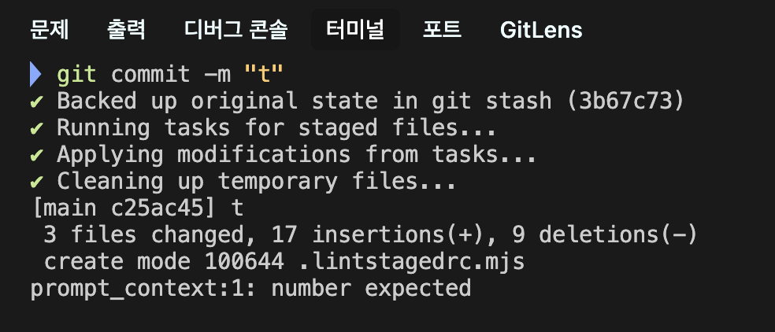

## Next.js 15 설치

```bash
**npx create-next-app@latest**
```

```
What is your project named?
Would you like to use TypeScript? No / **Yes**
Would you like to use ESLint? No / **Yes**
Would you like to use Tailwind CSS? No / **Yes**
Would you like your code inside a `src/` directory? No / **Yes**
Would you like to use App Router? (recommended) No / **Yes**
Would you like to use Turbopack for `next dev`?  No / **Yes**
Would you like to customize the import alias (`@/*` by default)? No / **Yes**
What import alias would you like configured? @/*
```

## next.js 에서 eslint + prttier + husky + lint-staged

- 우선 VSCode에서 prettier 확장 프로그램을 설치하는 것이 좋다.

### prttier

```bash
npm install -D prettier
```

- 해당 프로젝트에서 `.prettierrc` 파일을 만들고 규칙을 넣어주면된다.

```json
{
  "arrowParens": "always",
  "bracketSpacing": true,
  "endOfLine": "lf",
  "htmlWhitespaceSensitivity": "css",
  "singleAttributePerLine": false,
  "bracketSameLine": false,
  "jsxSingleQuote": false,
  "printWidth": 80,
  "proseWrap": "preserve",
  "quoteProps": "as-needed",
  "semi": true,
  "singleQuote": false,
  "tabWidth": 2,
  "trailingComma": "all",
  "useTabs": false,
  "embeddedLanguageFormatting": "auto",
  "experimentalTernaries": false,
}
```

```json
{
  // 화살표 함수의 매개변수 괄호 여부 (x) => x
  "arrowParens": "always",

  // 객체 리터럴의 중괄호 안쪽 공백 여부 { foo: bar }
  "bracketSpacing": true,

  // 줄 끝 문자를 LF(Line Feed)로 통일
  "endOfLine": "lf",

  // HTML 공백 처리 방식을 CSS 디스플레이 속성에 따라 결정
  // => inline 요소의 공백은 유지하고, block 요소의 공백은 무시
  "htmlWhitespaceSensitivity": "css",

  // JSX/HTML 속성을 한 줄에 하나씩 작성할 것인지
  "singleAttributePerLine": false,

  // JSX 태그의 닫는 괄호(>)를 같은 줄에 배치할 것인지
  "bracketSameLine": false,

  // JSX 속성에 작은 따옴표를 사용할 것인지
  "jsxSingleQuote": false,

  // 한 줄의 최대 길이를 몇 자로 제한할 것인지
  "printWidth": 80,

  // 마크다운 등의 prose 텍스트를 printWidth에 맞춰 줄바꿈할 것인지 유지할 것인지
  "proseWrap": "preserve",

  // 객체 속성에 따옴표를 필요한 경우에만 사용
  "quoteProps": "as-needed",

  // 문장 끝에 세미콜론 추가
  "semi": true,

  // '작은따옴표'를 사용할 것인지
  "singleQuote": false,

  // 탭 너비
  "tabWidth": 2,

  // 가능한 모든 곳에 후행 쉼표 추가
  "trailingComma": "all",

  // 들여쓰기에 탭을 사용할 것인지 공백을 사용할 것인지
  "useTabs": false,

  // 템플릿 리터럴 내의 코드를 자동으로 포맷팅
  "embeddedLanguageFormatting": "auto",

  // 삼항 연산자의 실험적 포맷팅 기능을 활성화 할건지
  "experimentalTernaries": false,
}
```

### eslint

- next.js를 설치하면 eslint 사용하는 구분에 yes 하면 `eslint.config.mjs` 파일 만들어짐.

```bash
npm install -D eslint-config-prettier
```

- eslint는 이제 8 → 9버전으로 업그레이드되면서 포맷팅 기능을 없앤다고 공식문서에 나와있음 하지만 여전히 9번저에서도 포맷팅 기능이 가능하지만, 언젠간 사라지니깐 분리를 해놓긴 해야 함.
- eslint-config-prettier : eslint와 prettier 충돌을 방지하기 위해서 설치✅
- eslint-plugin-prettier : eslint에서 prettier 실행하는 명령어인데 이제 필요 없어짐❌

```jsx
// eslint.config.mjs

import { dirname } from "path";
import { fileURLToPath } from "url";
import { FlatCompat } from "@eslint/eslintrc";
import eslintConfigPrettier from "eslint-config-prettier";

const __filename = fileURLToPath(import.meta.url);
const __dirname = dirname(__filename);

const compat = new FlatCompat({
  baseDirectory: __dirname,
});

const eslintConfig = [
  ...compat.extends("next/core-web-vitals", "next/typescript"),
  eslintConfigPrettier,
];

export default eslintConfig;

```

### husky

```bash
npm install -D husky
```

```bash
npx husky init
```

- 초기화를 진행하면 해당 프로젝트 최상위 루트에 `.husky` 디렉토리가 생성되고 `package.json`에 `prepare` 스크립트가 자동으로 추가된다.
- 참고로 prepare은 패키지 설치 전 자동으로 실행되는 특별한 라이프사이클 스크립트다. 이를 통해 다른 팀원이 pnpm install을 할 때 자동으로 git hooks 설정이 완료된다.

### husky 단점

- 프로젝트 크기가 커질수록 포맷하는 시간이 오래 걸림.

그래서 husky의 단점을 해결하기 위해서 lint-staged와 같이 사용하면 변경한 파일로만 포맷하기 때문에 단점 해결.

### lint-staged

```bash
npm install -D lint-staged
```

- `package.json` 에 lint-staged를 설정해도 되지만 next.js를 사용하면 https://nextjs.org/docs/app/api-reference/config/eslint#running-lint-on-staged-files 참고

```jsx
import path from "path";

const buildEslintCommand = (filenames) =>
  `next lint --fix --file ${filenames
    .map((f) => path.relative(process.cwd(), f))
    .join(" --file ")}`;

const buildPrettierCommand = (filenames) =>
  `prettier --write ${filenames.join(" ")}`;

const config = {
  "*.{js,jsx,ts,tsx}": [buildEslintCommand, buildPrettierCommand],
};

export default config;
```

- `.lintstagedrc.mjs` 최상위 루트에 파일을 생성해 위와 같이 작성

### pre-commit.sh

```bash
npm exec lint-staged
```

- commit을 하면 eslint + prettier를 확인하여 통과하면 커밋을 시켜줍니다.



### 참고

https://llbllhllk.tistory.com/135

https://www.youtube.com/watch?v=nTJ5PieYero

https://velog.io/@gyur1kim/2025%EB%85%84-%EA%B8%B0%EC%A4%80-Next.js-15-%ED%94%84%EB%A1%9C%EC%A0%9D%ED%8A%B8-%EC%85%8B%ED%8C%85%ED%95%98%EA%B8%B0-prettier-eslint-husky

https://nextjs.org/docs/app/api-reference/config/eslint#running-lint-on-staged-files

```toc

```