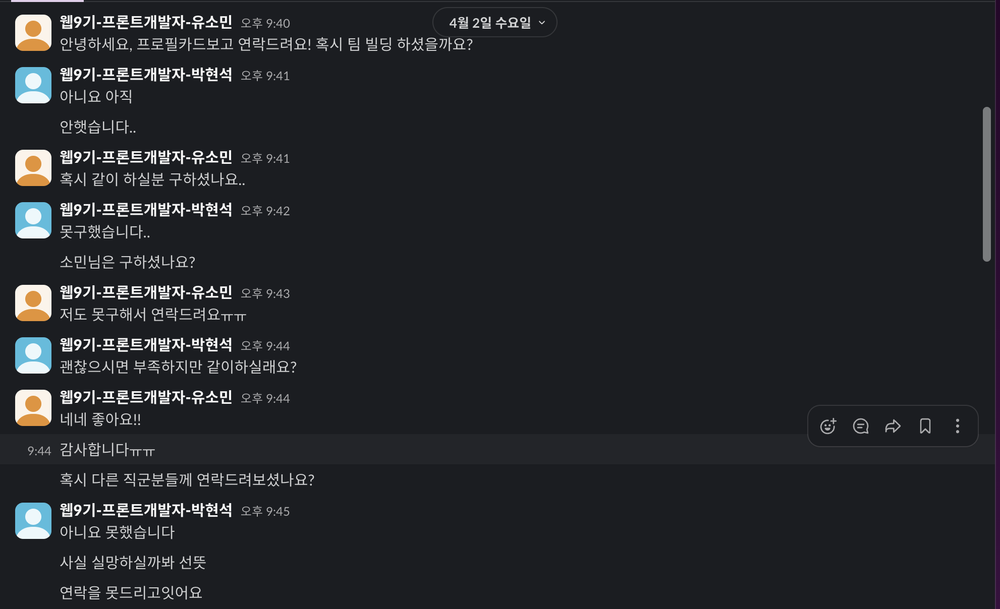

## 회고

[HOBBi](https://github.com/SWYP-HOBBI)

스위프 공모전이 끝나서 프로젝트에 대한 회고를 작성해보려고합니다.

### SWYP에 어떻게 참여하게 되었는지?

개발을 혼자 공부하면서 뭔가 회의감이 온 거 같아서 어느 순간 사이드 프로젝트를 진행해 보면 어떨까?라는 생각이 들어서 찾아보다가, IT 사이드 프로젝트를 전문적으로 진행하는 SWYP를 찾아서 신청하고, 참여하게 되었습니다.

### 팀원 구성은 어떻게 정해졌는지?

사실 SWYP에서 팀원을 구성하는 방법이 있었는데, 개인의 프로필 카드를 작성하여 어필하는 방식이었는데, 사실 걱정부터 됐었다.

왜냐하면 다른 사람들의 프로필 카드를 봤는데, 이미 경력자 이신 분들도 많았고, 현업에서 일하고 계신 분들도 많았기에 "누가 내 프로필 카드를 보고 연락을 줄까?"라는 생각이 들었지만, 최대한 개인 프로젝트, 협업 했던 프로젝트를 적어서 프로필 카드를 작성했고, 마침내 결전의 날인 팀원을 뽑는 시간이 왔었는데, 역시나 처음에는 연락이 없었었고, 내가 연락하기에는 "남한테 피해 주는 건 아닐까?"라는 생각부터 들었기에 선뜻 먼저 연락을 하지 못했지만, 그래도 시간이 좀 지났을까 저랑 같은 직군인 사람한테 연락이 왔기에 같이 하기로 했고, 프론트 2분을 찾고 계시는 팀원분들이 계셔서 연락을 드린 후같이 팀원 구성을 하게 되었습니다.
| | |
| ----------- | ----------- |
|  |  |

### 아이디어가 "취미인들의 커뮤니티 공간 HOBBi"가 되었는지?

사실 저희 1~2주 차에서는 기획을 하기 위해 팀원 전원(7명) 이 아이디어를 생각하여 발표하고 투표하는 식으로 진행하기로 했었습니다.

내가 생각한 아이디어는 [치매예방](https://www.notion.so/1cd469c31ecd80e2a53fd99f5f2b24b0?source=copy_link)이였습니다.(물론 투표에서 물러났지만, 나중에 기회가 되면 치매예방 아이디어를 만들어 보도록 하겠습니다.) 왜냐하면 제가 개발을 하는 이유와 가치관은 사람들에게 실질적으로 도움을 주는 개발을 추구하기 때문에 치매예방에 대해서 생각을 했었습니다.
| | |
| ----------- | ----------- |
|  |  |

그래서 투표로 뽑힌 게 사용자 뉴스 추천 사이트였는데, 저희는 1주 차 좀 넘어서까지 저희는 뉴스에 대한 기획을 세웠는데 문제는 뉴스 데이터를 크롤링 해서 수집을 하려고 했는데 크롤링에 대한 제약이 걸려있어서 저희는 다시 2주 차까지도 기획을 생각했어야 했습니다.

또다시 투표를 진행하게 되었고, 6주 안에 만들 수 있는 프로젝트를 생각해서 취미를 공유하는 커뮤니티 공간을 만들자 해서 HOBBi가 결정되었습니다.

### 프로젝트를 진행하면서 아쉬웠던 점은 무엇인가?

항상 어떤 프로젝트를 하든 아쉬운점은 남는거 같습니다.

**첫 번째 기획을 구체적이고 탄탄하게 하지 못한 점**

물론 아이디어 기획이 한번 엎어져서 시간이 부족했지만, 왜 그렇게 느꼈냐면, 프로젝트를 하면서 기획과 기능에 대해서 바뀌는 건 예상은 했지만 그 빈도수가 너무 많아서 사실 좀 개발하는데 바뀌는 게 많아서 좀 힘들었던 거 같습니다.

**두 번째 소통이 원활이 되지 못한 점**

사실 이건 백엔드와 프론트엔드에 대한 서로 간의 입장을 이해하지 못했기에 소통의 대한 문제이기도 하다.

사건의 발단은 소셜 로그인을 구현하는 방식이였는데, 백엔드에서 소셜 로그인을 개인이 혼자 다 구현하고, 프론트한테 링크만 주는 경우였는데, 그러면 사실 프론트에서 할 게 없었기에 다시 수정하고 서로 api를 연결함으로써 해결이 되었지만, 얼마 남지 않았던 시간을 날렸던 경험이 있다...

### 프로젝트를 진행해 보았는데 소감은?

**소감**

아무 경험 없이 부족한 상태로 참여하게 되었지만, 6주 동안 좋은 팀원분들과 함께 프로젝트를 무사히 완수할 수 있었습니다.

이번 공모전 경험이 여기서 끝이 아니라, 앞으로도 함께 이 서비스를 계속 발전시켜 나갈 수 있기를 바랍니다.

**성장 포인트**

제일 성장 포인트로는 팀 협업 및 소통 능력이 눈에 띄게 성장했다고 생각합니다.

각자의 역할을 분담하고, 백엔드분들과 API에 대해 긴밀히 소통하면서 기능 구현 과정에서의 불필요한 시행착오를 크게 줄일 수 있었습니다.

요구사항과 데이터 형식을 명확히 이해하고 조율하며 각자 맡은 부분을 효율적으로 개발할 수 있었고, 이는 결국 정해진 기간 안에 완성도 높은 프로젝트를 만들어내는 원동력이 되었습니다.

**인사이트**

'시작 단계의 부족함보다는 실행하고 완성하는 과정의 가치' 에 대한 것입니다.

아무 경험 없이 막막하게 시작했지만, 6주라는 짧은 시간 안에 아이디어를 실제 작동하는 웹 서비스로 만들어내는 과정을 거치면서 이론적인 지식 습득만큼이나 직접 부딪히고 완성해보는 '실행력'과 '완수 경험'이 성장에 얼마나 중요한지 깨달았습니다. 완벽하게 준비되지 않았더라도 일단 시작하고, 문제를 만나면 팀원들과 함께 해결하며 앞으로 나아가는 과정 자체가 가장 효과적인 학습 방법이며, 이를 통해 스스로의 가능성을 확장할 수 있음을 알게 되었습니다.


```toc

```
