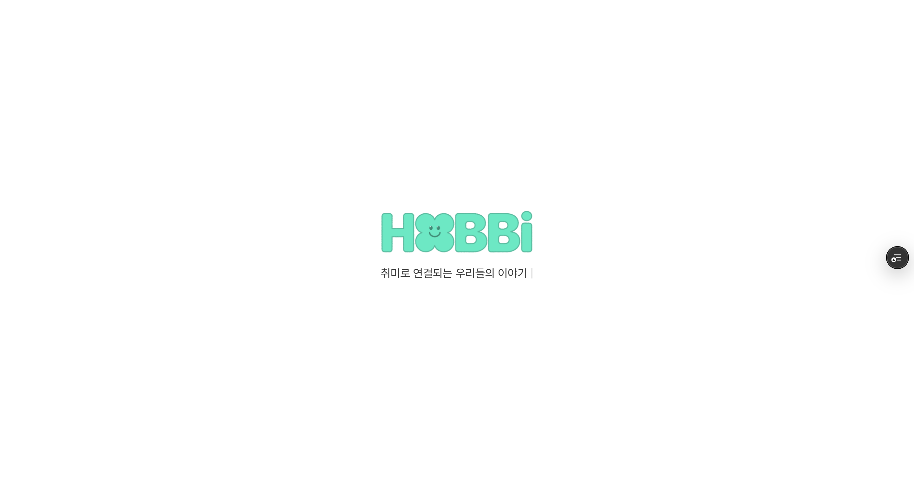

## Splash Screen 이란?

애플리케이션이 시작될 때 기본 인터페이스나 콘텐츠가 로드되기 전까지 일시적으로 표시되는 초기 화면을 말합니다.

## 구현 방법

"어떻게 구현하면 좋을까?" 생각을 하다가 [react portal](https://react.dev/reference/react-dom/createPortal) 에 대해서 학습한적이 있기에 스플래시화면도 사용 해보면 좋을거 같아서 일단 portal을 사용하였다.

### react protal 이란?

React Portal은 부모 컴포넌트의 DOM 계층 구조 외부에 자식 컴포넌트를 렌더링할 수 있게 해주는 기능입니다.

주로

- 모달 창
- 툴팁
- 스플래시 화면
- 플로팅 메뉴

사용됩니다.

### react protal을 사용하는 이유?

react 특성상 부모 컴포넌트가 렌더링 되면 자식 컴포넌트가 렌더링 되는 Tree 구조를 가지고 있다.

이런 Tree 구조는 종종 불편함을 가지게 되는데 부모-자식 관계를 가지고 있어 DOM 계층 구조에 영향을 미치게 된다.

하지만 리액트 포탈을 사용하면 독립적인 위치에서 렌더링하기 때문에 편리하게 사용이 가능하다.

대표적인 예로 스타일링이 간편하다.

독립적인 위치에서 렌더링 하게 된다면 overflow: hidden, z-index 와 같은 속성을 부모 컴포넌트에 영향을 받지 않도록 할 수 있다.

따라서 리액트 포탈을 사용하면 스타일링을 간편하게 사용 가능하고 이런 독립된 스타일링은 유지 보수성을 향상시키고 CSS 충돌을 방지한다.

### react protal 사용 방법

next.js 15 입니다.

```html
<!-- layout.tsx -->
<div id="splash-screen" />
```

- 루트 layout에 potal을 위한 DOM 요소를 생성합니다.

```typescript
import { createPortal } from 'react-dom';

// Portal 대상 요소 찾기
const portalElement = document.getElementById('splash-screen');

// Portal 생성
return createPortal(
  <컴포넌트>,
  portalElement
);
```

```typescript
import { useEffect, useState } from 'react';
import { createPortal } from 'react-dom';
import SvgIcon from '../common/svg_icon';
import { motion, AnimatePresence } from 'framer-motion';

/**
 * 스플래시 화면 컴포넌트 Props 인터페이스
 * @param onFinish - 스플래시 화면 종료 핸들러
 */
interface SplashScreenProps {
  onFinish: () => void;
}

// 타이핑 효과를 위한 컴포넌트
function TypewriterText({ text }: { text: string }) {
  const [displayedText, setDisplayedText] = useState('');
  const [currentIndex, setCurrentIndex] = useState(0);

  useEffect(() => {
    if (currentIndex < text.length) {
      const timeout = setTimeout(() => {
        setDisplayedText((prev) => prev + text[currentIndex]);
        setCurrentIndex((prev) => prev + 1);
      }, 100); // 각 글자가 나타나는 속도 (밀리초)

      return () => clearTimeout(timeout);
    }
  }, [currentIndex, text]);

  return (
    <motion.p
      className='mt-4 text-grayscale-80 text-lg max-md:text-base'
      initial={{ opacity: 0 }}
      animate={{ opacity: 1 }}
      transition={{
        duration: 0.5,
        ease: 'easeOut',
      }}
    >
      {displayedText}
      <motion.span
        animate={{ opacity: [0, 1, 0] }}
        transition={{
          duration: 0.8,
          repeat: Infinity,
          ease: 'linear',
        }}
        className='inline-block ml-1'
      >
        |
      </motion.span>
    </motion.p>
  );
}

/**
 * 스플래시 화면 컴포넌트
 *
 * 주요 기능
 * 1. 로고가 페이드인되며 등장
 * 2. 2초 후에 위로 이동하는 애니메이션 시작
 * 3. 3초 후에 스플래시 스크린을 닫기
 */
export default function SplashScreen({ onFinish }: SplashScreenProps) {
  const [mounted, setMounted] = useState<boolean>(false);

  useEffect(() => {
    setMounted(true);

    // 3초 후에 스플래시 스크린을 닫기
    const finishTimer = setTimeout(() => {
      onFinish();
    }, 3000);

    // 컴포넌트가 언마운트될 때 타이머 정리
    return () => {
      clearTimeout(finishTimer);
    };
  }, [onFinish]);

  // 스플래시 화면이 표시될 때 body 스크롤 방지
  useEffect(() => {
    document.body.style.overflow = 'hidden';
    return () => {
      document.body.style.overflow = 'unset';
    };
  }, []);

  if (!mounted) return null;

  const portalElement =
    typeof document !== 'undefined' ? document.getElementById('splash-screen') || document.body : null;

  if (!portalElement) return null;

  return createPortal(
    <div className='fixed inset-0 z-50 flex items-center justify-center bg-grayscale-0'>
      <AnimatePresence>
        <motion.div
          className='flex flex-col items-center'
          initial={{ opacity: 0 }}
          animate={{ opacity: 1 }}
          exit={{ opacity: 0 }}
          transition={{
            duration: 0.8,
            ease: 'easeOut',
          }}
        >
          <SvgIcon name='logo' className='w-[240px] h-[70px] max-md:w-[150px] max-md:h-[44px]' />
          <TypewriterText text='취미로 연결되는 우리들의 이야기' />
        </motion.div>
      </AnimatePresence>
    </div>,
    portalElement,
  );
}
```

- 스플래시에 대한 구현입니다.



스크린샷 처럼 타이핑이 되면서 스플래시 화면이 보여집니다.

### react protal 장점

1. DOM 구조의 유연성

- 부모 컴포넌트의 CSS 영향을 받지 않음
- z-index 관리가 용이

2. 재사용성

- 다른 프로젝트에서도 쉽게 재사용 가능
- 커스터마이징이 용이

3. 성능

- 메인 앱과 별도로 렌더링되어 성능에 영향을 미치지 않음

```toc

```
