 [Next.js](https://nextjs.org/docs) 공식 문서입니다.

 HOBBi 프로젝트를 진행하면서 Next.js에 대해서 깊게 학습하고 사용해보기로 했었습니다.

 사실 Next.js 13버전은 사용해봤지만, 15버전은 얼마나 다를까 하다가 공부한 내용을 정리해 봅니다.

 ## Next.js 15

 기존에 app router 기법은 비슷한거 같았고, 기존에 app 폴더안에 `app/abc` 이런식으로 폴더를 만들면 endpoint/abc 이런식으로 라우팅이 작동합니다.(주의할 점으로는 폴더안에 `page.tsx` 파일을 만들어야한다는 점)

그리고 공용 UI가 있을 경우 `layout`을 사용하면 좋을꺼 같다고 생각했습니다.

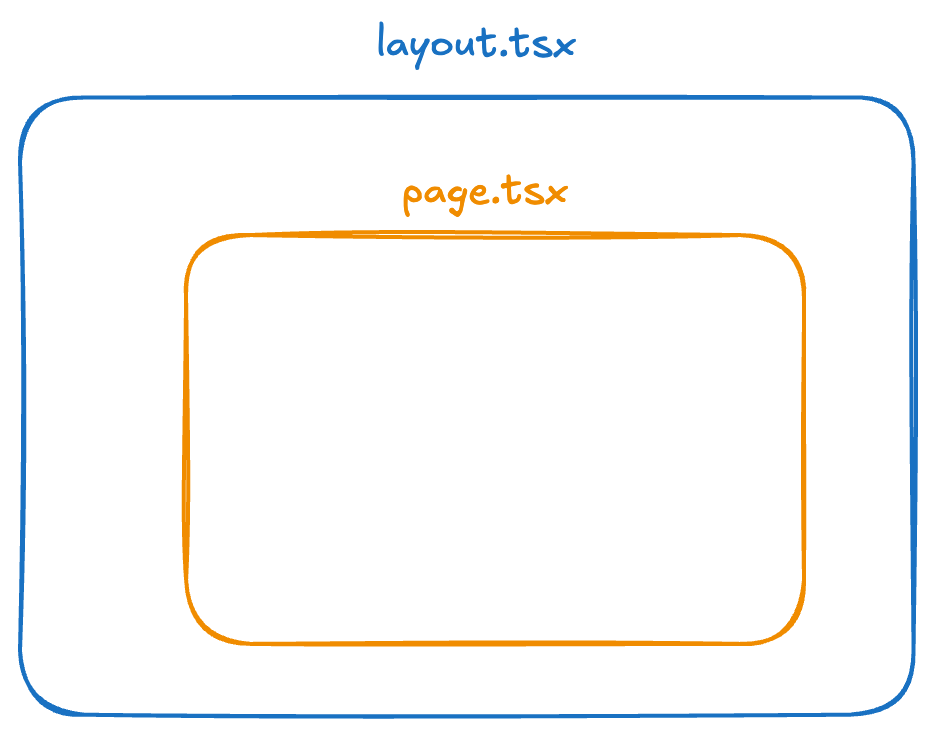

- next.js는 layout 안에 page가 작동하는 방식.

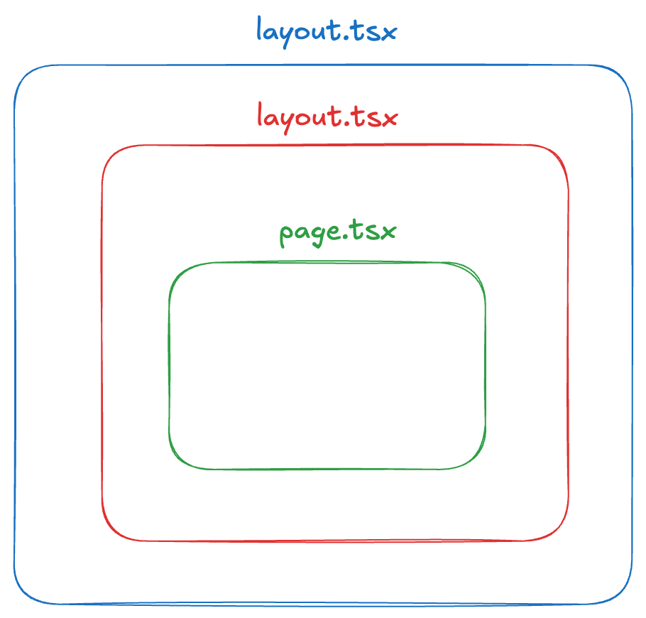

- 상위폴더의 layout.js 안에 하위폴더의 layout.js를 담아서 보여줍니다.

### layout 사용하면 좋은점

- 페이지 이동 시 state 보존합니다.

- 인터랙티브한 요소들은 유지되며 리렌더링이 되지않음

### Dynamic Routes

[Dynamic Routes](https://nextjs.org/docs/app/api-reference/file-conventions/dynamic-routes)

```
📦app
 ┣ 📂abc
 ┃ ┣ 📂[id]
 ┃ ┃ ┗ 📜page.tsx
 ┃ ┗ 📜page.tsx
 ┣ 📜favicon.ico
 ┣ 📜globals.css
 ┣ 📜layout.tsx
 ┗ 📜page.tsx
 ```

 ```typescript
 export default function ABC({ params }: { params: { id: string } }) {
    return (
        <div>
            <h1>ABC {params.id}</h1>
        </div>
    );
}
```

- http://localhost:3000/abc/1 으로 접속했다면  params.id 는 1이 찍힌걸 확인할 수 있다.

### Route Groups

[Route Groups](https://nextjs.org/docs/app/api-reference/file-conventions/route-groups)

```
📦app
 ┣ 📂(auth)
 ┃ ┗ 📂login
 ┃ ┃ ┗ 📜page.tsx
 ┣ 📂abc
 ┃ ┣ 📂[id]
 ┃ ┃ ┗ 📜page.tsx
 ┃ ┗ 📜page.tsx
 ┣ 📜favicon.ico
 ┣ 📜globals.css
 ┣ 📜layout.tsx
 ┗ 📜page.tsx
```

- `(auth)` 폴더가 라우트 그룹을 한 것 라우트 그룹은 path에 영향을 주지 않는다.
- http://localhost:3000/auth/login 으로 작동하나 싶지만 path에 영향을 주지 않기 때문에 http://localhost:3000/login 으로 접속하면 됩니다.

라우트 그룹을 어떨 때 사용하면 좋을까?

- path에 추가하고 싶지 않은데 특정 라우트 세그먼트들에 공통적으로 적용할 UI가 있을 때 사용하면 좋다.
    - 예를 들어 로그인이나 회원가입 페이지는 화면 가운데 정렬인 경우가 많다. 그러면 방법은 여러가지가 있겠지만, 상위에 세그먼트를 만들기도 그렇고, 루트 레이아웃에 스타일을 적용하기에는 로그인 이후에는 UI가 달라지는 경우가 많기 때문에 이럴 때는 주로 라우트 그룹을 활용하면 좋다.

### Route Handlers

[Route Handlers](https://nextjs.org/docs/app/building-your-application/routing/route-handlers)

```typescript
// app/api/test/route.ts

// eslint-disable-next-line @typescript-eslint/no-unused-vars
export async function GET(request: Request) {
    return Response.json({ message: 'Hello World' });
}
```

```typescript
export default async function ABC() {
    const res = await fetch('http://localhost:3000/api/test');
    const data = await res.json();
    return (
        <div>
            <h1>ABC</h1>
            <p>{data.message}</p>
        </div>
    );
}
```

- next.js 에서 fetch는 브라우저 fetch 확장한 fetch이다.
    - 기본 fetch 기능에서 캐시나 요청 메모이제이션이 추가된 next fetch
    - next 14버전 까지는 캐시기능이 작동하는게 디폴트 값 15버전부터는 캐시를 안하는게 디폴트 값

```
📦api
 ┗ 📂test
 ┃ ┣ 📂[testId]
 ┃ ┃ ┗ 📜route.ts
 ┃ ┗ 📜route.ts
 ```

 ```typescript
 // app/api/test/[testId]/route.ts

export async function POST(
    request: Request,
    { params }: { params: { testId: string } }
) {
    const body = await request.json();
    return Response.json({ message: `Hello World ${params.testId}`, body });
}
 ```

 ```
 📦app
 ┣ 📂(auth)
 ┃ ┗ 📂login
 ┃ ┃ ┗ 📜page.tsx
 ┣ 📂abc
 ┃ ┣ 📂[id]
 ┃ ┃ ┗ 📜page.tsx
 ┃ ┗ 📜page.tsx
 ┣ 📂api
 ┃ ┗ 📂test
 ┃ ┃ ┣ 📂[testId]
 ┃ ┃ ┃ ┗ 📜route.ts
 ┃ ┃ ┗ 📜route.ts
 ┣ 📜favicon.ico
 ┣ 📜globals.css
 ┣ 📜layout.tsx
 ┗ 📜page.tsx
 ```

 ```typescript
 // app/abc/[id]/page.tsx

'use client';

export default async function ABC({ params }: { params: { id: string } }) {
    const handleSubmit = async (e: React.FormEvent) => {
        e.preventDefault();

        const response = await fetch(`/api/test/${params.id}`, {
            method: 'POST',
            headers: {
                'Content-Type': 'application/json',
            },
            body: JSON.stringify({ name: 'John Doe' }),
        });
        const data = await response.json();
        console.log(data);
    };
    return (
        <div>
            <button
                type="submit"
                onClick={handleSubmit}
            >
                Submit
            </button>
        </div>
    );
}
 ```

 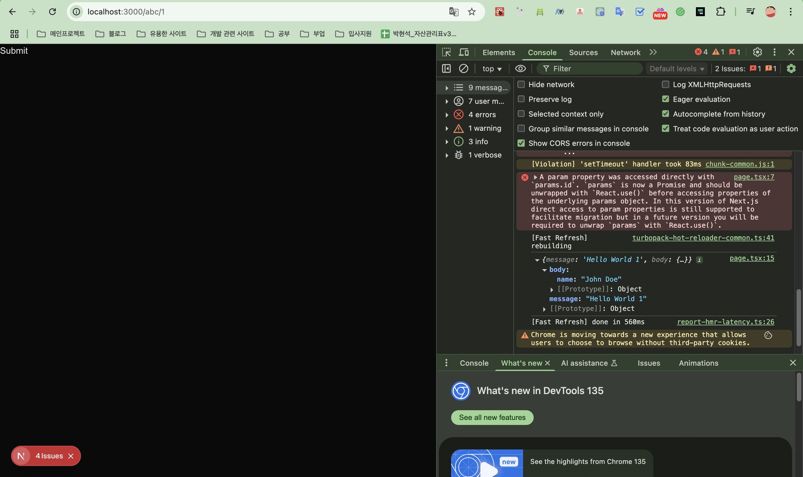

### Loading UI and Streaming

[Loading UI and Streaming](https://nextjs.org/docs/app/api-reference/file-conventions/loading)

loading.js 파일과 react suspense 통해 로딩 UI를 구성할 수 있다.

이러한 컨벤션들을 사용하면 해당 라우트 세그먼트의 콘텐츠가 로드되는 동안 즉시 로딩 상태를 보여주게 되고, 렌더링이 완료가되면 콘텐츠가 자동으로 교체됨.

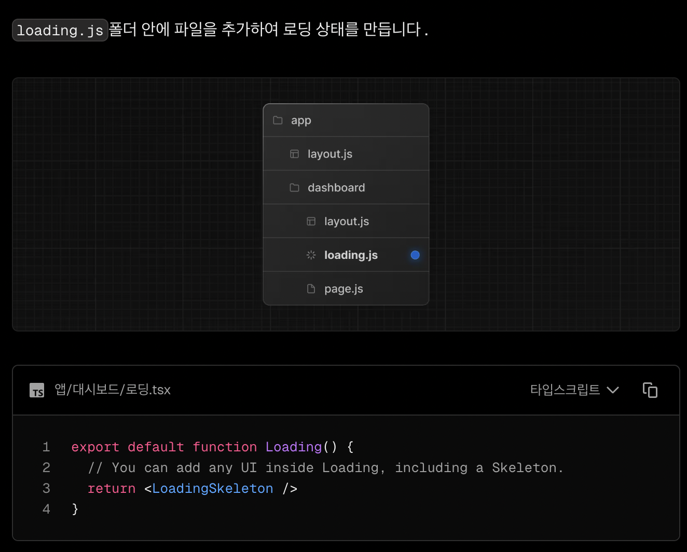

- 사용 방법은 해당 라우트 세그먼트에 loading 파일을 만들어주면 된다.

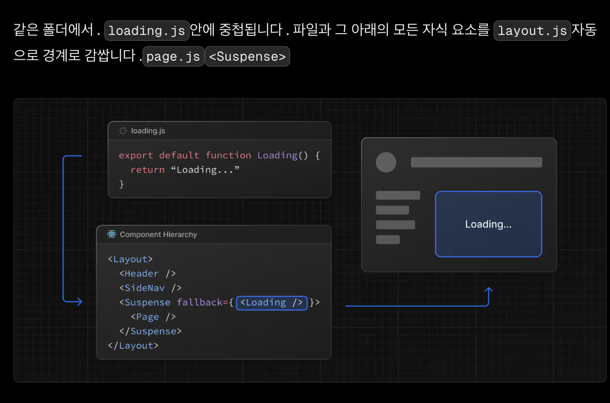

- loading 파일을 사용하게 되면 해당 suspense를 사용하는 것과 동일하다고 보면됨

**예시**

```typescript
const delay = (ms: number) => new Promise((resolve) => setTimeout(resolve, ms)); // 지연시키기 위해 딜레이 함수 생성
// eslint-disable-next-line @typescript-eslint/no-unused-vars
export async function GET(request: Request) {
    const randomNumber = Math.floor(Math.random() * 5000);

    console.log('대기 중...');
    await delay(randomNumber);
    console.log('대기 완료');
    return Response.json({ message: `응답 완료 ${randomNumber}ms` });
}
```

```typescript
export default async function ABC() {
    const res = await fetch('http://localhost:3000/api/test');
    const data = await res.json();
    return (
        <div>
            <h1>ABC</h1>
            <p>{data.message}</p>
        </div>
    );
}
```

```typescript
export default function Loading() {
    return <div>Loading...</div>;
}
```

| | |
| ----------- | ----------- |
| 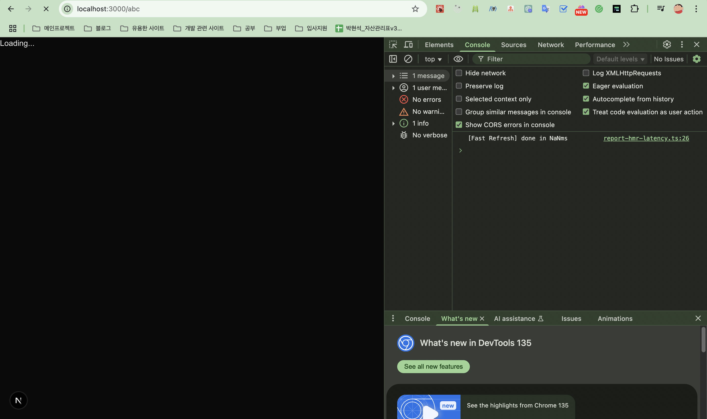 | 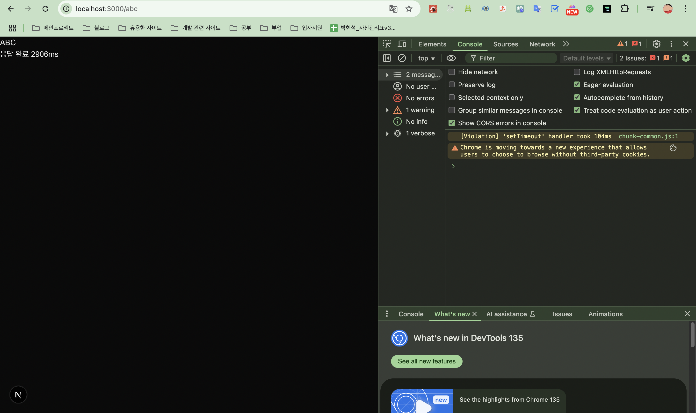 |

### 스트리밍이란 무엇인가?

스트리밍을 이해할려면 먼저 SSR 서버사이드렌더링에 대한 이해가 필요하다라고 공식문서에 작성이 되어있다.

1. 주어진 페이지의 모든 데이터를 서버로 가져옵니다.
2. 그런 다음 서버는 해당 페이지의 HTML을 렌더링합니다.
3. 해당 페이지의 HTML, CSS, JavaScript가 클라이언트로 전송됩니다.
4. 생성된 HTML과 CSS를 사용하여 비대화형 사용자 인터페이스가 표시됩니다.
5. 마지막으로 React는 [수화물을 생성합니다.](https://react.dev/reference/react-dom/client/hydrateRoot#hydrating-server-rendered-html)사용자 인터페이스를 대화형으로 만들었습니다.

이러한 단계들은 순차적으로 진행이 되는데, 어느 한단계에서 지연이 발생하면 블로킹이 일어나기 때문에 서버는 모든 데이터를 가져온 후에만 페이지 HTML을 생성할 수 있고, 그리고 클라이언트에서 모든 자바스크립트 코드가 다 다운로드가 되어야 hydrate를 할 수 있기 때문에 밑에 그림처럼 일부 fetch가 늦어지면 그 만큼 전체 페이지를 보여주는 시간도 늦어진다는 얘기.

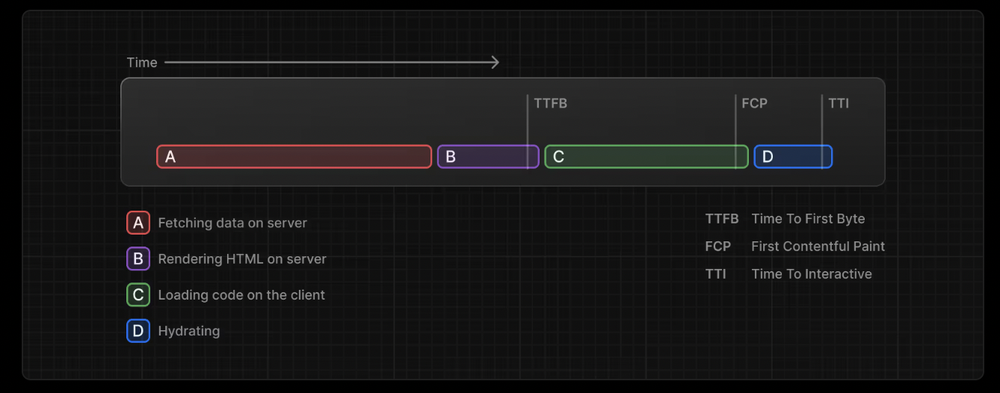

그러므로 스트리밍은 페이지의 HTML을 더 작은 청크 단위로 나누어 클라이언트에 점진적으로 전송을 하기 때문에 모든 부분이 완성될 때까지 기다리지 않고 완성된 부분 먼저 사용자에게 보여줌으로써 앞서 봤던 서버사이드렌더링의 한계를 개선한거라고 보면 된다.

**예시**

```typescript
import { Suspense } from 'react'
import { PostFeed, Weather } from './Components'
 
export default function Posts() {
  return (
    <section>
      <Suspense fallback={<p>Loading feed...</p>}>
        <PostFeed />
      </Suspense>
      <Suspense fallback={<p>Loading weather...</p>}>
        <Weather />
      </Suspense>
    </section>
  )
}
```

스트리밍 적용 방법에 대한 예시이다. suspense를 감싸서 적용하면 끝

### Error Handling

에러 핸들링은 두 가지로 나눠볼 수 있다.

예상이 되는 에러와 예상이 되지 않는 에러 이렇게 두 가지로 나눈거 같다.

#### 예상 되는 에러

Server Actions 안에서 `try/catch` 로 잡는 에러를 말하는 거 같음

이 에러 같은 경우에는 [useActionState](https://react.dev/reference/react/useActionState) 를 사용해서 처리하라고 나와있음.

#### 예상 되지 않는 에러

`error.tsx` and `global-error.tsx` 를 사용해서 에러 바운더리를 구현해 처리해 달라고 나와있다.

예상 하지 못한 에러를 세 가지 경우로 나눠져 있는데

1. common : 루트 세그먼트에 `error.tsx` 파일을 만들어 루트 레이아웃 하위에서 발생한 에러를 처리하는게 common 케이스

2. Optional : 각 라우트 세그먼트마다 `error.tsx` 파일을 추가해 해당 라우트 세그먼트에서 발생하는 에러에 대한 처리를 해줄 수 있다.

3. Uncommon : 루트 레이아웃에서 발생하는 에러를 처리할 수 있는 global-error 파일이 있는데 common 케이스처럼 루트 세그먼트에 추가한 에러 파일 같은 경우는 로딩 파일과 비슷하게
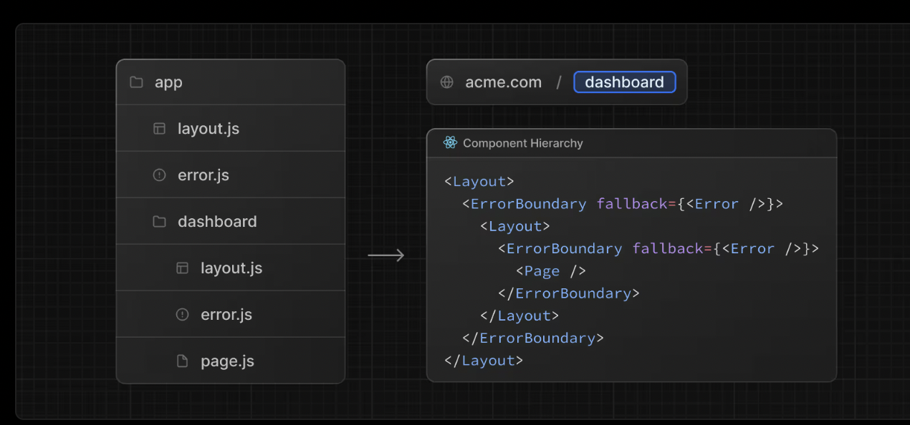

이렇게 레이아웃 하위에 페이지를 에러 바운더리로 감싼 형태와 동일하기 때문에 이 루트 레이아웃에서 발생하는 에러에 대해서는 처리를 못하게 됩니다.

그래서 루트 레이아웃에서 발생하는 에러를 처리하기 위해 global-error 파일을 사용합니다.

**예시(app/error.tsx 앱 루트에 에러 파일) 케이스 1번**

```typescript
'use client'; // Error boundaries must be Client Components

import { useEffect } from 'react';

export default function Error({
    error,
    reset,
}: {
    error: Error & { digest?: string };
    reset: () => void;
}) {
    useEffect(() => {
        // Log the error to an error reporting service
        console.error(error);
    }, [error]);

    return (
        <div>
            <h2>루트 에러 페이지</h2>
            <button
                onClick={
                    // Attempt to recover by trying to re-render the segment
                    () => reset()
                }
            >
                Try again
            </button>
        </div>
    );
}
```

```typescript
const delay = (ms: number) => new Promise((resolve) => setTimeout(resolve, ms)); // 지연시키기 위해 딜레이 함수 생성
// eslint-disable-next-line @typescript-eslint/no-unused-vars
export async function GET(request: Request) {
    const randomNumber = Math.floor(Math.random() * 5000);

    throw new Error(); // 임의로 에러를 띄움.
    console.log('대기 중...');
    await delay(randomNumber);
    console.log('대기 완료');
    return Response.json({ message: `응답 완료 ${randomNumber}ms` });
}
```


**예시(app/abc/error.tsx 세그먼트에 에러 파일) 케이스 2번**

```typescript
'use client'; // Error boundaries must be Client Components

import { useEffect } from 'react';

export default function Error({
    error,
    reset,
}: {
    error: Error & { digest?: string };
    reset: () => void;
}) {
    useEffect(() => {
        // Log the error to an error reporting service
        console.error(error);
    }, [error]);

    return (
        <div>
            <h2>ABC 에러 페이지</h2>
            <button
                onClick={
                    // Attempt to recover by trying to re-render the segment
                    () => reset()
                }
            >
                Try again
            </button>
        </div>
    );
}
```

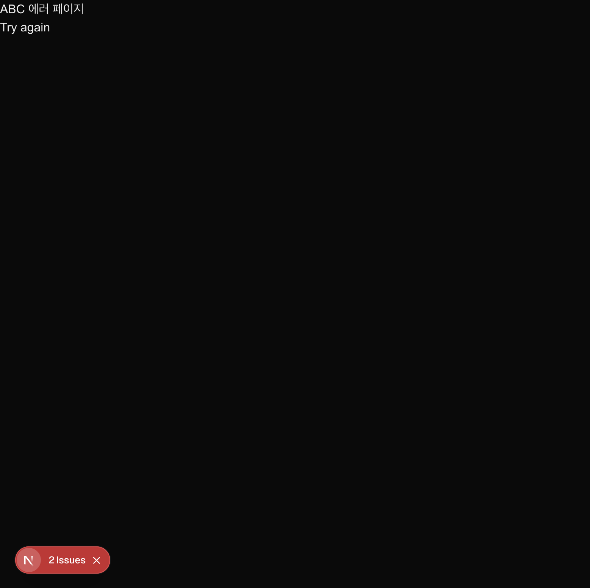

**예시(global-error.tsx) 케이스 3번**

```typescript
'use client' // Error boundaries must be Client Components
 
export default function GlobalError({
  error,
  reset,
}: {
  error: Error & { digest?: string }
  reset: () => void
}) {
  return (
    // global-error must include html and body tags
    <html>
      <body>
        <h2>Something went wrong!</h2>
        <button onClick={() => reset()}>Try again</button>
      </body>
    </html>
  )
}
```

글로벌 에러 파일은 html, body 태그가 있어야함

### not-found (기존 404 페이지를 커스텀할 수 있게 해주는 파일)

app 루트에 not-found.tsx 파일을 만들면 기존 404 페이지를 커스텀할 수 있다.

```typescript
export default function NotFound() {
    return <div>Not Found</div>;
}
```

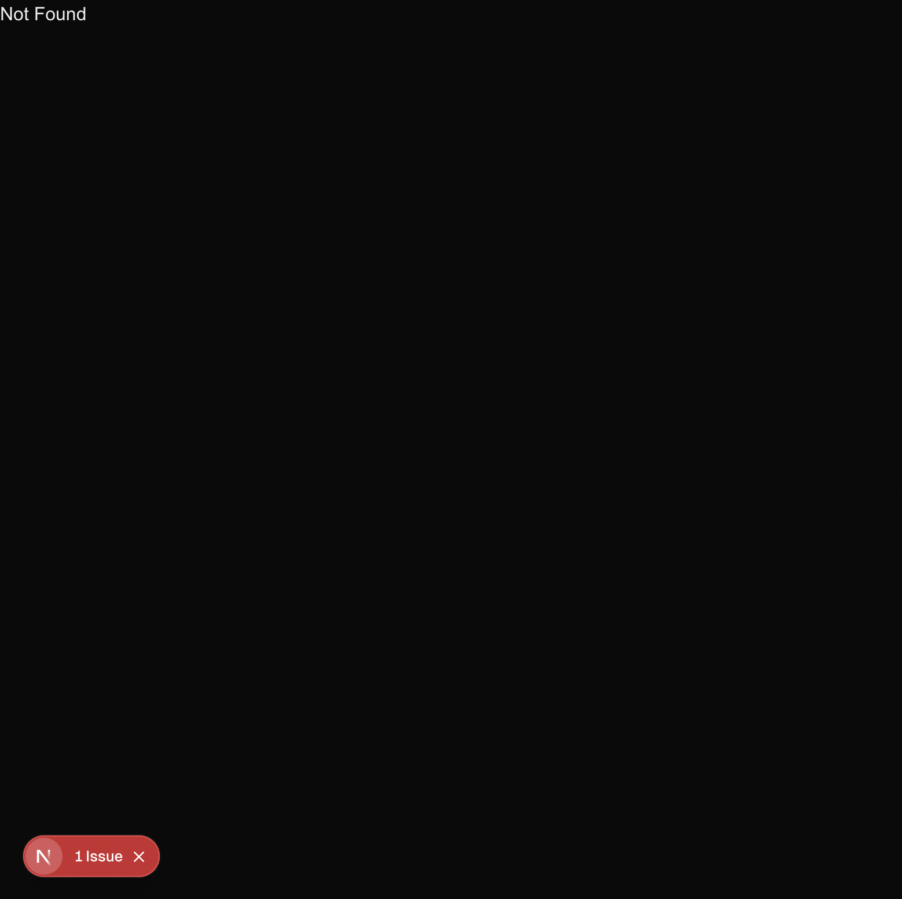

Next.js 15에 대해서 학습해보았는데요, 다시 학습한걸 블로그로 복습하니깐 프로젝트에 얼른 적용해보고 싶네요☺️

```toc

```
