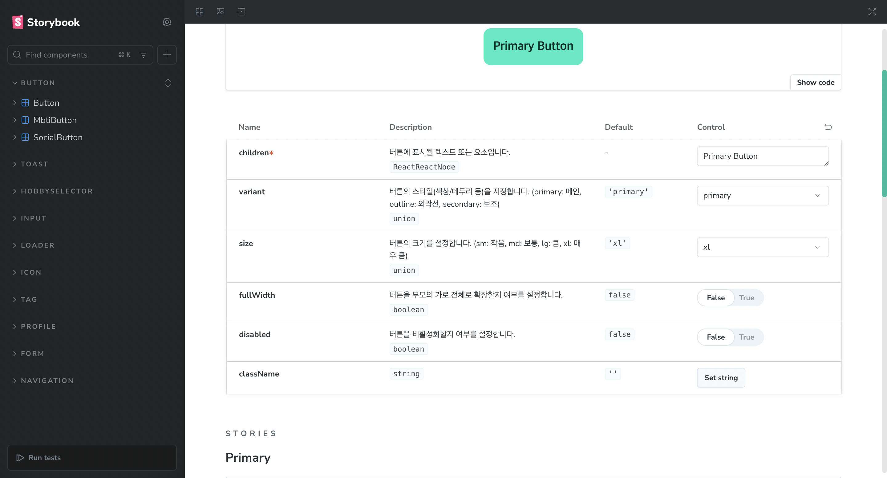
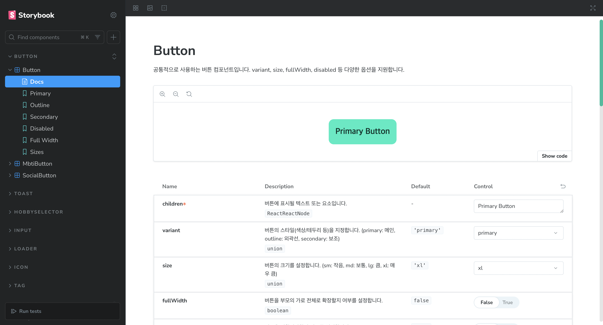

## Storybook의 핵심 개념

### 컴포넌트 단위 개발

- Storybook은 **UI 컴포넌트 하나하나를 “Story”라는 단위로 분리**해서 개발합니다.
- 각 Story는 컴포넌트의 다양한 상태(예: 버튼의 크기, 색상, 비활성화 등)를 독립적으로 보여줍니다.

### 실시간 미리보기 & 테스트

- Storybook UI에서 각 Story를 클릭하면,

해당 상태의 컴포넌트를 **실시간으로 미리보고, 조작(Props 변경)하며 테스트**할 수 있습니다.

### 문서화

- 각 Story는 자동으로 문서화되어,

**디자인 시스템, 개발자 문서, QA 가이드** 등으로 활용할 수 있습니다.

## Storybook의 주요 기능에는 뭐가 있을까?

### Stories

- 컴포넌트의 다양한 상태/조합을 코드로 정의합니다.

- 예시
  ```typescript
  export const Primary = { args: { variant: 'primary', children: 'Primary' } };
  export const Disabled = { args: { disabled: true, children: 'Disabled' } };
  ```

### Controls (Args/ArgTypes)

- Storybook UI에서 **props(Args)를 실시간으로 조작**할 수 있습니다.
- argTypes로 props의 타입, 설명, 컨트롤 타입(슬라이더, 드롭다운 등)을 지정할 수 있습니다.

### Docs

- 각 컴포넌트/Story에 **한글/영문 설명, 사용법, 예시**를 추가할 수 있습니다.
- 자동으로 props 테이블, 예시 코드, 미리보기 등이 생성됩니다.

### Addons

- 접근성(a11y), 테스트, 디자인 연동, 스냅샷, 다크모드 등 다양한 기능을 플러그인처럼 확장할 수 있습니다.

### Mocking & Decorators

- API, 라우터, 상태관리(zustand, recoil 등)도 Storybook에서 mock하여 실제 서비스와 유사한 환경을 만들 수 있습니다.

## Storybook의 장점

- **UI 컴포넌트 개발 속도 향상**: 페이지 전체가 아니라, 컴포넌트만 빠르게 개발/테스트 가능
- **디자인-개발 협업 강화**: 디자이너, 기획자, QA가 Storybook에서 UI를 직접 확인/피드백
- **문서화 자동화**: 컴포넌트 사용법, props, 예시가 자동으로 문서화
- **회귀 테스트/품질 보장**: 스냅샷, 접근성, 인터랙션 테스트 등 다양한 품질 도구와 연동

## 세팅하는법 (Next.js(v15) + Storybook(v9))

```
npm create storybook@latest
```

- 설치하면 자동으로 플러그인 설치도 설치해줍니다.

하지만 설치하고 storybook을 실행보니 에러가 발생합니다.

```
=> Failed to build the preview
SB_FRAMEWORK_NEXTJS_0003 (IncompatiblePostCssConfigError): Incompatible PostCSS configuration format detected.

Next.js uses an array-based format for plugins which is not compatible with Vite:

// ❌ Incompatible format (used by Next.js)
const config = {
  plugins: ["@tailwindcss/postcss"],
};

Please transform your PostCSS config to use the object-based format, which is compatible with Next.js and Vite:

// ✅ Compatible format (works with Next.js and Vite)
const config = {
  plugins: {
    "@tailwindcss/postcss": {},
  },
};

Original error: Invalid PostCSS Plugin found at: plugins[0]

(@./postcss.config.mjs)
```

- 에러에 대해서 살펴보니 **@tailwindcss/postcss** plugins를 **@tailwindcss/postcss": {}** 이런식으로 바꿔달라는 에러인거 같다.

```typescript
const config = {
  plugins: ['@tailwindcss/postcss'],
};

export default config;
```

- ❌

```typescript
const config = {
  plugins: {
    '@tailwindcss/postcss': {},
  },
};

export default config;
```

- ✅ 으로 바꿔주면 실행이됩니다.

## 스토리북 tailwindCSS 설정 (Next.js)

```
npm install tailwindcss @tailwindcss/vite
```

```typescript
// vite.config.ts

import tailwindcss from '@tailwindcss/vite';
export default defineConfig({
  plugins: [tailwindcss()],
});
```

```typescript
import type { Preview } from '@storybook/nextjs-vite';
import '../src/app/globals.css';

const preview: Preview = {
  parameters: {
    controls: {
      matchers: {
        color: /(background|color)$/i,
        date: /Date$/i,
      },
    },
    a11y: {
      test: 'todo',
    },
  },
};

export default preview;
```

- preview 에 import '../src/app/globals.css'; 추가해주셔야 tailwindcss가 적용됩니다.

### 예시

저희 HOBBi 프로젝트에 스토리북 적용 예시 입니다.

```typescript
import React, { ButtonHTMLAttributes } from 'react';
import clsx from 'clsx';

type ButtonVariant = 'primary' | 'outline' | 'secondary';
type ButtonSize = 'sm' | 'md' | 'lg' | 'xl';

const sizeStyles = {
  sm: 'text-sm',
  md: 'text-base',
  lg: 'text-lg',
  xl: 'text-xl',
};

const variantStyles = {
  primary: 'bg-primary text-primary-b80 hover:bg-primary/80',
  outline: 'border border-primary-b60 bg-grayscale-0 text-primary-b60 hover:bg-primary-b60 hover:text-grayscale-0',
  secondary: 'bg-grayscale-10 text-grayscale-50',
};

interface ButtonProps extends ButtonHTMLAttributes<HTMLButtonElement> {
  variant?: ButtonVariant;
  size?: ButtonSize;
  fullWidth?: boolean;
  children: React.ReactNode;
  className?: string;
  disabled?: boolean;
}

export default function Button({
  variant = 'primary',
  size = 'xl',
  fullWidth = false,
  children,
  className = '',
  disabled = false,
  ...props
}: ButtonProps) {
  const currentVariant = disabled ? 'secondary' : variant;

  return (
    <button
      className={clsx(
        'py-3 px-4 rounded-lg button_transition font-semibold text-center cursor-pointer disabled:cursor-not-allowed h-[60px] max-md:h-[48px] whitespace-nowrap',
        sizeStyles[size],
        variantStyles[currentVariant],
        { 'w-full': fullWidth },
        className,
      )}
      disabled={disabled}
      {...props}
    >
      {children}
    </button>
  );
}
```

- 기존에 공동컴포넌트 였던 Button으로 예시를 들겠습니다.

```typescript
import type { Meta, StoryObj } from '@storybook/nextjs-vite';
import React from 'react';

import Button from '../components/common/button';

const meta: Meta<typeof Button> = {
  title: 'Button/Button',
  component: Button,
  parameters: {
    layout: 'centered',
    docs: {
      description: {
        component:
          '공통적으로 사용하는 버튼 컴포넌트입니다. variant, size, fullWidth, disabled 등 다양한 옵션을 지원합니다.',
      },
    },
  },
  tags: ['autodocs'],
  argTypes: {
    variant: {
      control: 'select',
      options: ['primary', 'outline', 'secondary'],
      description: '버튼의 스타일(색상/테두리 등)을 지정합니다. (primary: 메인, outline: 외곽선, secondary: 보조)',
    },
    size: {
      control: 'select',
      options: ['sm', 'md', 'lg', 'xl'],
      description: '버튼의 크기를 설정합니다. (sm: 작음, md: 보통, lg: 큼, xl: 매우 큼)',
    },
    fullWidth: {
      control: 'boolean',
      description: '버튼을 부모의 가로 전체로 확장할지 여부를 설정합니다.',
    },
    disabled: {
      control: 'boolean',
      description: '버튼을 비활성화할지 여부를 설정합니다.',
    },
    children: {
      control: 'text',
      description: '버튼에 표시될 텍스트 또는 요소입니다.',
    },
  },
  args: {
    children: 'Button',
    variant: 'primary',
    size: 'xl',
    fullWidth: false,
    disabled: false,
  },
} satisfies Meta<typeof Button>;

export default meta;
type Story = StoryObj<typeof Button>;

export const Primary: Story = {
  args: {
    variant: 'primary',
    children: 'Primary Button',
  },
};

export const Outline: Story = {
  args: {
    variant: 'outline',
    children: 'Outline Button',
  },
};

export const Secondary: Story = {
  args: {
    variant: 'secondary',
    children: 'Secondary Button',
  },
};

export const Disabled: Story = {
  args: {
    disabled: true,
    children: 'Disabled Button',
  },
};

export const FullWidth: Story = {
  args: {
    fullWidth: true,
    children: 'Full Width Button',
  },
};

export const Sizes: Story = {
  render: (args) => {
    return (
      <div
        style={{
          display: 'flex',
          gap: 12,
          flexDirection: 'column',
          width: 220,
        }}
      >
        <Button {...args} size='sm'>
          Small
        </Button>
        <Button {...args} size='md'>
          Medium
        </Button>
        <Button {...args} size='lg'>
          Large
        </Button>
        <Button {...args} size='xl'>
          XLarge
        </Button>
      </div>
    );
  },
};
```

## meta란?

- meta는 **해당 컴포넌트의 스토리북 전체 설정/정보**를 담는 객체입니다.
- 각 스토리 파일(Button.stories.tsx)의 최상단에 선언하며, 이 객체를 `export default meta;`로 내보내야 스토리북이 인식합니다.

## meta의 주요 속성

### title

- 스토리북 좌측 네비게이션에 표시될 컴포넌트/스토리의 경로입니다.

```typescript
title: 'Button/Button';
```

→ "Button" 폴더 아래 "Button" 컴포넌트로 표시



### component

- **스토리북에서 미리볼 컴포넌트**를 지정합니다.

### parameters

- **스토리북 전체 설정/문서화/레이아웃 등**을 지정합니다.
- 주요 예시
  - layout: 'centered', 'fullscreen', 'padded' 등 미리보기 레이아웃
  - docs.description.component: 컴포넌트 전체 설명(문서화)
  - 기타: actions, backgrounds, viewport 등 다양한 글로벌 설정 가능



### tags

- 스토리북의 **자동 문서화(autodocs)** 등에서 활용되는 태그입니다.

### argTypes

- **props(Args)의 타입, 설명, 컨트롤 UI**를 지정합니다.
- 각 prop별로
  - control: 스토리북 UI에서 조작할 수 있는 컨트롤 타입(예: select, boolean, text 등)
  - options: select 컨트롤의 옵션 값
  - description: 한글/영문 설명(문서화에 자동 반영)

### args

- 스토리북에서 각 스토리의 기본값(초기 props) 을 지정합니다.

---

스토리북을 프로젝트에 적용해보았는데, 사실 처음 프로젝트할 때 시간이 촉박할거같아서 스토리북은 뒤에 나중에 적용하자고 했지만 막상 사용해보고, 공통컴포넌트 만들어 놓으니깐 어려운 작업은 아니였던거같다.

다음에는 스토리북을 배포하는 방법에 대해서 작성해보도록 하겠습니다.

```toc

```
