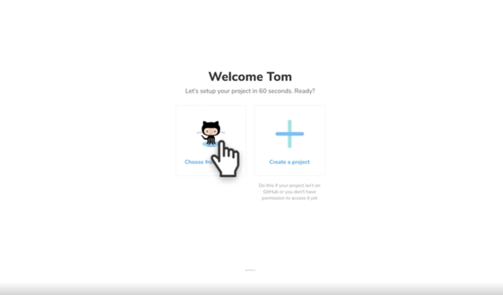
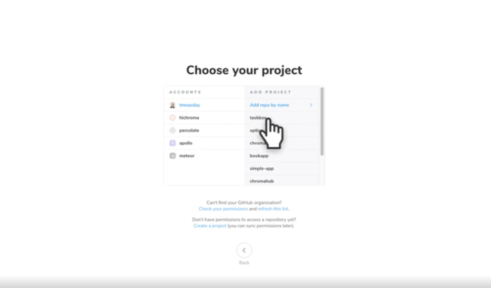
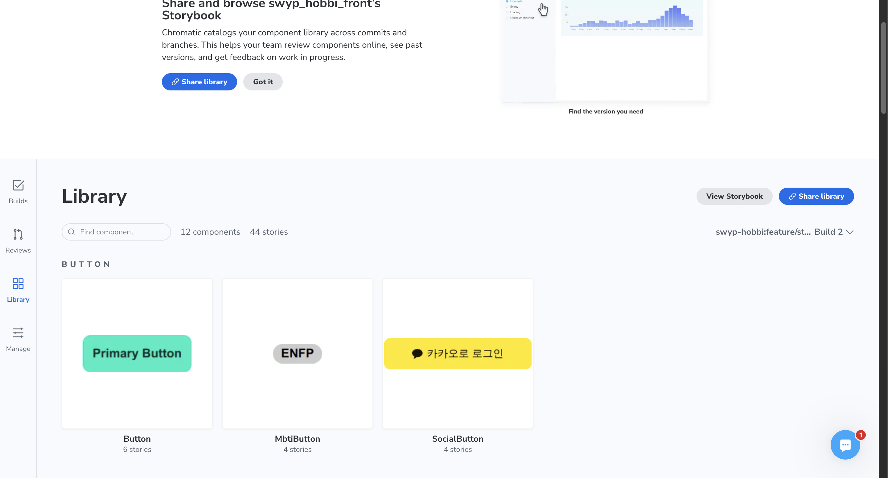

---
emoji:📗
title: 'Storybook 적용을 해봤다면 배포까지 해보자👀'
date: '2025-06-14'
categories: Dev
---

[HOBBi 스토리북](https://685004915b4c4c7b97cd81df-blhtbirhls.chromatic.com/?path=/docs/button-button--docs)

## 배포

### 정적 앱으로 내보내기

스토리북을 배포하기 위해서는 먼저 정적인 웹 앱으로 내보내야 합니다. 이 기능은 이미 스토리북에 내장되어 있으며 미리 구성되어 있습니다.

**yarn build-storybook**을 실행하면 **storybook-static** 디렉토리에 정적인 스토리북이 생성될 것이며 이를 정적 사이트 호스팅 서비스에 배포할 수 있습니다.

### 크로마틱(Chromatic)으로 배포하기

스토리북 관리자가 만든 무료 배포 서비스인 Chromatic을 사용하여 안전하게 배포하고 호스팅 할 수 있습니다.

| | |
| ----------- | ----------- |
|  |  |

- 자기가 하고 싶은 레포를 선택하면됩니다.

```
npm install --save-dev chromatic
```

```
npm chromatic --project-token=<project-token>
```



- Library View Storybook을 누르시면, [storybook - Storybook](https://685004915b4c4c7b97cd81df-blhtbirhls.chromatic.com/?path=/docs/button-button--docs) 볼 수 있습니다.

```
CHROMATIC_PROJECT_TOKEN=자기 토큰 값
```

```json
"scripts": {
	"chromatic": "chromatic --project-token=$CHROMATIC_PROJECT_TOKEN"
	}
```
- npm run chromatic 으로 하면 배포됩니다.
- CHROMATIC_PROJECT_TOKEN 은 .env 파일에 넣어줬습니다.


---

[스토리북 공식문서 배포](https://storybook.js.org/tutorials/intro-to-storybook/react/ko/deploy/)

[](https://llbllhllk.tistory.com/133)

[크로마틱](https://www.chromatic.com/)

```toc

```
