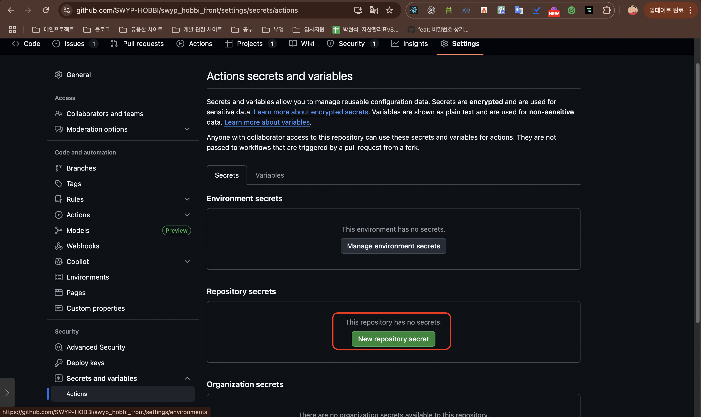
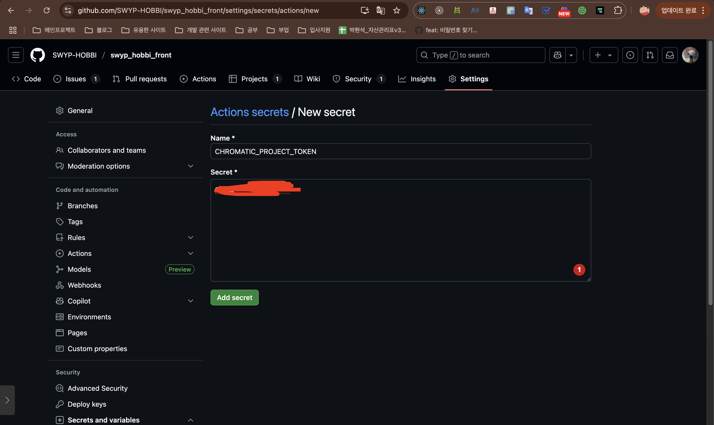
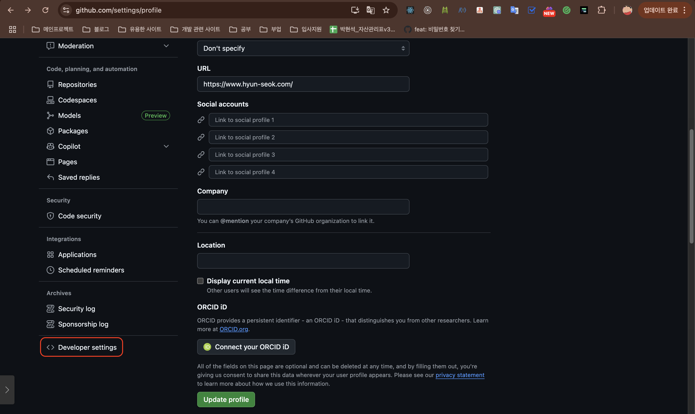
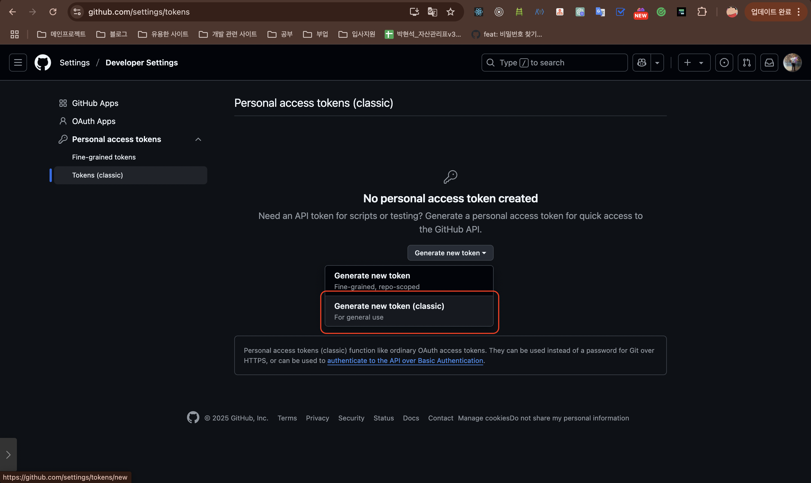
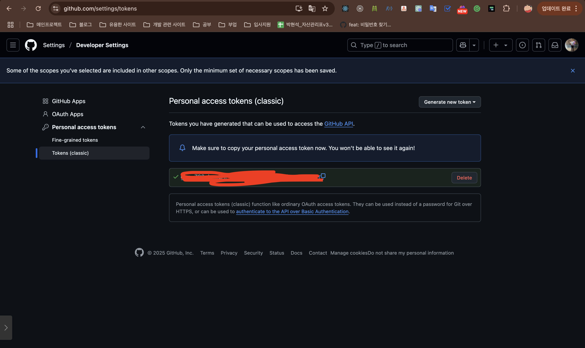
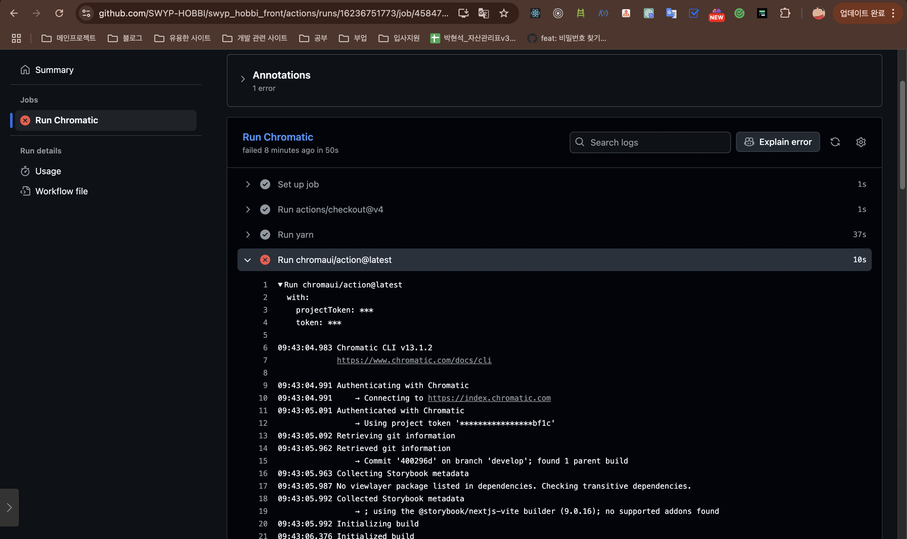
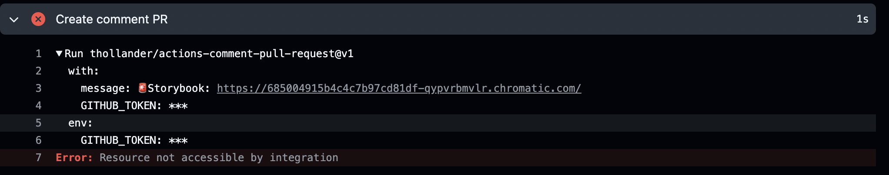
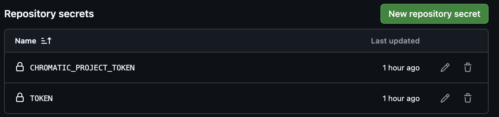
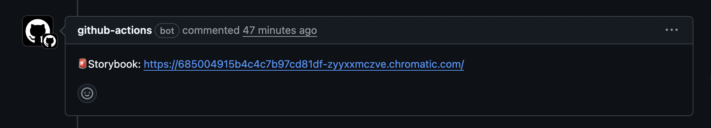

전에 이어서 storybook 배포를 진행해보았다면, CI 구축도 하면 좋을거 같아서 storybook 공식사이트에서 알려준 방법으로 차근차근 시도해 본 경험을 적어봤습니다.

# 크로마틱을 통한 지속적 배포(CI)하기

이제 프로젝트가 깃허브 저장소에 호스팅 되었으므로 자동으로 스토리북을 배포하기 위하여 지속적 통합(continuous integration, CI) 서비스를 이용할 수 있습니다. [GitHub Actions](https://github.com/features/actions)는 깃허브에 내장된 무료 CI 서비스로, 쉽게 자동으로 배포할 수 있도록 합니다.

### **스토리북을 배포하기 위해 깃허브 액션 추가하기**

프로젝트의 기본 폴더에 `.github`라는 새로운 디렉토리를 만들고 그 안에 `workflows`라는 디렉토리를 만들어주세요.

`chromatic.yml`이라는 파일을 아래와 같이 생성해주세요.

```tsx
# Workflow name
name: 'Chromatic Deployment'

# Event for the workflow
on: push

# List of jobs
jobs:
  chromatic:
    name: 'Run Chromatic'
    runs-on: ubuntu-latest
    # Job steps
    steps:
      - uses: actions/checkout@v4
        with:
          fetch-depth: 0
      - run: yarn
        #👇 Adds Chromatic as a step in the workflow
      - uses: chromaui/action@latest
        # Options required for Chromatic's GitHub Action
        with:
          #👇 Chromatic projectToken, see https://storybook.js.org/tutorials/intro-to-storybook/react/ko/deploy/ to obtain it
          projectToken: ${{ secrets.CHROMATIC_PROJECT_TOKEN }}
          token: ${{ secrets.TOKEN }}

```

- 스토리북 공식사이트에서 알려준대로 코드를 복사 붙여넣기를 했었다.

### CHROMATIC_PROJECT_TOKEN





- `CHROMATIC_PROJECT_TOKEN` 은 전에 배포하였을 때 받았던 토큰값을 사용하면 됩니다. [**스토리북(Storybook) 배포하기**](https://www.notion.so/Storybook-214469c31ecd80299efaeac2f298aab1?pvs=21)

### GITHUB_TOKEN








- 깃헙 토큰을 얻었으면 secrets에 크로마틱 토큰을 넣었던것 처럼 넣어줍니다.(저는 `TOKEN` 이라는 이름으로 넣었습니다.)

  

### 🚨npm을 사용할 때(Error)



- 설정을 하구 커밋과 푸쉬를 하였을 때 위에 사진처럼 에러가 발생한걸 볼 수 있습니다.
- 무슨 에러일까 찾아보다가 `run` 이 yarn으로 되어있는데 저희 프로젝트에서는 yarn을 사용하지 않고 npm을 사용하기 때문에 npm에 맞게끔 변경을 해줘야합니다.

  ```bash
      steps:
        - uses: actions/checkout@v4
          with:
            fetch-depth: 0

        - name: Setup Node.js
          uses: actions/setup-node@v4
          with:
            node-version: '20'
            cache: 'npm'

        - run: npm ci

        - name: Build Storybook
          run: npm run build-storybook
  ```

  - 버전은 20으로 했습니다. 18버전으로 했었는데 스토리북이 9 이상은 20이상부터여서 에러가 발생하여 20으로 바꿨습니다.

### 스토리북 배포 링크 PR comment 남기기

```bash
- name: Create comment PR
        if: github.event_name == 'pull_request'
        uses: thollander/actions-comment-pull-request@v3
        env:
          GITHUB_TOKEN: ${{ secrets.TOKEN }}
        with:
          message: '🚨Storybook: ${{ steps.chromatic.outputs.storybookUrl }}'

```



- push, pull_request 둘다 있는데 pull_request에서만 코멘트를 달기 때문에 if문을 넣어줬습니다.

### 🚨워크플로우 권한 설정(Error)



```bash
permissions:
  pull-requests: write
```

- PR 코멘트를 달려야하지만, 에러가 발생했었다.
- 찾아 보니깐 워크플로우 권한 설정 문제라는걸 찾았고 위에 코드를 설정해주니 에러가 해결하였습니다.

### 특정 파일에서만 CI 하기

```bash
on:
  push:
    branches: [main, develop]
    paths:
      - '.storybook/**'
      - 'src/**/*.stories.*'
      - 'src/**/*.mdx'
      - 'package.json'
  pull_request:
    branches: [main, develop]
    paths:
      - '.storybook/**'
      - 'src/**/*.stories.*'
      - 'src/**/*.mdx'
      - 'package.json'
```

- 처음에는 설정을 안했을 때 계속 CI를 체크했는데 불필요한거 같아서 사실 스토리북만을 위한 CI였기 때문에 paths를 지정하여 스토리북에 관한 경로만 추가하여 저 path가 변경할 때만 CI를 진행합니다.

### 전체 코드

```bash
name: 'Chromatic Deployment'

on:
  push:
    branches: [main, develop]
    paths:
      - '.storybook/**'
      - 'src/**/*.stories.*'
      - 'src/**/*.mdx'
      - 'package.json'
  pull_request:
    branches: [main, develop]
    paths:
      - '.storybook/**'
      - 'src/**/*.stories.*'
      - 'src/**/*.mdx'
      - 'package.json'

permissions:
  pull-requests: write

jobs:
  chromatic:
    name: 'Run Chromatic'
    runs-on: ubuntu-latest

    steps:
      - uses: actions/checkout@v4
        with:
          fetch-depth: 0

      - name: Setup Node.js
        uses: actions/setup-node@v4
        with:
          node-version: '20'
          cache: 'npm'

      - run: npm ci

      - name: Build Storybook
        run: npm run build-storybook

      - name: Run Chromatic
        id: chromatic
        uses: chromaui/action@latest
        with:
          projectToken: ${{ secrets.CHROMATIC_PROJECT_TOKEN }}
          token: ${{ secrets.TOKEN }}

      - name: Create comment PR
        if: github.event_name == 'pull_request'
        uses: thollander/actions-comment-pull-request@v3
        env:
          GITHUB_TOKEN: ${{ secrets.TOKEN }}
        with:
          message: '🚨Storybook: ${{ steps.chromatic.outputs.storybookUrl }}'

```

```toc

```
