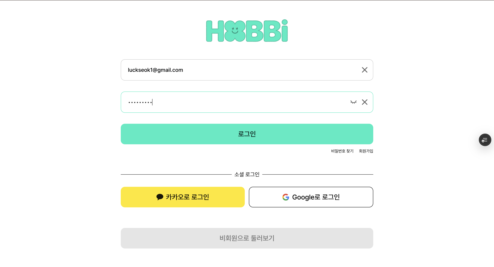
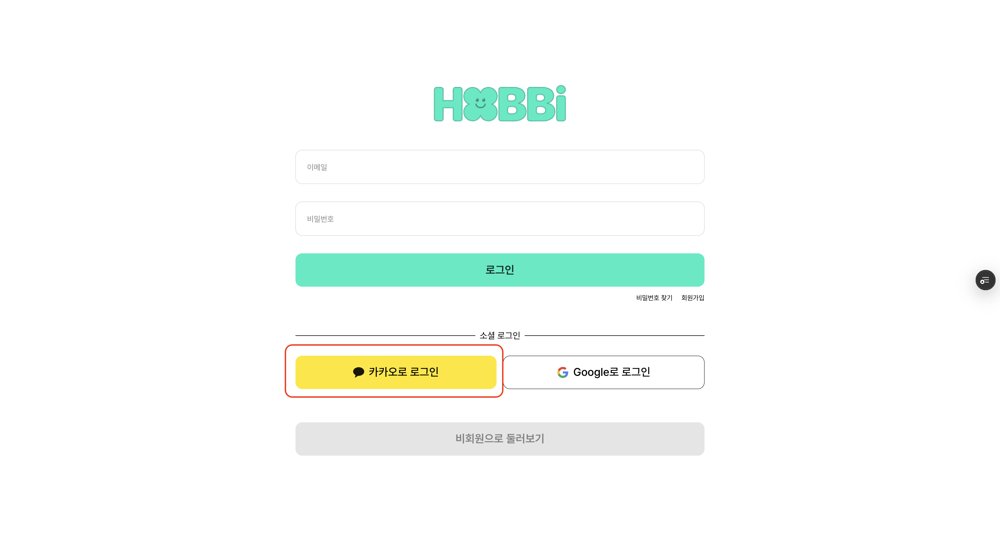
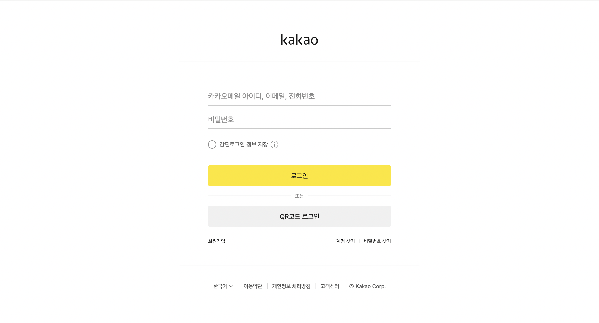
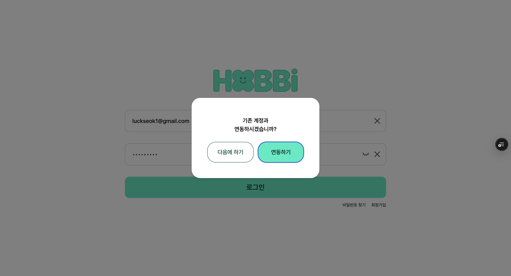
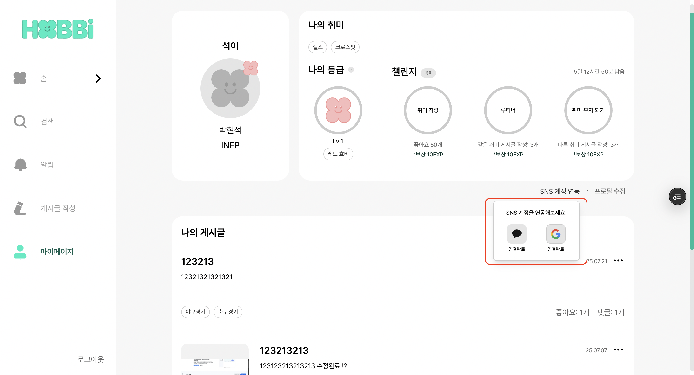
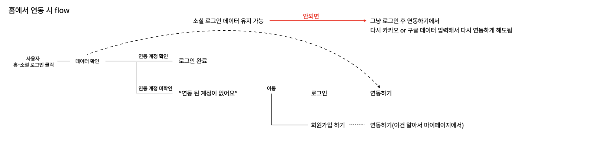

소셜 로그인 연동에 대해서 많은 공부가 되었고, 처음에는 연동하는 과정이 될까? 싶으면서도 막상 시나리오를 보고 개발해보니 이해하는게 어려웠지만, 좋은 경험을 기록해 봅니다.

# 로그인, 소셜 로그인(kakao, google)

프로젝트에서 로그인 & 소셜 로그인에 대한 로직 구현 설명 및 정리한 내용들 입니다.

(+소셜 로그인 연동에 대한 시나리오 흐름과 로직이 헷갈리고 어려웠음🥹)



기존 로그인에 대한 스크린샷

```tsx
const LoginSchema = z.object({
  email: z.string().email('유효한 이메일을 입력해주세요.'),
  password: z.string().min(8, '비밀번호는 8자 이상이어야 합니다.'),
});
```

- zod를 이용하여 유효성 검사를 합니다.
  - email: 이메일 형식 검증
  - password: 최소 8자 이상 검증

```tsx
type LoginFormError = Partial<Record<'email' | 'password', string>>;
```

- **Record Utility Type**
  - **Record<K, V>**: 키-값 쌍의 객체 타입을 생성
  - K: 키의 타입 ('email' | 'password')
  - V: 값의 타입 (string)
  - 결과: { email: string; password: string }
- **Partial Utility Type**
  - **Partial<T>**: 모든 속성을 선택적(optional)으로 만듦
  - ? 연산자를 모든 속성에 적용
  - 결과: { email?: string; password?: string }

```tsx
const handleChange = useCallback(
  (e: React.ChangeEvent<HTMLInputElement>) => {
    const { name, value } = e.target;

    setFormData((prev) => ({
      ...prev,
      [name]: value,
    }));

    if (isError) {
      setIsError(false);
      setErrorMessage(null);
    }

    if (name === 'email') {
      const result = LoginSchema.shape.email.safeParse(value);
      setFormError((prev) => ({
        ...prev,
        email: result.success ? undefined : result.error.errors[0].message,
      }));
    } else if (name === 'password') {
      const result = LoginSchema.shape.password.safeParse(value);
      setFormError((prev) => ({
        ...prev,
        password: result.success ? undefined : result.error.errors[0].message,
      }));
    }
  },
  [isError, setIsError, setErrorMessage],
);
```

```tsx
setFormData((prev) ⇒ {…prev, [name] : value})
```

- 기존 값을 유지하면서 `[name]` 에 따라 동적으로 값 업데이트
  - **예시**: { email: "user@example.com", password: "123456" }

```tsx
if (isError) {
  setIsError(false);
  setErrorMessage(null);
}
```

- 에러 상태 초기화

```tsx
const result = LoginSchema.shape.email.safeParse(value);
```

- 즉시 유효성 검사로 실시간으로 검증을 진행합니다.
  ```tsx
  setFormError((prev) => ({ ...prev, [name]: result.success ? undefined : result.error.errors[0].message }));
  ```
  - 성공시 에러메시지 `undefined` 실패시 에러메시지 보여주기.
- `useCallback` 을 사용하여 불필요한 리렌더링 방지 (의존성이 변경될 때만 함수 재생성)하여 최적화 해줍니다.

```tsx
const handleSubmit = useCallback(
  async (e: React.FormEvent<HTMLFormElement>) => {
    e.preventDefault();

    setIsLoading(true);
    setIsError(false);
    setErrorMessage(null);

    const result = LoginSchema.safeParse(formData);
    if (!result.success) {
      const fieldErrors: LoginFormError = {};
      result.error.errors.forEach((err) => {
        if (err.path[0]) fieldErrors[err.path[0] as keyof LoginFormError] = err.message;
      });
      setFormError(fieldErrors);
      setIsLoading(false);
      return;
    }

    try {
      const userData = await authService.login(formData.email, formData.password);

      setAuth(userData);
      router.push('/posts');
    } catch (error: any) {
      setIsError(true);

      if (error.data?.errorCode === 'USER_NOT_FOUND') {
        setErrorMessage('등록되지 않은 이메일입니다. 회원가입 후 이용해 주세요.');
      } else if (error.status === 401) {
        setErrorMessage('비밀번호가 일치하지 않습니다. 비밀번호를 다시 확인해 주세요.');
      } else {
        setErrorMessage('로그인 중 오류가 발생했습니다');
      }
    } finally {
      // 로딩 상태 종료
      setIsLoading(false);
    }
  },
  [formData, setIsLoading, setIsError, setErrorMessage, setAuth, router],
);
```

```tsx
e.preventDefault();
```

- 기본 폼 제출 방지(즉 새로고침 방지)

```tsx
setIsLoading(true);
setIsError(false);
setErrorMessage(null);
```

- 에러 및 로딩 상태 초기화

```tsx
const result = LoginSchema.safeParse(formData);
if (!result.success) {
  const fieldErrors: LoginFormError = {};
  result.error.errors.forEach((err) => {
    if (err.path[0]) fieldErrors[err.path[0] as keyof LoginFormError] = err.message;
  });
  setFormError(fieldErrors);
  setIsLoading(false);
  return;
}
```

- zod 유효성 검사

```tsx
// 입력 데이터
formData = { email: 'invalid', password: '123' };

// Zod 검증 결과
result.error.errors = [
  { path: ['email'], message: '유효한 이메일을 입력해주세요' },
  { path: ['password'], message: '비밀번호는 8글자 이상이어야 합니다' },
];

// 변환된 에러 객체
fieldErrors = {
  email: '유효한 이메일을 입력해주세요',
  password: '비밀번호는 8글자 이상이어야 합니다',
};
```

- 에러 처리 예시

```tsx
try {
  const userData = await authService.login(formData.email, formData.password);

  setAuth(userData);
  router.push('/posts');
} catch (error: any) {
  // 에러 처리
}
```

- API 호출 및 로그인 처리

```tsx
catch (error: any) {
  setIsError(true);

  if (error.data?.errorCode === 'USER_NOT_FOUND') {
    setErrorMessage('등록되지 않은 이메일입니다. 회원가입 후 이용해 주세요.');
  } else if (error.status === 401) {
    setErrorMessage('비밀번호가 일치하지 않습니다. 비밀번호를 다시 확인해 주세요.');
  } else {
    setErrorMessage('로그인 중 오류가 발생했습니다');
  }
}
```

- 에러 처리
- `useCallback` 최적화

## ⭐️⭐️⭐️소셜 로그인(소셜 연동 로직이 헷갈리고 어려웠음)⭐️⭐️⭐️

|             |             |
| ----------- | ----------- |
|  |  |

|                                                                                                                                     |                                       |
| ----------------------------------------------------------------------------------------------------------------------------------- | ------------------------------------- |
|  |  |

- 예시로 카카오로 데이터를 확인해서 연동이 되어있지 않으면 위 스크린샷처럼 따로 소셜 로그인으로 넘어가서 연동을 할 수 있음

- 마이페이지에서 연동도 가능

```tsx
const handleSocialLogin = async (provider: 'kakao' | 'google') => {
  try {
    // 소셜 로그인 URL 가져오기
    const loginUrl = authService.getSocialLoginUrl(provider);

    // 소셜 로그인 페이지로 리다이렉트
    window.location.href = loginUrl;
  } catch (error: any) {
    console.error('소셜 로그인 에러:', error);
    openModal({
      title: '오류',
      message: '소셜 로그인 중 오류가 발생했습니다.',
      confirmText: '확인',
    });
  }
};
```

```tsx
  getSocialLoginUrl: (provider: 'kakao' | 'google') => {
    // 환경 변수에서 OAuth 설정 가져오기
    const KAKAO_CLIENT_ID = process.env.NEXT_PUBLIC_KAKAO_REST_API_KEY;
    const GOOGLE_CLIENT_ID = process.env.NEXT_PUBLIC_GOOGLE_CLIENT_ID;
    const BASE_URL = process.env.NEXT_PUBLIC_URL;

    // OAuth2 콜백 URL 생성
    // 서버의 OAuth2 콜백 엔드포인트 형식에 맞게 설정
    const REDIRECT_URI = `${BASE_URL}/oauth/callback/${provider}`;

    // 제공자별 OAuth URL 생성
    const urls = {
      kakao: `https://kauth.kakao.com/oauth/authorize?client_id=${KAKAO_CLIENT_ID}&redirect_uri=${REDIRECT_URI}&response_type=code`,
      google: `https://accounts.google.com/o/oauth2/v2/auth?client_id=${GOOGLE_CLIENT_ID}&redirect_uri=${REDIRECT_URI}&response_type=code&scope=email profile`,
    };

    return urls[provider];
  },
```

- 소셜 로그인 URL 생성

**플로우 전체 과정을 설명 드리겠습니다. (예시 카카오)**

1. 소셜 로그인 시작

```tsx
// 사용자가 "카카오로 로그인" 버튼 클릭
handleSocialLogin('kakao');

// 결과: https://kauth.kakao.com/oauth/authorize?client_id=...&redirect_uri=...
window.location.href = loginUrl;
```

1. 소셜 서비스 인증

   사용자 → 카카오 로그인 페이지 → 카카오 계정으로 로그인 → 권한 승인

2. 콜백 처리

   카카오 → 애플리케이션 콜백 URL → 인증 코드 전달 → 서버에서 토큰 교환

3. 로그인 성공

## ⭐️⭐️⭐️소셜 로그인 콜백 페이지⭐️⭐️⭐️

- 소셜 로그인 인증 후 OAuth 제공자로부터 리다이렉트되는 콜백 페이지

### 주요 기능

1. OAuth 인가 코드 처리
2. 소셜 로그인 API 호출
3. 기존 계정 연동 처리
4. 신규 사용자 회원가입 안내
5. 에러 처리 및 사용자 피드백

### ⭐️⭐️⭐️시나리오⭐️⭐️⭐️



1. 사용자가 소셜 로그인 버튼 클릭
2. OAuth 제공자 인증 페이자로 이동
3. 사용자 인증 완료 후 이 콜백 페이지로 리다이렉트
4. URL 파라미터에서 인가 코드 추출
5. 인가 코드로 소셜 로그인 API 호출
6. 응답에 따른 분기 처리
   1. 기존 계정 존재 : 로그인 완료
   2. 신규 사용자 : 회원가입 안내 또는 계정 연동

```tsx
type Provider = 'kakao' | 'google';
```

```tsx
type Props = {
  params: Promise<{
    provider: Provider; // URL 경로에서 추출된 소셜 로그인 제공자
  }>;
};
```

```tsx
const searchParams = useSearchParams();
```

- code : OAuth 인가 코드
- state : 요청 시 전달한 상태값(마이페이지, 일반 소셜 로그인)

```tsx
useEffect(() => {
  const handleCallback = async () => {
    // ===== URL 파라미터 추출 및 출처 구분 =====
    const state = searchParams.get('state');
    const isFromMyPage = state === 'mypage'; // 마이페이지에서 온 경우 구분

    try {
      // ===== 동적 라우팅 파라미터 해결 =====
      const resolvedParams = await params;
      const code = searchParams.get('code');

      // ===== 인가 코드 유효성 검사 =====
      if (!code) {
        throw new Error('인가 코드가 없습니다.');
      }

      // ===== 제공자별 소셜 로그인 API 호출 =====
      const loginMethod =
        resolvedParams.provider === 'kakao'
          ? authService.kakaoLogin // 카카오 로그인
          : authService.googleLogin; // 구글 로그인

      const response = await loginMethod(code);

      // ===== API 응답 유효성 검사 =====
      if (!response) {
        throw new Error('소셜 로그인 처리 중 오류가 발생했습니다.');
      }

      // ===== 응답에 따른 분기 처리 =====
      if (!response.accessToken) {
        // ===== 기존 계정이 없는 경우 (신규 사용자 또는 연동 필요) =====

        if (isFromMyPage) {
          // ===== 마이페이지에서 온 경우: 계정 연동 시도 =====
          openModal({
            message: '기존 계정과\n연동하시겠습니까?',
            confirmText: '연동하기',
            cancelText: '다음에 하기',
            showCancelButton: true,
            onConfirm: async () => {
              try {
                // ===== 계정 연동 API 호출 =====
                await authService.linkSocialAccount();

                // ===== 연동 성공 시 마이페이지로 이동 =====
                router.push('/my_page');
              } catch (error) {
                // ===== 연동 실패 시 에러 처리 =====
                openModal({
                  title: '오류',
                  message: '계정 연동 중 오류가 발생했습니다.',
                  confirmText: '확인',
                  cancelText: '닫기',
                  showCancelButton: true,
                  onConfirm: () => {
                    // ===== 에러 확인 후 소셜 로그인 페이지로 이동 (재시도 가능) =====
                    router.push('/login/social');
                  },
                });
              }
            },
            onCancel: () => {
              // ===== 연동 건너뛰기 시 마이페이지로 이동 =====
              router.push('/my_page');
            },
          });
        } else {
          // ===== 일반 소셜 로그인의 경우: 회원가입 안내 =====
          openModal({
            title: '연동된 계정이 없습니다',
            message: '회원가입을 하시겠습니까?',
            confirmText: '회원가입',
            cancelText: '로그인하기',
            showCancelButton: true,
            onConfirm: () => {
              // ===== 회원가입 선택 시 회원가입 페이지로 이동 =====
              router.push('/signup');
            },
            onCancel: () => {
              // ===== 로그인 선택 시 소셜 로그인 페이지로 이동 =====
              router.push('/login/social');
            },
          });
        }
      } else {
        // ===== 기존 계정이 있는 경우: 로그인 완료 =====

        // ===== 인증 상태 설정 =====
        setAuth({
          accessToken: response.accessToken,
          refreshToken: response.refreshToken || '',
          userId: response.userId || 0,
        });

        // ===== 로그인 성공 시 메인 페이지로 이동 =====
        router.push('/posts');
      }
    } catch (error: any) {
      // ===== 에러 처리 =====
      openModal({
        title: '오류',
        message: '소셜 로그인 처리 중 오류가 발생했습니다.',
        confirmText: '확인',
        showCancelButton: false,
        onConfirm: () => {
          // ===== 출처에 따른 에러 후 페이지 이동 =====
          router.push(isFromMyPage ? '/my_page' : '/login/social');
        },
      });
    }
  };

  // ===== 콜백 처리 함수 실행 =====
  handleCallback();
}, [params, searchParams, router, openModal, setAuth]);
```

- 컴포넌트 마운트 시 OAuth 콜백 처리
- 소셜 로그인 인증 후 리다이렉트되는 즉시 실행되는 핵심 로직
- 처리 과정
  - URL 파라미터에서 인가 코드와 상태값 추출
  - 출처 구분(마이페이지 vs 일반 소셜 로그인)
  - 소셜 로그인 API 호출
  - 응답에 따른 분기 처리
  - 에러 처리 및 사용자 피드백

```tsx
  kakaoLogin: async (code: string): Promise<SocialLoginResponse> => {
    return fetchApi(`/oauth/login/kakao?code=${code}`, {
      method: 'GET',
    });
  },
```

```tsx
  googleLogin: async (code: string): Promise<SocialLoginResponse> => {
    return fetchApi(`/oauth/login/google?code=${code}`, {
      method: 'GET',
    });
  },
```

```toc

```
