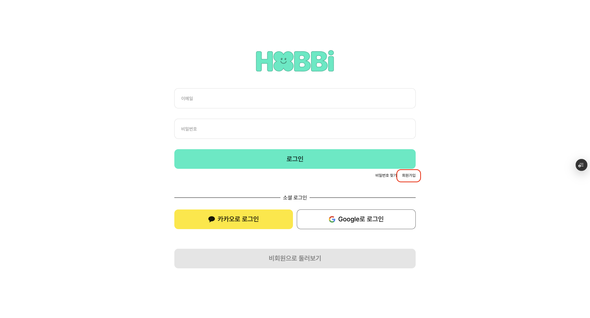
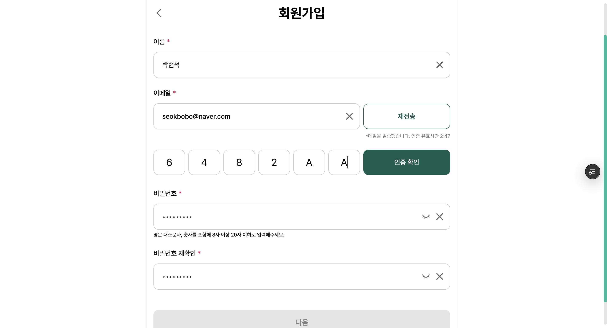
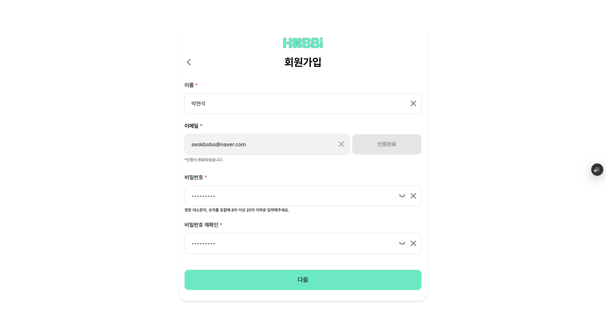
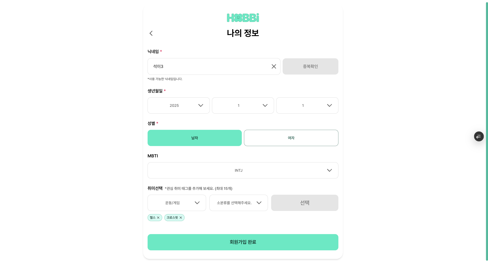

회원가입에 대한 1단계, 2단계 스텝별로 회원가입을 적용시킬 수 있어서 좋은 경험이었고, 사용자 관점에 대해서 많이 생각할 수 있어서(이메일 자동 인증 -> 이메일 코드 인증) 기록해 봅니다.

# 회원가입

|             |             |
| ----------- | ----------- |
|  |  |

|             |             |
| ----------- | ----------- |
|  |  |

### 주요 기능

1. 회원가입 단계별 폼 관리(총 2가지 1. 기본 정보 → 2. 상세 정보)
2. 회원가입 데이터 상태 관리 및 유효성 검사
3. 일반 회원가입과 소셜 회원가입 구분 처리
4. 회원가입 완료 후 인증 상태 설정
5. 성공/실패 피드백 및 페이지 이동

### 프로세스

1. 기본 정보 입력 (이름, 이메일, 이메일 인증, 비밀번호, 비밀번호 확인)
2. 상세 정보 입력 (닉네임, 생년 월일, 성별, MBTI, 취미)
3. API 호풀을 통한 회원가입 완료
4. 인증 상태 설정 및 메인 페이지 이동

```tsx
const { setAuth } = useAuthStore();
```

- Auth Store에서 인증 상태 설정 함수 가져오기
- 회원가입 완료 후 사용자 인증 상태를 설정하는데 사용

```tsx
const resetSelections = useHobbyStore((state) => state.resetSelections);
```

- 취미 선택 초기화 함수
- 회원가입 완료 후 취미 선택 상태를 초기화하는데 사용

```tsx
const {
  signupStep, // 현재 회원가입 단계 ('signup' | 'userInfo')
  signupData, // 회원가입 데이터
  setSignupStep, // 회원가입 단계 설정 함수
  updateSignupData, // 회원가입 데이터 업데이트 함수
  resetSignup, // 회원가입 상태 초기화 함수
} = useSignupStore();
```

```tsx
const handleSignup = (data: SignupFormData) => {
  updateSignupData(data);
  setSignupStep('userInfo');
};
```

- 회원가입 폼에서 제출된 기본 정보를 처리
- 처리 과정
  - 1단계 : 제출된 데이터를 스토어에 업데이트
  - 2단계 : 회원가입 단계를 ‘userInfo’로 변경
  - 3단계 : 2단계 상세 정보 입력 폼으로 이동
- data → 1단계에서 제출된 기본 정보 (이름, 이메일, 비밀번호 등)

```tsx
const handleUserInfo = async (data: UserInfoFormData) => {
  try {
    // ===== 상세 정보 스토어 업데이트 =====
    updateSignupData(data);

    // ===== 최신 회원가입 데이터 가져오기 =====
    const currentSignupData = useSignupStore.getState().signupData;

    // ===== 일반 회원가입과 소셜 회원가입 구분 =====
    const isSocialSignup = currentSignupData.socialProvider && currentSignupData.socialId;

    // ===== API 호출을 통한 회원가입 완료 =====
    const userData: LoginResponse = await authService.signup({
      ...currentSignupData,
      // 소셜 회원가입의 경우 password 관련 필드 제외
      // 일반 회원가입의 경우 password 필드 포함
      ...(isSocialSignup
        ? {}
        : {
            username: currentSignupData.username!,
            password: currentSignupData.password!,
            passwordConfirm: currentSignupData.passwordConfirm!,
          }),
    });

    // ===== 회원가입 관련 임시 데이터 정리 =====
    localStorage.removeItem('signup-storage');
    if (!isSocialSignup) {
      // 일반 회원가입의 경우에만 이메일 인증 관련 데이터 정리
      localStorage.removeItem('verifiedEmail');
      localStorage.removeItem('emailVerified');
    }

    // ===== 인증 상태 설정 (hobbyTags 포함) =====
    setAuth(userData);

    // ===== 회원가입 성공 모달 표시 =====
    openModal({
      title: '환영합니다!',
      message: '회원가입이 완료되었어요.',
      confirmText: '확인',
      onConfirm: () => {
        // ===== 상태 초기화 및 페이지 이동 =====
        resetSignup(); // 회원가입 상태 초기화
        resetSelections(); // 취미 선택 상태 초기화
        router.push('/posts'); // 메인 페이지로 이동
      },
    });
  } catch (error) {
    // ===== 에러 처리 =====
    console.error('회원가입 에러:', error);
    openModal({
      title: '오류',
      message: '회원가입 중 오류가 발생했습니다.',
      confirmText: '확인',
    });
  }
};
```

- 사용자 상세 정보 제출 및 회원가입 완료 핸들러
- 회원가입 폼에서 제출된 상세 정보를 처리하고 최정 회원가입 API 호출을 수행
- 처리 과정
  - 1단계 : 제출된 상세 정보를 스토어에 업데이트
  - 2단계 : 일반 회원가입과 소셜 회원가입 구분
  - 3단계 : API 호출을 통한 회원가입 완료
  - 4단계 : 임시 데이터 정리(localStorage)
  - 5단계 : 인증 상태 설정
  - 6단계 : 성공 모달 표시 및 메인 페이지 이동
- data → 상세 정보 데이터 (닉네임, 생년월일, 성별, MBTI, 취미)

```tsx
const handlePrevStep = () => {
  // 소셜 로그인 사용자는 이전 단계로 돌아갈 수 없음
  if (signupData.socialProvider) {
    router.push('/');
    return;
  }
  setSignupStep('signup');
};
```

- 2단계(상세 정보)에서 1단계(기본 정보) 돌아가는 기능
- 단 소셜 로그인 사용자는 이전 단계로 돌아갈 수 없음
- 소셜 로그인 사용자의 경우 홈페이지로 이동
- 일반 회원가입 사용자의 경우 1단계로 이동

```tsx
useEffect(() => {
  // ===== 스토어 초기화 =====
  resetSignup();

  // ===== 로컬스토리지 초기화 =====
  localStorage.removeItem('emailVerified');
  localStorage.removeItem('verifiedEmail');
}, [resetSignup]);
```

- useEffect로 컴포넌트 마운트 시 초기화 작업
- 회원가입 페이지에 진입할 때마다 실행되는 초기화 로직

1. 회원가입 스토어 상태 초기화
2. 이메일 인증 관련 localStorage 데이터 정리

---

## 1단계 기본 정보(signup_form) 이메일 인증 자동

```tsx
{
  signupStep === 'signup' ? (
    // 1단계: 기본 정보 입력 폼
    <SignupForm onSubmit={handleSignup} onBackButton={handleBackButton} />
  ) : (
    // 2단계: 상세 정보 입력 폼
    <UserInfoForm onSubmit={handleUserInfo} onPrevStep={handlePrevStep} />
  );
}
```

SignupForm 에 대해서 입니다.

```tsx
/**
 * 회원가입 폼 Props 인터페이스
 *
 * @param onSubmit - 회원가입 데이터가 유효성 검사를 통과했을 때 호출되는 콜백 함수
 *                   부모 컴포넌트에서 다음 단계로 진행하는 로직을 처리
 * @param onBackButton - 이전 단계로 이동할 때 호출되는 콜백 함수
 *                       회원가입 프로세스에서 뒤로 가기 기능을 제공
 */
```

```tsx
const SignupSchema = z
  .object({
    username: z
      .string()
      .min(2, '이름은 2자 이상이어야 합니다.')
      .max(10, '이름은 10자 이하여야 합니다.')
      .regex(/^[가-힣a-zA-Z]+$/, '이름은 한글 또는 영문만 입력 가능합니다.'),
    email: z.string().email('유효한 이메일을 입력해주세요.'),
    password: z
      .string()
      .min(8, '* 비밀번호는 8자 이상이어야 합니다.')
      .max(20, '* 비밀번호는 20자 이하여야 합니다.')
      .regex(/[A-Z]/, '* 영문 대문자를 포함해야 합니다.')
      .regex(/[a-z]/, '* 영문 소문자를 포함해야 합니다.')
      .regex(/[0-9]/, '* 숫자를 포함해야 합니다.'),
    passwordConfirm: z.string(),
  })
  .refine((data) => data.password === data.passwordConfirm, {
    message: '* 비밀번호가 일치하지 않습니다.',
    path: ['passwordConfirm'], // 에러가 발생한 필드 지정
  });
```

- 회원가입 폼 전체 데이터 유효성 검사를 위한 zod 스키마
- 각 필드별 검증 규칙
  - username : 2-10자, 한글/영문만 허용
  - email : 유효한 이메일 형식
  - password : 8-20자, 영문 대소문자 + 숫자 포함
  - passwordConfirm: password와 일치 여부 확인

### 주요 기능

1. 사용자 기본 정보 입력(이름, 이메일, 이메일 인증, 비밀번호, 비밀번호 확인)
2. 이메일 인증 시스템 (인증 메일 전송, 재전송, 타이머)
3. 실시간 유효성 검사 (Zod 스키마 기반)
4. 단계별 회원가입 프로세스

```tsx
const {
  signupData, // 회원가입 폼 데이터
  updateSignupData, // 폼 데이터 업데이트 함수
  isEmailVerified, // 이메일 인증 완료 여부
  isLoading, // 로딩 상태
  isError, // 에러 발생 여부
  errorMessage, // 에러 메시지
} = useSignupStore();
```

```tsx
const { isEmailSent, emailTimer, formatTime, checkEmailAndSendVerification } = useEmailVerification();
```

- 이메일 인증 관련 기능을 제공하는 커스텀 훅

```tsx
const handleChange = useCallback(
  (e: React.ChangeEvent<HTMLInputElement | HTMLSelectElement>) => {
    const { name, value } = e.target;

    // 스토어의 폼 데이터 업데이트
    updateSignupData({ [name]: value });

    const nextData = { ...signupData, [name]: value };
    const result = SignupSchema.safeParse(nextData);

    // ===== 비밀번호 관련 필드 특별 처리 =====
    if (name === 'password' || name === 'passwordConfirm') {
      // 비밀번호 변경 시 전체 스키마로 검증 (일치 여부 확인을 위해)

      setFormError((prev) => ({
        ...prev,
        password: result.success ? undefined : result.error.errors.find((e) => e.path[0] === 'password')?.message,
        passwordConfirm: !nextData.passwordConfirm
          ? undefined // 비밀번호 확인이 비어있으면 에러 표시하지 않음
          : result.success
          ? undefined
          : result.error.errors.find((e) => e.path[0] === 'passwordConfirm')?.message,
      }));
      return;
    }

    // ===== 개별 필드 실시간 유효성 검사 =====
    if (name === 'username') {
      setFormError((prev) => ({
        ...prev,
        username: result.success ? undefined : result.error.errors.find((e) => e.path[0] === 'username')?.message,
      }));
    } else if (name === 'email') {
      setFormError((prev) => ({
        ...prev,
        email: result.success ? undefined : result.error.errors.find((e) => e.path[0] === 'email')?.message,
      }));
    }
  },
  [signupData, updateSignupData],
);
```

- 입력 필드 변경 핸들러
- 스토어의 폼 데이터 업데이트
- 실시간 유효성 검사 수행
- 에러 상태 업데이트

```tsx
const isFormValid = useCallback(() => {
  const result = SignupSchema.safeParse(signupData);
  return result.success && isEmailVerified; // 모든 검증 통과 + 이메일 인증 완료
}, [signupData, isEmailVerified]);
```

- 폼 전체 유효성 검사 함수
- 제출 버튼 활성화 여부를 결정하는데 사용

```tsx
const handleSubmit = useCallback(
  (e: React.FormEvent) => {
    e.preventDefault(); // 기본 폼 제출 동작 방지

    // ===== Zod 전체 폼 유효성 검사 =====
    const result = SignupSchema.safeParse(signupData);
    if (!result.success) {
      // 유효성 검사 실패 시 필드별 에러 메시지 설정
      const fieldErrors: SignupFormError = {};
      result.error.errors.forEach((err) => {
        if (err.path[0]) fieldErrors[err.path[0] as keyof SignupFormData] = err.message;
      });
      setFormError(fieldErrors);
      return;
    }

    // ===== 이메일 인증 확인 =====
    if (!isEmailVerified) {
      setFormError((prev) => ({
        ...prev,
        email: '이메일 인증이 필요합니다.',
      }));
      return;
    }

    // ===== 검증 통과 시 부모 컴포넌트에 데이터 전달 =====
    onSubmit(result.data);
  },
  [signupData, isEmailVerified, onSubmit],
);
```

- 폼 제출 핸들러 회원가입 데이터를 최종 검증하고 부모 컴포넌트에 전달합니다.
- 검증 단계
  - Zod 스키마를 통한 전체 데이터 유효성 검사
  - 이메일 인증 완료 여부 확인
  - 검증 통과 시 부모 컴포넌트에 데이터 전달

## 이메일 인증 (코드 6자리) 변경

원래는 이메일에서 확인하여 로컬스토리지에 값을 담아 이메일 인증이 완료되도록 되어있었지만, 바꾸게 된 계기는 모바일에서는 이메일인증을 사용할 수 없기에 코드 6자리로 변경하게 되었습니다.

```tsx
const SignupSchema = z
  .object({
    username: z
      .string()
      .min(2, '* 이름은 2자 이상이어야 합니다.')
      .max(10, '* 이름은 10자 이하여야 합니다.')
      .regex(/^[가-힣a-zA-Z]+$/, '* 이름은 한글 또는 영문만 입력 가능합니다.'),
    email: z.string().email('* 유효한 이메일을 입력해주세요.'),
    password: z
      .string()
      .min(8, '* 비밀번호는 8자 이상이어야 합니다.')
      .max(20, '* 비밀번호는 20자 이하여야 합니다.')
      .regex(/[A-Z]/, '* 영문 대문자를 포함해야 합니다.')
      .regex(/[a-z]/, '* 영문 소문자를 포함해야 합니다.')
      .regex(/[0-9]/, '* 숫자를 포함해야 합니다.'),
    passwordConfirm: z.string(),
    **verificationCode: z.string().optional(),
    isEmailVerified: z.boolean().optional(),**
  })
  **.refine(
    (data) =>
      data.isEmailVerified ||
      (data.verificationCode && data.verificationCode.length === 6),
    {
      message: '* 인증 코드는 6자리여야 합니다.',
      path: ['verificationCode'],
    },
  )**
  .refine((data) => data.password === data.passwordConfirm, {
    message: '* 비밀번호가 일치하지 않습니다.',
    path: ['passwordConfirm'],
  });
```

- 코드 6자리를 받아야하기에 zod도 맞게끔 변경해주었습니다.

```tsx
const handleVerifyCode = useCallback(async () => {
  if (!signupData.verificationCode || signupData.verificationCode.length !== 6) {
    setFormError((prev) => ({
      ...prev,
      verificationCode: '* 6자리 인증 코드를 입력해주세요.',
    }));
    return;
  }

  try {
    setIsLoading(true);
    setIsError(false);
    setErrorMessage(null);

    // 인증 코드 확인 API 호출
    await authService.verifyEmail(signupData.verificationCode, signupData.email);

    // 인증 성공 시 상태 업데이트
    setIsEmailVerified(true);
    setIsEmailSent(false);
    setEmailTimer(0);

    // 인증 코드 필드 초기화
    updateSignupData({ verificationCode: '' });

    // 에러 상태 초기화
    setFormError((prev) => ({
      ...prev,
      verificationCode: undefined,
    }));
  } catch (error) {
    setIsError(true);
    setErrorMessage(error instanceof Error ? error.message : '인증 코드 확인 중 오류가 발생했습니다.');
    setFormError((prev) => ({
      ...prev,
      verificationCode: '* 인증 코드가 올바르지 않습니다.',
    }));
  } finally {
    setIsLoading(false);
  }
}, [
  signupData.verificationCode,
  signupData.email,
  setIsLoading,
  setIsError,
  setErrorMessage,
  setIsEmailVerified,
  setIsEmailSent,
  setEmailTimer,
  updateSignupData,
]);
```

- 인증 코드 확인 핸들러
- 사용자가 입력한 6자리 인증 코드를 서버에 전송하여 이메일 인증을 완료합니다.
- 처리 과정
  - 인증 코드 유효성 검사
  - 서버에 인증 코드 전송
  - 인증 성공 시 이메일 인증 상태 업데이트
  - 에러 처리 및 상태 정리

### 이메일 인증 코드 input

```tsx
import React, { useRef } from 'react';

/**
 * 인증 코드 입력 컴포넌트의 Props 인터페이스
 */
interface VerificationCodeInputProps {
  value: string; // 현재 입력된 값
  onChange: (value: string) => void; // 값이 변경될 때 호출되는 콜백 함수
  length?: number; // 입력 필드의 개수 (기본값: 6)
  disabled?: boolean; // 입력 필드 비활성화 여부 (기본값: false)
}

/**
 * 인증 코드 입력 컴포넌트
 *
 * 특징:
 * - 각 자리마다 개별 input 필드 제공
 * - 숫자와 영문자만 입력 가능
 * - 자동으로 다음 필드로 포커스 이동
 * - 백스페이스로 이전 필드로 이동
 * - 복사붙여넣기 지원
 *
 * @param value - 현재 입력된 값
 * @param onChange - 값 변경 시 호출되는 콜백
 * @param length - 입력 필드 개수 (기본값: 6)
 * @param disabled - 비활성화 여부 (기본값: false)
 */
const VerificationCodeInput: React.FC<VerificationCodeInputProps> = ({
  value,
  onChange,
  length = 6,
  disabled = false,
}) => {
  // 각 input 필드에 대한 ref 배열 (포커스 제어용)
  const inputsRef = useRef<Array<HTMLInputElement | null>>([]);

  /**
   * 개별 input 필드의 값 변경을 처리하는 핸들러
   *
   * 동작 방식:
   * 1. 입력된 값에서 숫자와 영문자만 추출
   * 2. 값이 비어있으면 해당 위치의 문자를 삭제
   * 3. 값이 있으면 해당 위치에 마지막 문자를 삽입
   * 4. 다음 필드로 자동 포커스 이동
   *
   * @param e - input change 이벤트
   * @param idx - 현재 input 필드의 인덱스
   */
  const handleInputChange = (e: React.ChangeEvent<HTMLInputElement>, idx: number) => {
    // 입력된 값에서 숫자(0-9)와 영문자(a-z, A-Z)만 허용하고 나머지는 제거
    const val = e.target.value.replace(/[^0-9a-zA-Z]/g, '');

    if (!val) {
      // 입력이 지워진 경우: 해당 위치의 문자를 빈 문자열로 교체
      const newValue = value.substring(0, idx) + '' + value.substring(idx + 1);
      onChange(newValue);
      return;
    }

    // 한 글자만 입력: 마지막 문자를 추출하여 해당 위치에 삽입
    const char = val.slice(-1);
    const newValue = value.substring(0, idx) + char + value.substring(idx + 1);
    onChange(newValue);

    // 다음 input으로 포커스 이동 (마지막 필드가 아닌 경우에만)
    if (char && idx < length - 1) {
      inputsRef.current[idx + 1]?.focus();
    }
  };

  /**
   * 키보드 이벤트를 처리하는 핸들러 (주로 백스페이스 처리)
   *
   * 동작 방식:
   * - 현재 필드가 비어있고 백스페이스를 누르면 이전 필드로 포커스 이동
   * - 이를 통해 사용자가 연속적으로 백스페이스로 이전 필드들을 지울 수 있음
   *
   * @param e - 키보드 이벤트
   * @param idx - 현재 input 필드의 인덱스
   */
  const handleKeyDown = (e: React.KeyboardEvent<HTMLInputElement>, idx: number) => {
    if (e.key === 'Backspace' && !value[idx] && idx > 0) {
      // 현재 칸이 비어있고 백스페이스를 누르면 이전 칸으로 포커스 이동
      inputsRef.current[idx - 1]?.focus();
    }
  };

  /**
   * 붙여넣기 이벤트를 처리하는 핸들러
   *
   * 동작 방식:
   * 1. 클립보드에서 텍스트 데이터를 가져옴
   * 2. 숫자와 영문자만 추출하고 지정된 길이만큼 자름
   * 3. 추출된 데이터로 전체 값을 업데이트
   * 4. 적절한 위치로 포커스 이동
   *
   * 예시:
   * - 붙여넣은 텍스트: "ABC123XYZ"
   * - length가 6인 경우: "ABC123"만 사용
   * - length가 8인 경우: "ABC123XY"만 사용
   *
   * @param e - 붙여넣기 이벤트
   */
  const handlePaste = (e: React.ClipboardEvent<HTMLInputElement>) => {
    // 기본 붙여넣기 동작을 방지 (브라우저 기본 동작 대신 커스텀 처리)
    e.preventDefault();

    // 클립보드에서 텍스트 데이터를 가져옴
    const pastedData = e.clipboardData.getData('text');

    // 숫자와 영문자만 추출하고, 지정된 길이만큼 자름
    const cleanedData = pastedData
      .replace(/[^0-9a-zA-Z]/g, '') // 숫자와 영문자가 아닌 문자 제거
      .slice(0, length); // 지정된 길이만큼만 사용

    if (cleanedData) {
      // 추출된 데이터로 전체 값을 업데이트
      onChange(cleanedData);

      // 적절한 위치로 포커스 이동
      if (cleanedData.length === length) {
        // 모든 필드가 채워진 경우: 마지막 필드로 포커스
        inputsRef.current[length - 1]?.focus();
      } else {
        // 일부만 채워진 경우: 다음 빈 필드로 포커스
        inputsRef.current[cleanedData.length]?.focus();
      }
    }
  };

  return (
    <div className='flex gap-2 items-center w-full'>
      {/* 지정된 길이만큼 input 필드들을 생성 */}
      {Array.from({ length }).map((_, idx) => (
        <input
          key={idx}
          // 각 input 필드를 ref 배열에 저장 (포커스 제어용)
          ref={(el) => {
            inputsRef.current[idx] = el;
          }}
          type='text'
          inputMode='numeric' // 모바일에서 숫자 키패드 표시
          maxLength={1} // 한 글자만 입력 가능
          className='w-full h-[60px] max-md:h-12 border border-grayscale-20 rounded-lg text-center text-2xl outline-none transition-colors'
          value={value[idx] || ''} // 현재 위치의 문자 또는 빈 문자열
          onChange={(e) => handleInputChange(e, idx)} // 값 변경 핸들러
          onKeyDown={(e) => handleKeyDown(e, idx)} // 키보드 이벤트 핸들러
          onPaste={handlePaste} // 붙여넣기 핸들러
          disabled={disabled} // 비활성화 여부
        />
      ))}
    </div>
  );
};

export default VerificationCodeInput;
```

## 2단계 상세 정보(user_info_form)

```tsx
 * @param onSubmit - 회원가입 상세 정보가 유효성 검사를 통과했을 때 호출되는 콜백 함수
 *                   부모 컴포넌트에서 최종 회원가입 처리를 담당
 * @param onPrevStep - 이전 단계로 이동할 때 호출되는 콜백 함수
 *                       회원가입 프로세스에서 뒤로 가기 기능을 제공
```

```tsx
const UserInfoSchema = z.object({
  nickname: z
    .string()
    .min(2, '닉네임은 2자 이상이어야 합니다.')
    .max(10, '닉네임은 10자 이하여야 합니다.')
    .regex(/^[^!@#$%^&*(),.?":{}|<>\s]+$/, '특수문자와 공백은 사용할 수 없습니다.'),
  birthYear: z.number().min(1900, '올바른 년도를 선택해주세요.'),
  birthMonth: z.number().min(1, '월을 선택해주세요.').max(12, '월을 선택해주세요.'),
  birthDay: z.number().min(1, '일을 선택해주세요.').max(31, '일을 선택해주세요.'),
  gender: z.enum(['남성', '여성'], { message: '성별을 선택해주세요.' }),
  mbti: z.string().optional(), // 선택사항
  hobbyTags: z.array(z.string()).max(15, '최대 15개까지 선택 가능합니다.'),
});
```

- 회원가입 상세 정보 유효성 검사를 위한 Zod 스키마
- 각 필드별 검증 규칙
  - nickname : 2-10자, 특수문자/공백 제외
  - birthYear : 1900년 이상
  - birthMonth : 1-12월
  - birthDay : 1-31일
  - gender: ‘남성’ 또는 ‘여성’ 중 선택
  - mbti : 선택사항(optional)
  - hobbyTags : 최대 15개 까지 선택 가능

### 주요 기능

1. 닉네임 입력 및 실시간 중복 검사
2. 생년월일 선택 (년/월/일 드롭다운)
3. 성별 선택 (남성/여성 버튼)
4. MBTI 선택 (드롭다운)
5. 취미 선택 (최대 15개, 다중 선택)
6. 실시간 유효성 검사 및 에러 피드백

```tsx
const {
  signupData, // 회원가입 데이터
  updateSignupData, // 회원가입 데이터 업데이트 함수
  isNicknameVerified, // 닉네임 중복 검사 완료 여부
  setIsNicknameVerified, // 닉네임 인증 상태 설정 함수
  isLoading, // 로딩 상태
  setIsLoading, // 로딩 상태 설정 함수
  isError, // 에러 발생 여부
  setIsError, // 에러 상태 설정 함수
  errorMessage, // 에러 메시지
  setErrorMessage, // 에러 메시지 설정 함수
} = useSignupStore();
```

```tsx
const [isYearOpen, setIsYearOpen] = useState(false); // 년도 선택 드롭다운
const [isMonthOpen, setIsMonthOpen] = useState(false); // 월 선택 드롭다운
const [isDayOpen, setIsDayOpen] = useState(false); // 일 선택 드롭다운
const [isMbtiOpen, setIsMbtiOpen] = useState(false); // MBTI 선택 드롭다운
```

```tsx
const today = new Date();
const currentYear = today.getFullYear();
const currentMonth = today.getMonth() + 1; // getMonth()는 0부터 시작하므로 1을 더함
const currentDay = today.getDate();
```

```tsx
const years = useMemo(() => {
  return Array.from({ length: currentYear - 1900 + 1 }, (_, i) => currentYear - i);
}, []);
```

- 1900년 ~ 현재년도
- 내림차순으로 정렬 (최신년도부터 표시)

```tsx
useEffect(() => {
  updateSignupData({
    hobbyTags: selectedHobbyTags.map((tag) => tag.subCategory),
  });
}, [selectedHobbyTags, updateSignupData]);
```

- 선택된 취미 태그가 변경될 때마다 signupData 업데이트
- HobbySelector 컴포넌트와 상태 동기화

```tsx
const handleChange = useCallback(
  (e: React.ChangeEvent<HTMLInputElement | HTMLSelectElement>) => {
    const { name, value } = e.target;

    // 닉네임이 변경되면 중복 검사 상태 초기화
    if (name === 'nickname') {
      setIsNicknameVerified(false);
    }

    // 스토어의 폼 데이터 업데이트
    updateSignupData({ [name]: value });

    // ===== 실시간 Zod 유효성 검사 =====
    if (name === 'nickname') {
      const result = UserInfoSchema.shape.nickname.safeParse(value);
      setFormError((prev) => ({
        ...prev,
        nickname: result.success ? undefined : result.error.errors[0].message,
      }));
    }
  },
  [updateSignupData, setIsNicknameVerified],
);
```

- 입력 필드 변경 핸들러
- 닉네임 입력 시 중복 검사 상태를 초기화하고 실시간 유효성 검사를 수행

```tsx
const handleNicknameCheck = useCallback(async () => {
  // ===== 기본 유효성 검사 =====
  const result = UserInfoSchema.shape.nickname.safeParse(signupData.nickname);
  if (!result.success) {
    setIsError(true);
    setErrorMessage(result.error.errors[0].message);
    setIsNicknameVerified(false);
    return;
  }

  try {
    setIsLoading(true);
    setIsError(false);
    setErrorMessage(null);

    // ===== API 호출을 통한 중복 검사 =====
    const response = await authService.checkNicknameDuplicate(signupData.nickname);

    // ===== 응답 검증 및 처리 =====
    if (response && typeof response === 'object' && 'isDuplicate' in response && response.isDuplicate) {
      setIsError(true);
      setErrorMessage('이미 사용 중인 닉네임입니다.');
      setIsNicknameVerified(false);
      return;
    }

    // 중복되지 않은 경우 인증 완료
    setIsNicknameVerified(true);
  } catch (error) {
    setIsError(true);
    setErrorMessage(error instanceof Error ? error.message : '닉네임 중복 확인 중 오류가 발생했습니다.');
    setIsNicknameVerified(false);
  } finally {
    setIsLoading(false);
  }
}, [signupData.nickname, setIsError, setErrorMessage, setIsNicknameVerified, setIsLoading]);
```

- 닉네임 중복 검사 핸들러
- API 호출을 통해 닉네임 중복 여부를 확인
- 검증 과정
  - Zod 스키마를 통한 기본 유효성 검사
  - API 호출을 통한 서버 측 중복 검사
  - 결과에 따른 상태 업데이트

```tsx
const handleGenderSelect = useCallback(
  (gender: Gender) => {
    updateSignupData({ gender });
  },
  [updateSignupData],
);
```

- 성벽 선택 핸들러
- gender → 선택된 성별 (’남성’ | ‘여성’)

```tsx
const handleSubmit = useCallback(
  (e: React.FormEvent) => {
    e.preventDefault(); // 기본 폼 제출 동작 방지

    // ===== Zod 전체 폼 유효성 검사 =====
    const result = UserInfoSchema.safeParse({
      ...signupData,
      hobbyTags: selectedHobbyTags.map((tag) => tag.subCategory),
    });

    if (!result.success) {
      // 유효성 검사 실패 시 필드별 에러 메시지 설정
      const fieldErrors: UserInfoFormError = {};
      result.error.errors.forEach((err) => {
        if (err.path[0]) fieldErrors[err.path[0] as keyof UserInfoFormData] = err.message;
      });
      setFormError(fieldErrors);
      return;
    }

    // ===== 닉네임 중복 검사 확인 =====
    if (!isNicknameVerified) {
      alert('닉네임 중복 확인이 필요합니다.');
      return;
    }

    // ===== 검증 통과 시 부모 컴포넌트에 데이터 전달 =====
    onSubmit({
      birthYear: signupData.birthYear,
      birthMonth: signupData.birthMonth,
      birthDay: signupData.birthDay,
      gender: signupData.gender,
      nickname: signupData.nickname,
      mbti: signupData.mbti,
      hobbyTags: signupData.hobbyTags,
    });
  },
  [signupData, selectedHobbyTags, isNicknameVerified, onSubmit],
);
```

- 폼 제출 핸들러
- 모든 필드의 유효성을 검사하고 닉네임 중복 검사 완료 여부를 확인한 후 부모 컴포넌트에 데이터를 전달
- 검증 단계
  - Zod 스키마를 통한 전체 데이터 유효성 검사
  - 닉네임 중복 검사 완료 여부 확인
  - 검증 통과 시 부모 컴포넌트에 데이터 전달

```tsx
const isFormValid = useCallback(() => {
  const result = UserInfoSchema.safeParse({
    ...signupData,
    hobbyTags: selectedHobbyTags.map((tag) => tag.subCategory),
  });
  // 모든 검증 통과 + 닉네임 중복 검사 완료
  return result.success && isNicknameVerified;
}, [signupData, selectedHobbyTags, isNicknameVerified]);
```

- 폼 전체 유효성 거사 함수
- 제출 버튼 활성화 여부를 결정하는데 사용

```tsx
const getDaysInMonth = (year: number, month: number) => {
  return new Date(year, month, 0).getDate();
};
```

- 월 날짜 검증 함수
- 주어진 년도와 월에 대한 해당 월의 마지막 날짜를 반환합니다.
- 윤년과 각 월의 일수를 고려

```tsx
const getAvailableMonths = () => {
  if (signupData.birthYear === currentYear) {
    return Array.from({ length: currentMonth }, (_, i) => i + 1);
  }
  return Array.from({ length: 12 }, (_, i) => i + 1);
};
```

- 선택 가능한 월 목록 반환 함수
- 현재 년도가 선택된 경우 현재 월까지만 선택 가능하도록 제한

```tsx
const getAvailableDays = () => {
  const daysInMonth = getDaysInMonth(signupData.birthYear, signupData.birthMonth);
  let maxDay = daysInMonth;

  // 현재 년도와 월이 선택되었을 때 현재 일자까지만 선택 가능
  if (signupData.birthYear === currentYear && signupData.birthMonth === currentMonth) {
    maxDay = Math.min(daysInMonth, currentDay);
  }

  return Array.from({ length: maxDay }, (_, i) => i + 1);
};
```

- 선택 가능한 일 목록 반환 함수
- 선택된 년도와 월에 따라 해당 월의 일수를 계산하고, 현재 년도와 월이 선택된 경우 현재 일자까지만 선택 가능하도록 제한

```toc

```
