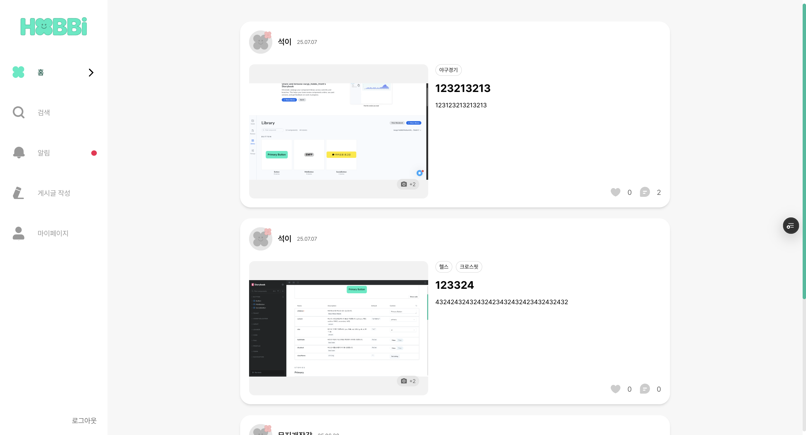
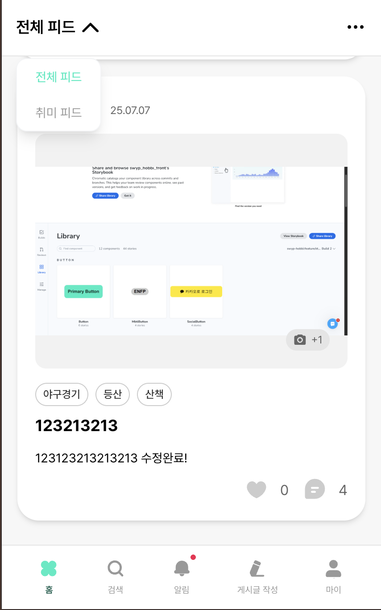

# 게시글 목록 페이지(메인 페이지)

메인 컨텐츠인 게시글 목록 페이지 기능에 대해 기록해보았습니다.

**PC**



**모바일**



### 주요 기능

1. 무한 스크롤을 통한 게시글 목록 조회
2. 로그인한 경우 : 사용자의 취미 태그에 따른 게시글 필터링
3. 비회원인 경우 : 모든 게시글을 cursor 기반 조회 (인가가 필요없는 비회원인 경우 파이썬으로 진행되었는데 백엔드분이 그만둠으로써 자바로 변경되어 다시 수정될 예정)
4. `IntersectionObserver` 를 활용한 스크롤 감지
5. 좋아요/좋아요 취소 기능
6. 스크롤 위치에 따른 맨 위로 이동 버튼
7. 로딩 상태 및 에러 처리

### 데이터 흐름

1. 사용자 인증 상태 및 피드 타입 확인
2. `React Query` 를 통한 무한스크롤 데이터 조회
3. `IntersectionObserver` 로 스크롤 위치 감지
4. 스크롤 하단 도달 시 다음페이지 데이터 요청
5. 좋아요 액션 시 낙관전 업데이트로 UI 즉시 반영

```tsx
const queryClient = useQueryClient();
```

- 캐시 관리 및 쿼리 데이터 업데이트

```tsx
const { userId, isAuthenticated } = useAuthStore();
```

- 인증 스토어에서 사용자 정보 가져오기

```tsx
const { feedType } = useFeedStore();
```

- 피드 스토어에서 현재 피드 타입 가져오기
- all : 전체피드
- hobby : 취미 기반 피드

```tsx
const observerRef = useRef<HTMLDivElement>(null);
```

- `IntersectionObserver` 관찰 대상 요소
- 스크롤 위치 감지를 위한 DOM 요소

```tsx
const [showScrollTop, setShowScrollTop] = useState(false);
```

- 맨 위로 이동 버튼 표시 여부 상태
- 스크롤 위치에 따라 동적으로 변경

```tsx
const {
  data, // 조회된 게시글 데이터 (페이지별로 그룹화)
  fetchNextPage, // 다음 페이지 데이터 요청 함수
  hasNextPage, // 다음 페이지 존재 여부
  isFetchingNextPage, // 다음 페이지 로딩 중 여부
  status, // 쿼리 상태 (pending, success, error)
  error, // 에러 객체
  refetch, // 데이터 재조회 함수
} = useInfiniteQuery({
  queryKey: ['posts', userId, feedType],
  queryFn: async ({ pageParam }) => {
    if (!isAuthenticated) {
      // ===== 비로그인 사용자 처리 =====
      // 비로그인 사용자는 항상 전체 피드만 볼 수 있음
      return await postService.getPublicPosts({
        cursor_id: pageParam ? Number(pageParam) : undefined,
        limit: 15,
      });
    }

    // ===== 로그인 사용자 처리 =====
    // 로그인 사용자의 피드 타입에 따른 조회
    return await postService.getInfiniteScrollPosts({
      tagExist: feedType === 'hobby', // 취미 피드일 때만 true
      lastPostId: pageParam ? Number(pageParam) : undefined,
      pageSize: 15,
    });
  },
  getNextPageParam: (lastPage) => {
    // ===== 다음 페이지 파라미터 결정 로직 =====
    // 마지막 페이지의 게시글 수가 15개 미만이면 더 이상 데이터가 없음
    if (!lastPage || lastPage.length < 15) return undefined;
    // 마지막 게시글의 ID를 다음 페이지 파라미터로 사용
    return lastPage[lastPage.length - 1].postId;
  },
  initialPageParam: undefined as string | undefined,
});
```

- 무한 스크롤을 위한 게시글 목록 조회 쿼리
- 쿼리 키 : `[’posts’, userId, feedType]`
  - userId : 사용자별 캐시 분리
  - feedType : 피드 타입별 캐시 분리
- 기능
  - 페이지별 데이터 조회
  - 다음 페이지 파라미터 자동 관리
  - 캐시된 데이터 재사용

```tsx
  /**
   * @param params - 조회 파라미터
   * @param params.tagExist - 태그가 있는 게시글만 조회할지 여부
   * @param params.lastPostId - 마지막으로 조회한 게시글 ID (페이지네이션용)
   * @param params.pageSize - 한 번에 조회할 게시글 수
   * @returns Promise<PostCardProps[]> - 게시글 목록
  **/

  getInfiniteScrollPosts: async (params: {
    tagExist: boolean;
    lastPostId?: number;
    pageSize: number;
  }) => {
    const searchParams = new URLSearchParams({
      tagExist: params.tagExist.toString(),
      ...(params.lastPostId && { lastPostId: params.lastPostId.toString() }),
      pageSize: (params.pageSize || 15).toString(),
    });

    return fetchApi<PostCardProps[]>(`/post?${searchParams}`, {
      method: 'GET',
    });
  },
```

- 회원용 무한 스크롤 게시글 조회
- 로그인한 사용자를 위한 무한 스크롤 피드
- 태그 존재 여부에 따라 필터링하고, 마지막 게시글 ID를 기준으로 페이지네이션

```tsx
  /**
   * @param params - 조회 파라미터
   * @param params.cursor_id - 커서 기반 페이지네이션용 ID
   * @param params.limit - 한 번에 조회할 게시글 수
   * @returns Promise<PostCardProps[]> - 게시글 목록
  **/
  getPublicPosts: async (params: { cursor_id?: number; limit?: number }) => {
    const searchParams = new URLSearchParams({
      ...(params.cursor_id && { cursor_id: params.cursor_id.toString() }),
      limit: (params.limit || 15).toString(),
    });

    // 공개 API 엔드포인트 사용 (인증 불필요)
    const url = `${API_BASE_URL_PUBLIC}/posts/cursor?${searchParams}`;

    const response = await fetch(url, { method: 'GET' });
    const data = await response.json();

    if (!response.ok) {
      throw new Error(data.message || '비회원 게시글 목록 조회 중 오류');
    }

    return data as PostCardProps[];
  },
```

- 비회원용 무한 스크롤 게시글 조회
- 로그인하지 않은 사용자를 위한 공개 게시글 피드입니다.
- 별도의 공개 API 엔드포인트를 사용하여 인증 없이 접근 가능합니다.

```tsx
const likeMutation = useMutation({
  mutationFn: (postId: string) => postService.likePost(Number(postId)),
  onSuccess: (_, postId) => {
    // ===== 낙관적 업데이트: 캐시된 데이터 즉시 수정 =====
    queryClient.setQueryData<InfinitePostsResponse>(['posts', userId, feedType], (oldData) => {
      if (!oldData) return oldData;
      return {
        ...oldData,
        pages: oldData.pages.map((page) =>
          page.map((post) =>
            post.postId === postId
              ? {
                  ...post,
                  liked: true, // 좋아요 상태 변경
                  likeCount: post.likeCount + 1, // 좋아요 수 증가
                }
              : post,
          ),
        ),
      };
    });
  },
});
```

- 좋아요 추가 Mutation
- 기능
  - 서버에 좋아요 요청
  - 성공 시 캐시된 데이터를 낙관적으로 업데이트
  - UI 즉시 반영으로 사용자 경험 향상

```tsx
  likePost: async (postId: number): Promise<PostLike> => {
    return fetchApi(`/like/post/${postId}`, {
      method: 'POST',
      headers: {
        'Content-Type': 'application/json',
      },
    });
  },
```

- 게시글 좋아요

```tsx
const unlikeMutation = useMutation({
  mutationFn: (postId: string) => postService.unlikePost(Number(postId)),
  onSuccess: (_, postId) => {
    // ===== 낙관적 업데이트: 캐시된 데이터 즉시 수정 =====
    queryClient.setQueryData<InfinitePostsResponse>(['posts', userId, feedType], (oldData) => {
      if (!oldData) return oldData;
      return {
        ...oldData,
        pages: oldData.pages.map((page) =>
          page.map((post) =>
            post.postId === postId
              ? {
                  ...post,
                  liked: false, // 좋아요 상태 변경
                  likeCount: post.likeCount - 1, // 좋아요 수 감소
                }
              : post,
          ),
        ),
      };
    });
  },
});
```

- 좋아요 취소 Mutation

```tsx
  unlikePost: async (postId: number): Promise<PostLike> => {
    return fetchApi(`/unlike/post/${postId}`, {
      method: 'POST',
      headers: {
        'Content-Type': 'application/json',
      },
    });
  },
};
```

- 게시글 좋아요 취소

```tsx
const handleLike = async (postId: string, isLiked: boolean) => {
  try {
    if (isLiked) {
      // 이미 좋아요된 상태면 좋아요 취소
      await unlikeMutation.mutateAsync(postId);
    } else {
      // 좋아요되지 않은 상태면 좋아요 추가
      await likeMutation.mutateAsync(postId);
    }
  } catch (error) {
    console.error('좋아요 처리 중 오류:', error);
  }
};
```

- 좋아요 처리 함수
- 현재 좋아요 상태에 따라 좋아요 추가 또는 취소를 실행

```tsx
useEffect(() => {
  const observer = new IntersectionObserver(
    (entries) => {
      // 관찰 대상이 화면에 보이고, 다음 페이지가 있으면, 현재 fetching 중이 아닐 때
      if (entries[0].isIntersecting && hasNextPage && !isFetchingNextPage) {
        fetchNextPage(); // 다음 페이지 데이터 요청
      }
    },
    { threshold: 0.1 }, // 관찰 대상이 10% 이상 보일 때 콜백 실행
  );

  // 관찰 대상 요소가 있으면 관찰 시작
  if (observerRef.current) {
    observer.observe(observerRef.current);
  }

  // 컴포넌트 언마운트 시 옵저버 해제
  return () => observer.disconnect();
}, [fetchNextPage, hasNextPage, isFetchingNextPage]);
```

- 스크롤이 관찰 대항에 도달하면 다음 페이지 데이터를 요청
- 동작 방식
  - 관찰 대상 요소(observerRef)가 화면에 10% 이상 보이면 감지
  - 다음 페이지가 존재하고 현재 로딩 중이 아닐 때 다음 페이지 요청
  - 컴포넌트 언마운트 시 옵저버 해제

```tsx
useEffect(() => {
  const handleScroll = () => {
    setShowScrollTop(window.scrollY > 1000);
  };

  window.addEventListener('scroll', handleScroll);
  return () => window.removeEventListener('scroll', handleScroll);
}, []);
```

- 스크롤 위치 감지
- 동작 방식
  - 스크롤 이벤트 리스너 등록
  - 스크롤 Y 위치가 1000px을 넘으면 버튼 표시
  - 컴포넌트 언마운트 시 이벤트 리스너 해제

```tsx
const scrollToTop = () => {
  window.scrollTo({
    top: 0,
    behavior: 'smooth',
  });
};
```

- 맨 위로 스크롤하는 함수

## Post Card

게시글 목록에서 개별 게시글을 표시하는 카드 형태의 컴포넌트

### 주요 기능

1. 게시글 기본 정보 표시 (제목, 내용, 작성자, 날짜)
2. 게시글 이미지 표시 및 다중 이미지 인디케이터
3. 취미 태그 표시
4. 좋아요/댓글 기능
5. 반응형 디자인
6. 클릭 시 게시글 상세 페이지로 이동
7. 애니메이션 효과

### 사용자 인터렉션

- 카드 클릭 : 게시글 상세 페이지 이동
- 좋아요 버튼 : 좋아요 추가/취소 (로그인 필요)
- 댓글 버튼 : 댓글 섹션으로 스크롤

```tsx
 * @param postId - 게시글 고유 ID
 * @param nickname - 작성자 닉네임
 * @param title - 게시글 제목
 * @param content - 게시글 내용
 * @param userImageUrl - 작성자 프로필 이미지 URL
 * @param postImageUrls - 게시글 이미지 URL 배열
 * @param postHobbyTags - 게시글 취미 태그 배열
 * @param userLevel - 작성자 레벨
 * @param likeCount - 좋아요 수
 * @param commentCount - 댓글 수
 * @param createdAt - 게시글 생성 시간
 * @param liked - 현재 사용자의 좋아요 여부
 * @param onLikeClick - 좋아요 클릭 핸들러
```

- props

```tsx
const { openModal } = useModalStore();
```

- 모달 스토어에서 모달 열기 함수 가져오기
- 로그인 필요 시 모달 표시에 사용

```tsx
const currentUserId = useAuthStore((state) => state.userId);
```

- 인증 스토어에서 현재 사용자 ID 가져오기
- 좋아요 기능 사용 시 로그인 상태 확인에 사용

```tsx
const handleLikeClick = (e: React.MouseEvent) => {
  e.preventDefault(); // 기본 동작 방지
  e.stopPropagation(); // 이벤트 버블링 방지

  if (!currentUserId) {
    // ===== 비로그인 사용자 처리 =====
    openModal({
      title: '로그인이 필요합니다',
      message: '좋아요를 누르려면 로그인이 필요합니다.',
      confirmText: '확인',
    });
    return;
  }

  // ===== 로그인 사용자 처리 =====
  onLikeClick();
};
```

- 좋아요 버튼 클릭 핸들러
- 기능
  - 이벤트 전파 방지(카드 클릭과 분리)
  - 로그인 상태 확인
  - 비로그인 시 모달 표시
  - 로그인 시 좋아요 액션 실행

```tsx
const handleCommentClick = () => {
  // 게시글 상세 페이지로 이동 (댓글 앵커 포함)
  router.push(`/posts/${postId}#comments`);

  // 페이지 이동 후 댓글 섹션으로 스크롤
  setTimeout(() => {
    const commentsSection = document.getElementById('comments');
    if (commentsSection) {
      commentsSection.scrollIntoView({ behavior: 'smooth' });
    }
  }, 100);
};
```

- 댓글 클릭 핸들러
- 게시글 상세 페이지 댓글 섹션으로 스크롤

```toc

```
