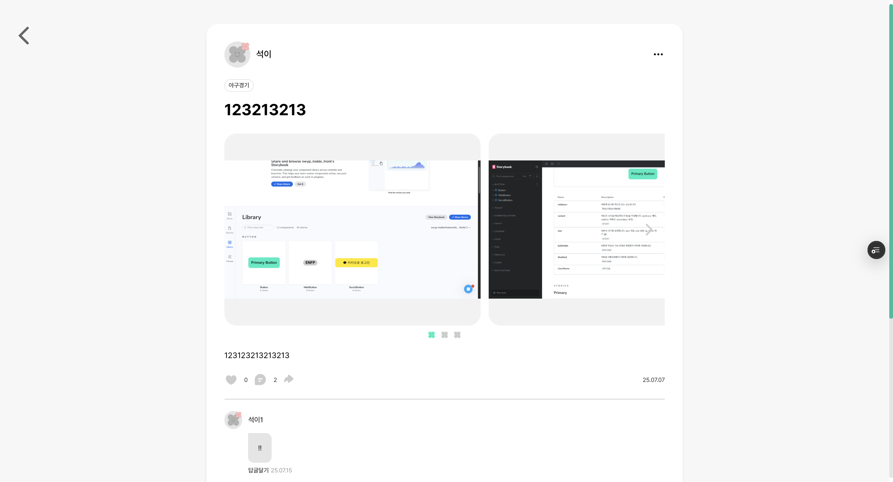
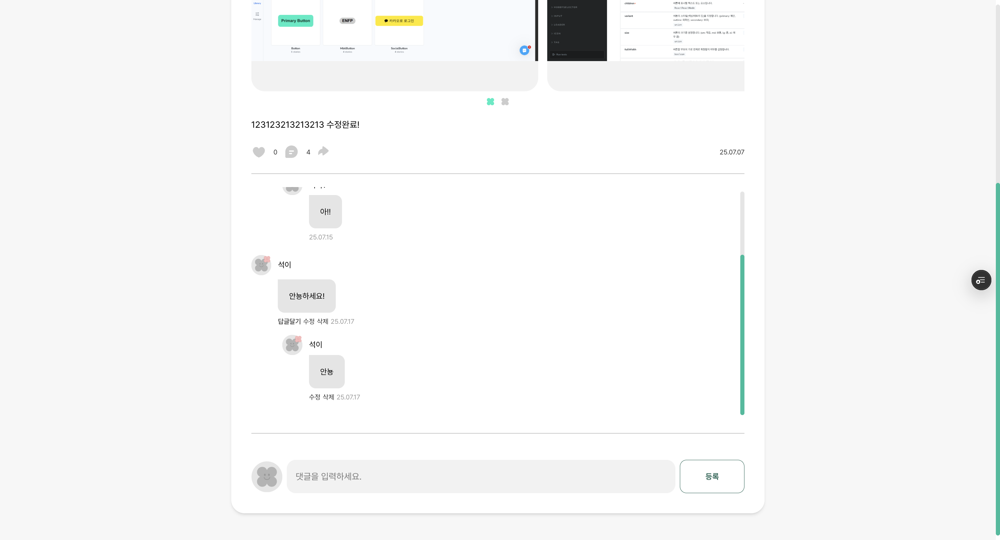
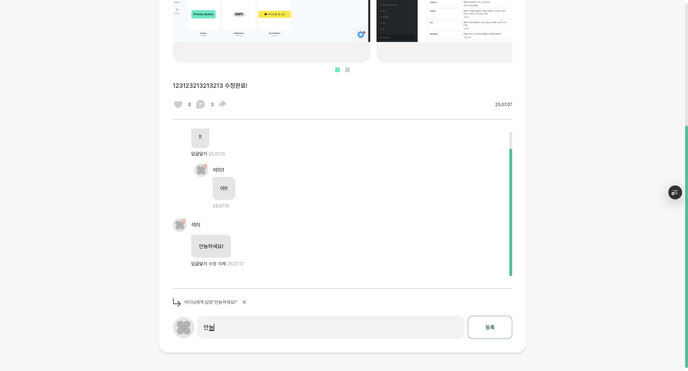
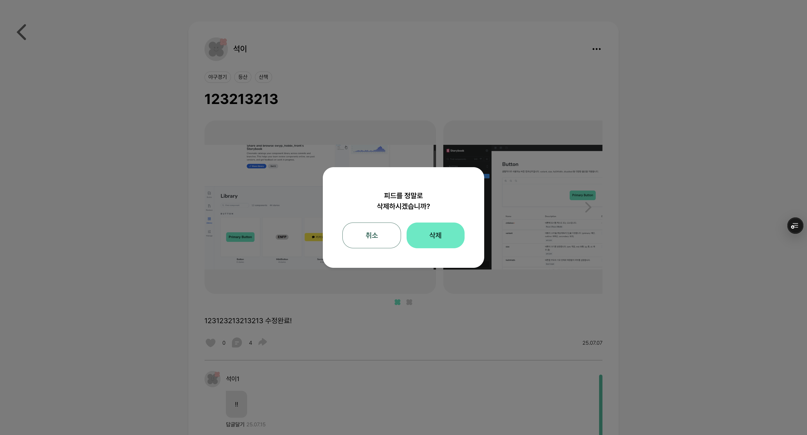
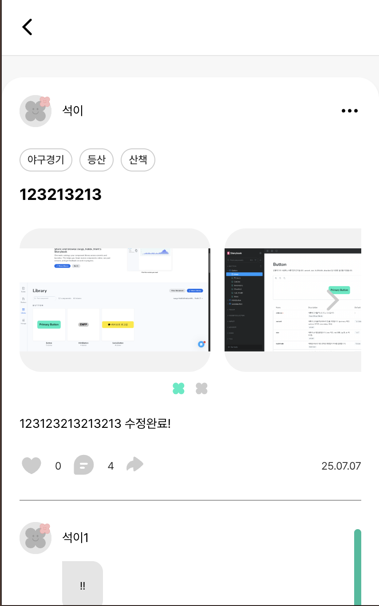
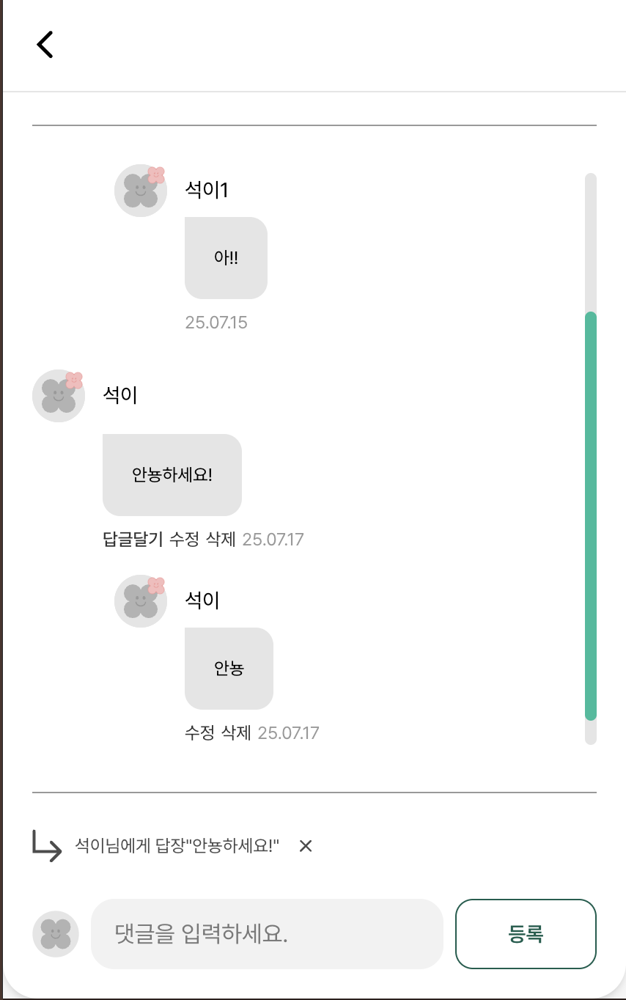

# 게시글 상세 페이지

게시글 상세 페이지에 기능에 대해서 기록해보았는데, 어려웠던 점은 댓글,대댓글에 대한 데이터를 가공하는 방법이 어려웠습니다.

밑에는 api에 구조를 보고 데이터를 가공했었습니다.

```tsx
[
  {
    commentId: 1,
    content: '111',
    nickname: '아넘',
    userImageUrl: 'default.png',
    parentCommentId: null,
    postId: 1,
    deleted: false,
    createdAt: '2025-05-01T21:52:54.6606051',
  },
  {
    commentId: 2,
    content: '123',
    nickname: '아넘as',
    userImageUrl: 'default.png',
    parentCommentId: null,
    postId: 1,
    deleted: false,
    createdAt: '2025-05-01T21:52:54.6606051',
  },
  {
    commentId: 3,
    content: '123',
    nickname: '아넘asfdfasd',
    userImageUrl: 'default.png',
    parentCommentId: null,
    postId: 1,
    deleted: false,
    createdAt: '2025-05-01T21:52:54.6606051',
  },
  {
    commentId: 4,
    content: '123123123',
    nickname: '아넘asasdasda',
    userImageUrl: 'default.png',
    parentCommentId: 1,
    postId: 1,
    deleted: true,
    createdAt: '2025-05-01T21:52:54.6606051',
  },
  {
    commentId: 5,
    content: '1234',
    nickname: '아넘마너너',
    userImageUrl: 'default.png',
    parentCommentId: 1,
    postId: 1,
    deleted: false,
    createdAt: '2025-05-01T21:52:54.6606051',
  },
];
```

저희 댓글은 댓글과 대댓글로 2뎁스로 이루어지고 대댓글에 대댓글은 되지 않는 구조입니다.

즉 댓글-대댓글 이렇게 구조화됩니다.

`parentCommentId` 로 대댓글이 있는지 알 수 있습니다.

예를 들어 `parentCommentId === null` 인 경우이면 댓글만 달려있는 상태입니다.

`parentCommentId === commentId` 인 경우이면 `commentId` 에 맞게 댓글-대댓글이 된 구조입니다.

**PC**

|             |             |
| ----------- | ----------- |
|  |  |

|             |             |
| ----------- | ----------- |
|  |  |

**모바일**

|             |             |
| ----------- | ----------- |
|  |  |

사용자가 개별 게시글의 상세 내용을 확인할 수 있는 페이지

### 주요 기능

1. 게시글 상세 정보 조회 (로그인/비로그인 사용자 구분)
2. 게시글 수정 및 삭제 기능(작성자만)
3. 댓글 조회 및 작성 기능
4. 공유 기능
5. 좋아요/좋아요 취소 기능
6. 댓글 섹션으로 자동 스크롤

### 데이터 흐름

1. URL 파라미터에서 게시글 ID 추출
2. 로그인 상태 확인 및 적절한 API 호출
3. 게시글 상세 정보 로드 및 상태 업데이트
4. 사용자 인터랙션 처리 (좋아요, 댓글, 수정, 삭제)
5. 댓글 업데이트 시 게시글 정보 재조회

```tsx
const { id } = useParams();
```

- 동적 라우팅 [id]에서 실제 게시글 ID 가져옴

```tsx
const { userId } = useAuthStore();
```

- 작성자 여부 확인 및 로그인 상태 체크에 사용

```tsx
const { openModal } = useModalStore();
```

- 확인/에러 메시지 표시에 사용

```tsx
const [post, setPost] = useState<PostDetail | null>(null);
```

- 게시글 상세 정보 상태
- API에서 조회한 게시글 데이터를 저장

```tsx
const isOwner = post?.userId === userId;
```

- 현재 사용자가 게시글 작성자인지 확인
- 작성자만 수정/삭제 버튼을 볼 수 있음

```tsx
const currentUserId = useAuthStore((state) => state.userId);
```

- 현재 사용자 ID (좋아요 기능에서 사용)
- useAuthStore에서 직접 가져와서 최신 상태 보장

```tsx
const checkLoginStatus = () => {
  try {
    const authStorage = localStorage.getItem('auth-storage');
    if (authStorage) {
      const { state } = JSON.parse(authStorage);
      return state.isAuthenticated;
    }
    return false;
  } catch (error) {
    console.error('로그인 상태 확인 중 오류:', error);
    return false;
  }
};
```

- 로그인 상태 확인 함수

```tsx
useEffect(() => {
  const fetchPostDetail = async () => {
    try {
      setIsLoading(true);

      // ===== 로그인 상태 확인 =====
      const isLoggedIn = checkLoginStatus();

      let data;
      try {
        // ===== 로그인 상태에 따른 API 호출 =====
        if (isLoggedIn) {
          // 로그인 사용자는 회원용 API 시도
          data = await postService.getPostDetail(Number(id));
        } else {
          // 비로그인 사용자는 공개 API 호출
          data = await postService.getPublicPostDetail(Number(id));
        }
      } catch (apiError) {
        // ===== 회원용 API 실패 시 공개 API로 fallback =====
        if (isLoggedIn) {
          data = await postService.getPublicPostDetail(Number(id));
        } else {
          throw apiError;
        }
      }

      // ===== 성공 처리 =====
      setPost(data);
      setError(null);
      setIsLoading(false);

      // ===== 댓글 섹션 자동 스크롤 =====
      // URL에 #comments가 있으면 댓글 섹션으로 스크롤
      if (window.location.hash === '#comments') {
        setTimeout(() => {
          const commentsSection = document.getElementById('comments');
          if (commentsSection) {
            commentsSection.scrollIntoView({ behavior: 'smooth' });
          }
        }, 500); // 애니메이션 완료 후 스크롤
      }
    } catch (err) {
      // ===== 에러 처리 =====
      setError(err instanceof Error ? err.message : '게시글을 불러오는데 실패했습니다.');
      setIsLoading(false);
    }
  };

  fetchPostDetail();
}, [id]);
```

- 페이지 진입 시 게시글 ID를 기반으로 상세 정보를 조회
- 처리 과정
  - 로딩 상태를 true로 설정
  - 로그인 상태 확인
  - 로그인 상태에 따라 적절한 API 호출
  - 회원용 API 실패 시 공개 API로 fallback
  - 성공 시 게시글 데이터 상태 업데이트
  - URL 에 #comments가 있으면 댓글 섹션으로 스크롤
  - 실패 시 에러 상태 설정
  - 완료 시 로딩 상태를 false로 설정
- API 호출
  - 로그인 사용자 : 회원용 API → 실패 시 공개 API fallback
  - 비로그인 사용자 : 공개 API 만 호출

```tsx
  getPostDetail: async (postId: number) => {
    return fetchApi<PostDetail>(`/post/${postId}`, {
      method: 'GET',
    });
  },
```

- 회원용 게시글 상세 조회
- 로그인한 사용자가 게시글의 상세 정보를 조회
- 좋아요 상태, 댓글 등 모든 정보를 포함

```tsx
  getPublicPostDetail: async (postId: number) => {
    const url = `${API_BASE_URL_PUBLIC}/posts/${postId}`;

    const response = await fetch(url, { method: 'GET' });
    const data = await response.json();

    if (!response.ok) {
      throw new Error(data.message || '비회원 게시글 상세 조회 중 오류');
    }

    return data as PostDetail;
  },
```

- 비회원용 게시글 상세 조회
- 로그인하지 않은 사용자가 게시글의 상세 정보를 조회
- 좋아요 기능은 제한되지만 게시글 내용과 댓글은 볼 수 있습니다.

```tsx
const handleEdit = () => {
  router.push(`/posts/${id}/edit`);
};
```

- 게시글 수정 핸들러
- 게시글 수정 페이지로 이동 작성자만 이 기능을 사용할 수 있습니다.

```tsx
const handleDelete = () => {
  if (!post) return;

  openModal({
    message: '피드를 정말로\n삭제하시겠습니까?',
    cancelText: '취소',
    confirmText: '삭제',
    showCancelButton: true,
    onConfirm: async () => {
      try {
        // ===== 게시글 삭제 API 호출 =====
        await postService.deletePost(post.postId);
        // 삭제 성공 시 게시글 목록 페이지로 이동
        router.push('/posts');
      } catch (err) {
        // ===== 삭제 실패 시 에러 모달 =====
        console.error('게시글 삭제 중 오류:', err);
        openModal({
          title: '오류',
          message: '게시글 삭제 중 오류가 발생했습니다.',
          confirmText: '확인',
        });
      }
    },
  });
};
```

- 게시글 삭제 확인 모달을 표시하고, 확인 시 삭제를 실행합니다.
- 작성자만 이 기능을 사용할 수 있습니다.

```tsx
  deletePost: async (postId: number): Promise<void> => {
    return fetchApi(`/post/${postId}`, {
      method: 'DELETE',
    });
  },
```

- 게시글 삭제

```tsx
const handleLikeClick = async () => {
  if (!post) return;

  // ===== 로그인 상태 확인 =====
  if (!currentUserId) {
    openModal({
      title: '로그인이 필요합니다',
      message: '좋아요를 누르려면 로그인이 필요합니다.',
      confirmText: '확인',
    });
    return;
  }

  try {
    // ===== 좋아요 상태에 따른 API 호출 =====
    if (post.liked) {
      // 이미 좋아요가 되어있다면 취소
      await postService.unlikePost(post.postId);
    } else {
      // 좋아요가 안되어있다면 좋아요
      await postService.likePost(post.postId);
    }

    // ===== 서버에서 최신 데이터 재조회 =====
    // 낙관적 업데이트 대신 서버 데이터로 동기화
    const updatedPost = await postService.getPostDetail(Number(id));
    setPost(updatedPost);
  } catch (error) {
    // ===== 에러 처리 =====
    console.error('좋아요 처리 중 오류:', error);
    openModal({
      title: '오류',
      message: '좋아요 처리 중 오류가 발생했습니다.',
      confirmText: '확인',
    });
  }
};
```

- 좋아요 추가 또는 취소를 처리
- 처리 과정
  - 로그인 상태 확인
  - 비로그인 시 로그인 필요 모달 표시
  - 현재 좋아요 상태에 따라 API 호출
  - 성공 시 서버에서 최신 데이터 재조회
  - 실패 시 에러 모달 표시

```tsx
const handleCommentUpdate = async () => {
  try {
    const updatedPost = await postService.getPostDetail(Number(id));
    setPost(updatedPost);
  } catch (error) {
    console.error('게시글 정보 업데이트 중 오류:', error);
  }
};
```

- 댓글 업데이트 핸들러
- 댓글이 추가/삭제/수정될 때 게시글 정보를 다시 불러옵니다.
- 댓글 수 등의 정보가 업데이트 되기 때문.

## Post Header

게시글 상세 페이지에서 작성자 정보와 수정/삭제 메뉴를 표시하는 컴포넌트

### 주요 기능

1. 게시글 작성자 프로필 정보 표시 (이미지, 닉네임, 레벨)
2. 작성자 전용 수정/삭제 메뉴(드롭다운)
3. 반응형 디자인
4. 메뉴 외부 클릭 시 자동 닫기
5. 접근성을 고려한 UI 구성

### 사용자 인터랙션

- 작성자만 메뉴 버튼(점 3개)표시
- 메뉴 클릭시 수정/삭제 옵션 드롭다운
- 메뉴 외부 클릭 시 자동 닫기
- 수정/삭제 버튼 클릭 시 해당 함수 호출

```tsx
 * @param nickname - 게시글 작성자 닉네임
 * @param userImageUrl - 게시글 작성자 프로필 이미지 URL
 * @param userLevel - 게시글 작성자 레벨
 * @param isOwner - 현재 사용자가 게시글 작성자인지 여부
 * @param onEdit - 게시글 수정 함수 (메뉴 클릭 시 호출)
 * @param onDelete - 게시글 삭제 함수 (메뉴 클릭 시 호출)
```

- Props 인터페이스

```tsx
const [isMenuOpen, setIsMenuOpen] = useState(false);
```

- 메뉴 열림/닫힘 상태

```tsx
const menuRef = useRef<HTMLDivElement>(null);
```

- 외부 클릭 감지를 위한 DOM 요소

```tsx
useEffect(() => {
  function handleClickOutside(event: MouseEvent) {
    if (menuRef.current && !menuRef.current.contains(event.target as Node)) {
      setIsMenuOpen(false);
    }
  }

  document.addEventListener('mousedown', handleClickOutside);
  return () => {
    document.removeEventListener('mousedown', handleClickOutside);
  };
}, []);
```

- 메뉴 외부 클릭 감지 및 메뉴 닫기
- 사용자가 메뉴 외부를 클릭했을 때 메뉴를 자동으로 닫습니다.
- 동작 방식
  - mousedown 이벤트 리스너 등록
  - 클릭된 요소가 메뉴 컨테이너 외부인지 확인
  - 외부 클릭 시 메뉴 상태를 false로 설정
  - 컴포넌트 언마운트 시 이벤트 리스너 해제

## Post Image Slider

게시글 첨부된 여러 이미지를 슬라이드 형태로 표시하는 컴포넌트

### 주요 기능

1. 이미지 슬라이드 표시(가로 스크롤)
2. 이전/다음 버튼을 통한 이미지 네비게이션
3. 이미지 인디게이터를 통한 직접 이동
4. 반응형 이미지 표시(4:3 비율)
5. 이미지 로드 실패 시 기본 이미지 표시

### 네비게이션 로직

- 첫 번째 이미지 : 다음 버튼만 표시
- 마지막 이미지 : 이전 버튼만 표시
- 중간 이미지들 : 양쪽 버튼 모두 표시
- 이미지가 1장인 경우 : 네비게이션 버튼 숨김

```tsx
interface PostImageSliderProps {
  images: string[];
}
```

- props 인터페이스

```tsx
const [currentImageIndex, setCurrentImageIndex] = useState(0);
```

- 현재 표시 중인 이미지의 인덱스
- 0 부터 시작하며, 이미지 배열의 길이보다 작은 값을 가집니다.
- 이 값이 변경될 때마다 슬라이더가 해당 이미지로 이동합니다.

```tsx
const showPrevButton = currentImageIndex > 0;
```

- 이전 버튼 표시 여부
- 현재 이미지가 첫 번째 이미지(인덱스 0)가 아닐 때만 true
- 첫 번째 이미지에서는 이전 버튼을 숨겨서 사용자 혼란을 방지

```tsx
const showNextButton = currentImageIndex < images.length - 1;
```

- 다음 버튼 표시 여부
- 현재 이미지가 마지막 이미지가 아닐 때만 true
- 마지막 이미지에서는 다음 버튼을 숨겨서 사용자 혼란을 방지

## Post Action Bar

게시글 하단에 위치하여 사용자 상호작용 기능을 제공하는 컴포넌트

### 주요 기능

1. 좋아요 버튼(좋아요 추가/취소 및 개수 표시)
2. 댓글 버튼(댓글 개수 표시, 클릭 시 댓글 섹션으로 스크롤)
3. 공유 버튼(공유 메뉴 드롭다운)
4. 게시글 작성 시간 표시(상대적 시간 형식)

### 사용자 인터랙션

- 좋아요 상태에 따른 하트 아이콘 색상 변경
- 좋아요 된 상태 : 빨간색 하트`(var(—like))`
- 좋아요 안된 상태 : 회색 하트 `(var(—grayscale-20))`
- 호버 효과 : 커서 포인터로 클릭 가능함을 표시

```tsx
 * @param likeCount - 좋아요 수 (현재 게시글의 총 좋아요 개수)
 * @param commentCount - 댓글 수 (현재 게시글의 총 댓글 개수)
 * @param createdAt - 게시글 작성 시간 (ISO 8601 형식의 날짜 문자열)
 * @param liked - 현재 사용자의 좋아요 여부 (true: 좋아요됨, false: 좋아요 안됨)
 * @param onLikeClick - 좋아요 버튼 클릭 시 호출되는 함수
 * @param postId - 게시글 고유 ID (공유 URL 생성에 사용)

interface PostActionBarProps {
  likeCount: number;
  commentCount: number;
  createdAt: string;
  liked: boolean;
  onLikeClick: () => void;
  postId: number;
}

```

- props 인터페이스

```tsx
const [isShareMenuOpen, setIsShareMenuOpen] = useState(false);
```

- 공유 메뉴 열림/닫힘 상태

```tsx
const handleShareClick = () => {
  setIsShareMenuOpen(!isShareMenuOpen);
};
```

- 공유 버튼 클릭 핸들러

## ⭐️⭐️⭐️Post Comment (댓글 - 대댓글 데이터를 구조화 하는 법이 어려웠음)⭐️⭐️⭐️

게시글의 댓글과 대댓글을 관리하는 종합적인 댓글 시스템

### 주요 기능

1. 댓글 목록 조회(무한 스크롤)
2. 댓글 작성(일반 댓글 및 대댓글)
3. 댓글 수정(작성자만)
4. 댓글 삭제(작성자만)
5. 대댓글 작성(2뎁스까지만 허용)
6. 실시간 댓글 수 업데이트

### 데이터 구조

- 부모 댓글 : `parentCommentId`가 `null` 인 댓글
- 대댓글 : `parentCommentId` 가 부모 댓글 ID인 댓글
- 대댓글의 대댓글은 허용하지 않음(2뎁스 제한)

### 권한 관리

- 댓글 작성 : 로그인한 사용자만
- 댓글 수정/삭제 : 댓글 작성자만
- 대댓글 작성 : 로그인한 사용자만(부모 댓글에만 가능)

```tsx
/*
 * @param commentId - 댓글 고유 ID
 * @param content - 댓글 내용
 * @param nickname - 댓글 작성자 닉네임
 * @param userImageUrl - 댓글 작성자 프로필 이미지 URL
 * @param parentCommentId - 부모 댓글 ID (대댓글인 경우)
 * @param postId - 게시글 ID
 * @param isDelete - 댓글 삭제 여부
 * @param createdAt - 댓글 작성 시간
 * @param replies - 대댓글 목록 (부모 댓글인 경우)
 */
interface CommentWithReplies extends Comment {
  replies?: Comment[];
}

/**
 * 답글 대상 정보 인터페이스
 *
 * 답글을 작성할 때 참조하는 원본 댓글의 정보를 저장합니다.
 *
 * @param commentId - 원본 댓글 ID
 * @param nickname - 원본 댓글 작성자 닉네임
 * @param content - 원본 댓글 내용 (미리보기용)
 */
interface ReplyTo {
  commentId: number;
  nickname: string;
  content: string;
}

/**
 * PostComment 컴포넌트 Props 인터페이스
 *
 * @param postId - 댓글을 작성할 게시글 ID
 * @param onCommentUpdate - 댓글 변경 시 호출되는 콜백 함수 (선택적)
 */
interface PostCommentProps {
  postId: number;
  onCommentUpdate?: () => void;
}
```

```tsx
const [newComment, setNewComment] = useState('');
```

- 새 댓글 입력 내용

```tsx
const [replyTo, setReplyTo] = useState<ReplyTo | null>(null);
```

- 답글 대상 정보

```tsx
const [editingCommentId, setEditingCommentId] = useState<number | null>(null);
```

- 수정 중인 댓글 ID

```tsx
const [editContent, setEditContent] = useState('');
```

- 수정 중인 댓글 내용

```tsx
const [isSubmitting, setIsSubmitting] = useState(false);
```

- 댓글 제출 중 상태
- 중복 제출 방지를 위해 사용

```tsx
const currentUserId = useAuthStore((state) => state.userId);
```

- 현재 사용자 ID

```tsx
const { userInfo, fetchUserInfo } = useUserProfileStore();
```

- 사용자 프로필 정보
- 댓글 작성 시 프로필 이미지 표시에 사용

```tsx
useEffect(() => {
  if (!userInfo) fetchUserInfo();
}, [fetchUserInfo, userInfo]);
```

- 컴포넌트 마운트 시 사용자 정보 가져오기
- `userInfo`가 없을 때만 사용자 정보를 조회
- 댓글 작성 시 프로필 이미지를 표시하기 위해 필요

```tsx
/*
 * @param content - 자를 텍스트 내용
 * @param maxLength - 최대 길이
 * @returns 자른 텍스트 (길이 초과 시 말줄임표 추가)
 */

const truncateContent = useCallback((content: string, maxLength: number) => {
  if (content.length <= maxLength) return content;
  return content.slice(0, maxLength) + '...';
}, []);
```

- 텍스트 내용 자르기 함수
- 긴 텍스트를 지정된 길이로 자르고 말줄임표를 추가합니다.
- 답글 대상 표시 시 긴 댓글 내용을 축약하는데 사용

```tsx
const observerRef = useRef<HTMLDivElement>(null);
```

- `IntersectionObserver` 관찰 대상 요소 참조

```tsx
const {
  data, // 조회된 댓글 데이터 (페이지별로 그룹화)
  fetchNextPage, // 다음 페이지 데이터 요청 함수
  hasNextPage, // 다음 페이지 존재 여부
  isFetchingNextPage, // 다음 페이지 로딩 중 여부
  status, // 쿼리 상태 (pending, success, error)
  error, // 에러 객체
  refetch, // 데이터 재조회 함수
} = useInfiniteQuery<Comment[], Error, InfiniteData<Comment[]>>({
  queryKey: ['comments', postId],
  queryFn: ({ pageParam }) => {
    return commentService.getComments({
      postId,
      lastCommentId: pageParam as number,
      pageSize: 15,
    });
  },
  getNextPageParam: (lastPage) => {
    // ===== 다음 페이지 파라미터 결정 로직 =====
    if (!lastPage || lastPage.length < 15) return undefined;
    return lastPage[lastPage.length - 1].commentId;
  },
  initialPageParam: undefined,
});
```

- 무한 스크롤을 위한 댓글 목록 조회 쿼리
- 쿼리 키 : `[’comments’, ‘postId’]`
  - postId가 변경될 때마다 자동으로 재실행
  - 게시글별로 캐시 분리
- 기능
  - 페이지별 댓글 데이터 조회
  - 다음 페이지 파라미터 자동 관리
  - 캐시된 데이터 재사용
  - 무한 스크롤 지원

```tsx
   /*
   * @param params - 조회 파라미터
   * @param params.postId - 댓글을 조회할 게시글 ID
   * @param params.lastCommentId - 마지막으로 조회한 댓글 ID (페이지네이션용)
   * @param params.pageSize - 한 번에 조회할 댓글 수
   * @returns Promise<Comm
   */
  getComments: async (params: {
    postId: number;
    lastCommentId?: number;
    pageSize?: number;
  }): Promise<Comment[]> => {
    const searchParams = new URLSearchParams({
      postId: params.postId.toString(),
      ...(params.lastCommentId && {
        lastCommentId: params.lastCommentId.toString(),
      }),
      pageSize: (params.pageSize || 15).toString(),
    });

    return fetchApi(`/comments?${searchParams}`, {
      method: 'GET',
    });
  },
```

- 댓글 목록 조회(무한 스크롤)
- 특정 게시글의 댓글을 무한 스크롤로 조회
- 대댓글 구조를 지원, 페이지네이션을 통해 성능을 최적화

```tsx
useEffect(() => {
  const observer = new IntersectionObserver(
    (entries) => {
      if (entries[0].isIntersecting && hasNextPage && !isFetchingNextPage) {
        fetchNextPage();
      }
    },
    { threshold: 0.1 }, // 관찰 대상이 10% 이상 보일 때 콜백 실행
  );

  if (observerRef.current) {
    observer.observe(observerRef.current);
  }

  return () => observer.disconnect();
}, [fetchNextPage, hasNextPage, isFetchingNextPage]);
```

- 무한스크롤에 대한 `IntersectionObserver` 설정

```tsx
/*
 * @param commentsData - 평면화된 댓글 배열
 * @returns 구조화된 댓글 배열 (부모-자식 관계)
 */

const structureComments = useCallback((commentsData: Comment[]): CommentWithReplies[] => {
  const parentComments: CommentWithReplies[] = [];
  const replyComments: Comment[] = [];

  // ===== 부모 댓글과 대댓글 분리 =====
  commentsData.forEach((comment) => {
    if (comment.parentCommentId === null) {
      parentComments.push({ ...comment, replies: [] });
    } else {
      replyComments.push(comment);
    }
  });

  // ===== 대댓글을 부모 댓글에 연결 =====
  replyComments.forEach((reply) => {
    const parentComment = parentComments.find((parent) => parent.commentId === reply.parentCommentId);
    if (parentComment && !reply.deleted) {
      parentComment.replies?.push(reply);
    }
  });

  return parentComments;
}, []);
```

- 댓글 데이터를 구조화하는 함수
- 평면화된 댓글 배열을 부모-자식 관계로 구조화합니다.
- 처리 과정
  - 부모 댓글과 대댓글을 분리
  - 부모 댓글에 대댓글 배열 추가
  - 삭제된 대댓글은 제외

```tsx
const allComments = data?.pages.flatMap((page) => page) ?? [];
const structuredComments = structureComments(allComments);
```

- 모든 페이지의 댓글을 하나의 배열로 합치고 구조화
- React Query의 페이지별 데이터를 하나로 합치고, 부모-자식 관계로 구조화

```tsx
/*
 * @param content - 댓글 내용
 * @param parentCommentId - 부모 댓글 ID (대댓글인 경우)
 */
const handleCreateComment = async (content: string, parentCommentId?: number | null) => {
  // ===== 로그인 상태 체크 =====
  if (!currentUserId) {
    openModal({
      title: '로그인이 필요합니다',
      message: '댓글을 작성하려면 로그인이 필요합니다.',
      confirmText: '로그인하기',
      onConfirm: () => {
        router.push('/');
      },
    });
    return;
  }

  // ===== 내용 유효성 검사 =====
  if (!content.trim() || isSubmitting) {
    return;
  }

  // ===== 대댓글 제한 확인 =====
  // 부모 댓글이 이미 대댓글인 경우 작성 방지
  if (parentCommentId) {
    const parentComment = allComments.find((comment) => comment.commentId === parentCommentId);
    if (parentComment?.parentCommentId) {
      openModal({
        title: '댓글 작성 실패',
        message: '대댓글에는 답글을 작성할 수 없습니다.',
        confirmText: '확인',
      });
      return;
    }
  }

  try {
    setIsSubmitting(true);
    await commentService.createComment(postId, content, parentCommentId, currentUserId);
    setNewComment('');
    setReplyTo(null);
    await queryClient.invalidateQueries({ queryKey: ['comments', postId] });
    onCommentUpdate?.();
  } catch (error) {
    console.error('댓글 작성에 실패했습니다:', error);
    openModal({
      title: '댓글 작성 실패',
      message: '댓글 작성 중 오류가 발생했습니다.',
      confirmText: '확인',
    });
  } finally {
    setIsSubmitting(false);
  }
};
```

- 댓글 작성 핸들러
- 새 댓글 또는 대댓글을 작성
- 처리 과정
  - 로그인 상태 확인
  - 내용 유효성 검사
  - 대댓글 제한 확인(2뎁스까지만 허용)
  - API 호출 및 상태 업데이트
  - 캐시 무효화 및 콜백 호출

```tsx
    /*
   * @param postId - 댓글을 작성할 게시글 ID
   * @param content - 댓글 내용
   * @param parentCommentId - 부모 댓글 ID (대댓글인 경우)
   * @param userId - 댓글 작성자 ID (대댓글에서 멘션할 사용자)
   * @returns Promise<any> - 작성된 댓글 정보
   */

  createComment: async (
    postId: number,
    content: string,
    parentCommentId?: number | null,
    userId?: number | null,
  ) => {
    return fetchApi(`/comment`, {
      method: 'POST',
      headers: {
        'Content-Type': 'application/json',
      },
      body: JSON.stringify({
        postId,
        content,
        parentCommentId,
        userId,
      }),
    });
  },
```

- 새로운 댓글을 작성합니다. 대댓글(답글) 작성도 지원

```tsx
/*
 * @param comment - 수정할 댓글 객체
 */
const handleStartEdit = (comment: Comment) => {
  setEditingCommentId(comment.commentId);
  setEditContent(comment.content);
};
```

- 댓글 수정 모드 시작

```tsx
const handleCancelEdit = () => {
  setEditingCommentId(null);
  setEditContent('');
};
```

- 댓글 수정 취소

```tsx
/*
 * @param commentId - 수정할 댓글 ID
 * @param content - 수정된 댓글 내용
 */
const handleUpdateComment = async (commentId: number, content: string) => {
  if (!content.trim()) {
    alert('댓글 내용을 입력해주세요.');
    return;
  }

  try {
    await commentService.updateComment(commentId, content, postId, currentUserId);
    setEditingCommentId(null);
    setEditContent('');
    await queryClient.invalidateQueries({ queryKey: ['comments', postId] });
  } catch (error) {
    console.error('댓글 수정에 실패했습니다:', error);
  }
};
```

- 댓글 수정 완료

```tsx
   /*
   * @param commentId - 수정할 댓글 ID
   * @param content - 수정할 댓글 내용
   * @param postId - 댓글이 속한 게시글 ID
   * @param userId - 댓글 작성자 ID
   * @returns Promise<any> - 수정된 댓글 정보
   */
  updateComment: async (
    commentId: number,
    content: string,
    postId: number,
    userId: number | null,
  ) => {
    return fetchApi(`/comment/${commentId}`, {
      headers: {
        'Content-Type': 'application/json',
      },
      method: 'PUT',
      body: JSON.stringify({ content, postId, userId }),
    });
  },
```

- 댓글 수정
- 기존 댓글의 내용을 수정, 작성자만 수정할 수 있습니다.

```tsx
/*
 * @param commentId - 삭제할 댓글 ID
 */
const handleDeleteComment = async (commentId: number) => {
  openModal({
    message: '댓글을 정말로\n삭제하시겠습니까?',
    confirmText: '삭제',
    cancelText: '취소',
    showCancelButton: true,
    onConfirm: async () => {
      try {
        await commentService.deleteComment(commentId);
        // ===== 댓글 목록 쿼리 무효화 =====
        await queryClient.invalidateQueries({
          queryKey: ['comments', postId],
        });
        // ===== 상위 컴포넌트에 알림 =====
        onCommentUpdate?.();
      } catch (error) {
        console.error('댓글 삭제에 실패했습니다:', error);
        openModal({
          type: 'error',
          message: '댓글 삭제에 실패했습니다.\n다시 시도해 주세요.',
          confirmText: '확인',
        });
      }
    },
  });
};
```

- 댓글 삭제
- 댓글 삭제 확인 모달을 표시, 확인 시 삭제를 실행

```tsx
   /*
   * @param commentId - 삭제할 댓글 ID
   */
  deleteComment: async (commentId: number) => {
    return fetchApi(`/comment/${commentId}`, {
      method: 'DELETE',
    });
  },
};

```

- 댓글을 삭제, 작성자만 삭제할 수 있습니다.

```tsx
/*
 * @param commentUserId - 댓글 작성자 ID
 * @returns 권한 여부 (boolean)
 */
const canModifyComment = useCallback(
  (commentUserId: number) => {
    if (!currentUserId) return false;
    return currentUserId === commentUserId;
  },
  [currentUserId],
);
```

- 댓글 수정/삭제 권한 체크 함수
- 현재 사용자가 해당 댓글을 수정/삭제할 수 있는지 확인

```tsx
/*
 * @param comment - 대댓글(답글) 대상 댓글
 */
const handleReplyTo = (comment: Comment) => {
  setReplyTo({
    commentId: comment.commentId,
    nickname: comment.nickname,
    content: comment.content,
  });
};
```

- 대댓글(답글) 대상 설정
- 대댓글(답글)을 작성할 댓글을 설정합니다.

```tsx
/*
 * 대댓글(답글) 대상을 취소하고 일반 댓글 작성 모드로 돌아갑니다.
 */
const handleCancelReply = () => {
  setReplyTo(null);
};
```

- 대댓글 대상 취소
- 대댓글 대상을 취소하고 일반 댓글 작성 모드로 돌아갑니다.

```toc

```
