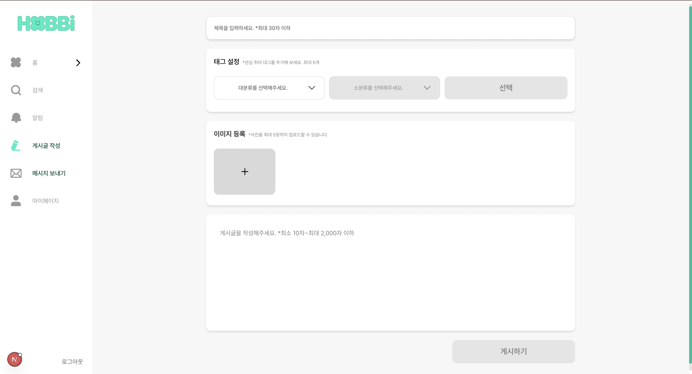
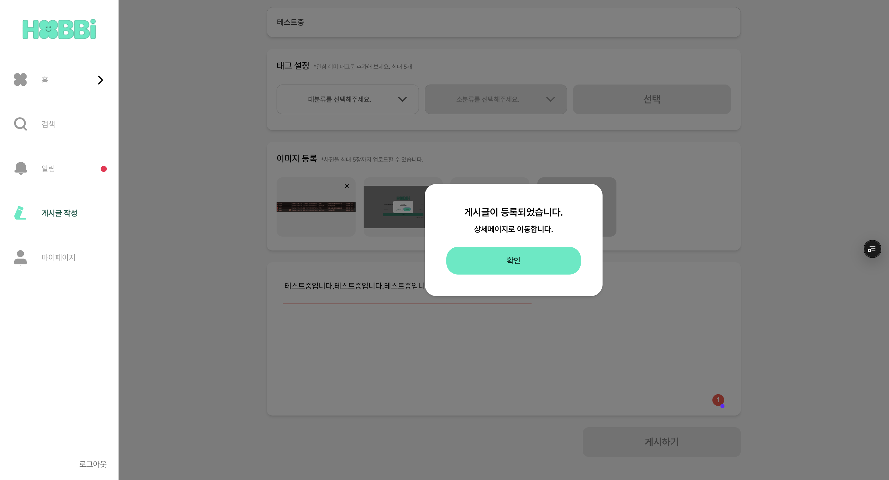
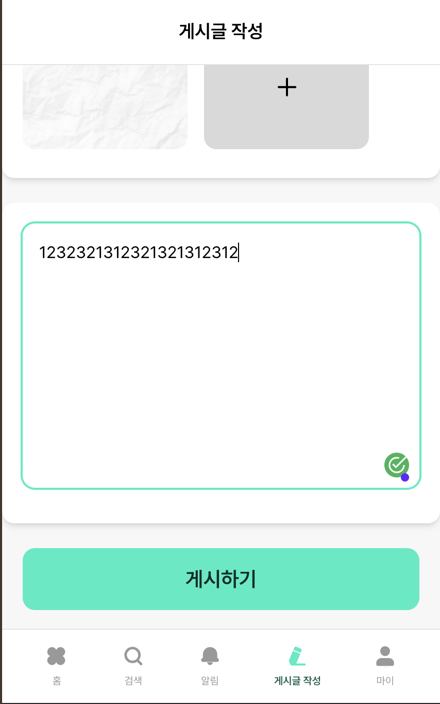

# 게시글 작성

게시글 작성 부분도 dnd-kit, 이미지, 취미태그, 제목, 내용 별로 취미 피드를 작성 하는 곳인데, 취미태그에 대한 데이터 가공 하는 법과 dnd-kit 부분이 어렵게 느껴져서 기록해보았습니다.

**PC**

|             |             |
| ----------- | ----------- |
|  |  |

**모바일**

|             |             |
| ----------- | ----------- |
|  |  |

사용자가 새로운 게시글을 작성할 수 있는 페이지

### 주요 기능

1. 게시글 제목 입력
2. 취미 태그 선택(최대 5개)
3. 이미지 업로드(최대 5장)
4. 게시글 내용 작성
5. 게시글 작성 데이터 검증
6. 게시글 작성 서버로 데이터 전송
7. 성공/실패 시 적절한 피드백 제공

### 흐름

1. 페이지 진입 시 취미 태그 선택 상태 초기화
2. PostForm 컴포넌트에서 사용자 입력 수집
3. 폼 제출 시 FormData로 서버로 전송
4. 성공 시 작성된 게시글 상세 페이지로 이동
5. 실패 시 에러 메시지 모달 표시

```tsx
const router = useRouter();
```

- 게시글 작성 완료 후 상세 페이지 이동에 사용

```tsx
const { openModal } = useModalStore();
```

- 성공/실패 메시지 표시에 사용

```tsx
const resetSelections = useHobbyStore((state) => state.resetSelections);
```

- 페이지 진입 시 및 작성 완료 후 취미 태그 선택 상태 초기화

```tsx
useEffect(() => {
  resetSelections();
}, [resetSelections]);
```

- 페이지 진입 시 취미 태그 선택 상태 초기화
- 목적
  - 이전에 선택된 취미 태그들이 남아있지 않도록 초기화
  - 사용자가 깨끗한 상태에서 게시글 작성 시작

```tsx
/*
 * @param formData - 게시글 작성에 필요한 모든 데이터 (제목, 내용, 이미지, 취미 태그)
 */

const handleSubmit = async (formData: FormData) => {
  try {
    // ===== 게시글 작성 요청 =====
    const { postId } = await postService.writePost(formData);

    // ===== 성공 처리 =====
    // 게시글 작성 완료 후에만 취미 태그 초기화
    // (페이지 진입 시와 중복되지 않도록)
    resetSelections();

    // 성공 모달 표시 및 상세 페이지 이동
    openModal({
      title: '게시글이 등록되었습니다.',
      message: '상세페이지로 이동합니다.',
      confirmText: '확인',
      onConfirm: () => {
        // 모달 확인 버튼 클릭 시 작성된 게시글 상세 페이지로 이동
        router.push(`/posts/${postId}`);
      },
    });
  } catch (error: any) {
    // ===== 에러 처리 =====
    console.error('게시글 작성 실패:', error);

    // 기본 에러 메시지
    let errorMessage = '게시글 작성에 실패했습니다.';

    // ===== 에러 타입별 메시지 분기 처리 =====
    if (error.code === 'EXCEED_FILE_SIZE_LIMIT') {
      // 파일 크기 초과 에러
      errorMessage = '이미지 파일의 크기가 너무 큽니다. 50MB 이하의 파일을 업로드해주세요.';
    } else if (error.message) {
      // 서버에서 전달된 에러 메시지가 있는 경우
      errorMessage = error.message;
    }

    // 에러 모달 표시
    openModal({
      title: '게시글 작성 실패',
      message: errorMessage,
      confirmText: '확인',
    });
  }
};
```

- 게시글 작성 폼 제출 핸들러
- PostForm 컴포넌트에서 전달받은 FormData를 처리
- 처리 과정
  - 서버에 게시글 작성 요청
  - 성공 시 취미 태그 초기화 및 성공 모달 표시
  - 실패 시 에러 타입에 따른 적절한 메시지 표시

```tsx
   /*
   * @param formData - 게시글 데이터 (이미지, 텍스트, 태그 등)
   * @returns Promise<PostResponse> - 작성된 게시글 정보
   */
  writePost: async (formData: FormData): Promise<PostResponse> => {
    const options: RequestInit = {
      method: 'POST',
      body: formData, // FormData는 Content-Type을 자동으로 설정
    };

    return fetchApi('/post', options);
  },
```

- 게시글 작성
- 새로운 게시글을 작성합니다. 이미지 파일과 텍스트 내용을 FormData로 전송

## ⭐️⭐️Post Form(취미 데이터 가공 하는 부분이 어려웠음)⭐️⭐️

게시글을 새로 작성하거나 기존 게시글을 수정할 수 있는 통합 폼 컴포넌트입니다.

### 주요 기능

1. 게시글 제목 입력(최대 30자)
2. 취미 태그 선택(최대 5개)
3. 이미지 업로드(최대 5장, 드래그 앤 드롭 지원)
4. 게시글 내용 입력(최소 10자, 최대 2000자)
5. 실시간 유효성 검사
6. 폼 제출 및 에러 처리
7. 애니메이션 효과

### 사용 모드

- 작성 모드 : `initialData`가 없는 경우
- 수정 모드 `initialData` 가 있는 경우(기존 데이터로 폼 초기화)

### 데이터 흐름

1. 사용자 입력 수집(제목, 내용, 태그, 이미지)
2. 실시간 유효성 검사
3. 폼 제출 시 FormData 생성
4. 부모 컴포넌트의 onSubmit 함수 호출

```tsx
/*
 * @param initialData - 수정할 게시글 데이터 (수정 모드에서만 사용)
 * @param onSubmit - 게시글 제출 함수 (FormData를 받아서 처리)
 * @param submitButtonText - 게시글 제출 버튼 텍스트 (기본값: '게시하기')
 */
interface PostFormProps {
  initialData?: PostDetail;
  onSubmit: (formData: FormData) => Promise<void>;
  submitButtonText?: string;
}
```

```tsx
const PostFormSchema = z.object({
  title: z.string().min(1, '제목을 입력해주세요.').max(30, '제목은 30자 이하로 입력해주세요.'),
  content: z.string().min(10, '내용은 최소 10자 이상 입력해주세요.').max(2000, '내용은 2,000자 이하로 입력해주세요.'),
  hobbyTags: z.array(z.string()).min(1, '태그를 선택해주세요.').max(5, '태그는 최대 5개까지 선택할 수 있습니다.'),
});
```

- title : 1-30자 필수
- content : 10-2000자 필수
- hobbyTags : 1-5개 필수

```tsx
type PostFormError = Partial<Record<'title' | 'content' | 'hobbyTags', string>>;
```

- 폼 에러 타입 정의

```tsx
const { selectedHobbyTags, setSelectedHobbyTags } = useHobbyStore();
```

- 취미 스토어에서 선택된 태그와 설정 함수 가져오기
- 전역 상태로 관리되어 다른 컴포넌트와 공유됨

```tsx
const [title, setTitle] = useState(initialData?.title || '');
```

- 게시글 제목 상태
- 수정 모드일 경우 기존 제목으로 초기화

```tsx
const [content, setContent] = useState(initialData?.content || '');
```

- 게시글 내용 상태
- 수정 모드일 경우 기존 내용으로 초기화

```tsx
const [images, setImages] = useState<ImageFile[]>(
  initialData?.postImageUrls.map((url) => ({
    file: null, // 기존 이미지는 file이 null
    preview: url, // 기존 이미지 URL을 preview로 사용
  })) || [],
);
```

- 이미지 파일 배열 상태
- 수정 모드일 경우 기존 이미지 URL을 preview로 설정
- 새로 업로드된 이미지는 file과 preview 모두 설정

```tsx
const [deletedImageUrls, setDeletedImageUrls] = useState<string[]>([]);
```

- 삭제된 이미지 URL 목록
- 수정 모드에서 기존 이미지를 삭제할 때 서버에 전송할 URL 목록

```tsx
const [formError, setFormError] = useState<PostFormError>({});
```

- 폼 유효성 검사 에러 상태

```tsx
useEffect(() => {
  // initialData가 있고 취미 태그가 있는 경우에만 실행
  if (initialData?.postHobbyTags) {
    // 서버에서 받은 태그 배열을 HobbyTag 형식으로 변환
    const convertedTags = initialData.postHobbyTags
      .map((subCategory) => {
        /**
         * HOBBY_SUB_CATEGORIES 객체에서 현재 subCategory가 속한 mainCategory 찾기
         *
         * HOBBY_SUB_CATEGORIES 구조 예시:
         * {
         *   'SPORTS': ['축구', '농구', '야구'],
         *   'ART': ['그림', '음악', '댄스'],
         *   ...
         * }
         *
         * Object.entries() 사용하여 [키, 값] 쌍의 배열로 변환 후
         * find()로 subCategory를 포함하는 카테고리 찾기
         */
        const mainCategoryEntry = Object.entries(HOBBY_SUB_CATEGORIES).find(([, subCategories]) =>
          subCategories.includes(subCategory),
        );

        // 메인 카테고리를 찾지 못한 경우 null 반환
        if (!mainCategoryEntry) {
          return null;
        }

        /**
         * mainCategoryEntry에서 메인 카테고리 키 추출
         * 예: ['SPORTS', ['축구', '농구', '야구']] => 'SPORTS'
         */
        const [mainCategoryKey] = mainCategoryEntry;

        /**
         * HOBBY_MAIN_CATEGORIES에서 실제 표시될 메인 카테고리 이름 가져오기
         *
         * HOBBY_MAIN_CATEGORIES 구조 예시:
         * {
         *   'SPORTS': '스포츠',
         *   'ART': '예술',
         *   ...
         * }
         */
        const mainCategory = HOBBY_MAIN_CATEGORIES[mainCategoryKey as keyof typeof HOBBY_MAIN_CATEGORIES];

        // HobbyTag 객체 형식으로 반환
        return {
          mainCategory, // 예: '스포츠'
          subCategory, // 예: '축구'
        } as HobbyTag;
      })
      // null 값 필터링 및 타입 가드 적용
      .filter((tag): tag is HobbyTag => tag !== null);

    // 변환된 태그 배열을 상태로 설정
    setSelectedHobbyTags(convertedTags);
  }
}, [initialData?.postHobbyTags, setSelectedHobbyTags]);
```

- 게시글 수정 시 기존 취미 태그 데이터 처리
- 목적
  - 초기 데이터(`initialData`)의 취미 태그를 컴포넌트의 상태로 변환
  - 서버 데이터 형식을 클라이언트 상태 형식으로 변환
- 데이터 변환 과정
  1. 서버에서 받은 태그 배열 : `[’축구’, ‘농구’, ‘야구’]`
  2. HOBBY_SUB_CATEGORIES에서 각 태그의 메인 카테고리 찾기
  3. 클라이언트 상태 형식으로 변환
     `[{ mainCategory: ‘스포츠’, subCategory: ‘축구’ }, …]`
- 서버 데이터 : `[’축구’, ‘농구’, ‘야구’]`
- 변환 결과 :
  ```tsx
  [
    { mainCategory: '스포츠', subCategory: '축구' },
    { mainCategory: '스포츠', subCategory: '농구' },
    { mainCategory: '스포츠', subCategory: '야구' },
  ];
  ```

```tsx
const handleTitleChange = useCallback((e: React.ChangeEvent<HTMLInputElement>) => {
  setTitle(e.target.value);
  const result = PostFormSchema.shape.title.safeParse(e.target.value);
  setFormError((prev) => ({
    ...prev,
    title: result.success ? undefined : result.error.errors[0].message,
  }));
}, []);
```

- 제목 입력 변경 핸들러

```tsx
const handleContentChange = useCallback((e: React.ChangeEvent<HTMLTextAreaElement>) => {
  setContent(e.target.value);
  const result = PostFormSchema.shape.content.safeParse(e.target.value);
  setFormError((prev) => ({
    ...prev,
    content: result.success ? undefined : result.error.errors[0].message,
  }));
}, []);
```

- 내용 입력 변경 핸들러

```tsx
useEffect(() => {
  const result = PostFormSchema.shape.hobbyTags.safeParse(selectedHobbyTags.map((tag) => tag.subCategory));
  setFormError((prev) => ({
    ...prev,
    hobbyTags: result.success ? undefined : result.error.errors[0].message,
  }));
}, [selectedHobbyTags]);
```

- 취미 태그 변경 시 유효성 검사
- selectedHobbyTags 가 변경될 때마다 실행되어 태그 개수에 대한 유효성을 검사합니다.

```tsx
const handleImageUpload = useCallback((files: File[]) => {
  const newImages = files.map((file) => ({
    file,
    preview: URL.createObjectURL(file), // 브라우저에서 미리보기 URL 생성
  }));
  setImages((prev) => [...prev, ...newImages]);
}, []);
```

- 이미지 업로드 핸들러
- 기능
  - 선택된 파일들을 ImageFile 형식으로 변환
  - 각 파일에 대해 미리보기 URL 생성
  - 기존 이미지 배열에 새 이미지들 추가

```tsx
const handleImageRemove = useCallback((index: number) => {
  setImages((prev) => {
    const newImages = [...prev]; // 기존 이미지 배열 복사
    const removedImage = newImages[index]; // 삭제할 이미지 추출

    // 기존 이미지 URL이 있다면 삭제 목록에 추가
    // (수정 모드에서 기존 이미지를 삭제한 경우)
    if (!removedImage.file && removedImage.preview) {
      setDeletedImageUrls((prev) => [...prev, removedImage.preview]);
    }

    // 새로 업로드된 이미지인 경우 브라우저 캐시에서 제거
    if (newImages[index].file) {
      URL.revokeObjectURL(newImages[index].preview);
    }
    newImages.splice(index, 1);
    return newImages;
  });
}, []);
```

- 이미지 삭제 핸들러
- 기능
  - 지정된 인덱스의 이미지 제거
  - 기존 이미지 URL인 경우 삭제 목록에 추가
  - 새로 업로드된 이미지인 경우 브라우저 캐시에서 제거

```tsx
const createFormData = () => {
  const formData = new FormData();

  // 게시글 메타데이터 (JSON 형태로 직렬화)
  const postData = {
    title,
    content,
    hobbyTagNames: selectedHobbyTags.map((tag) => tag.subCategory),
    deletedImageUrls, // 삭제된 이미지 URL 목록 추가
  };

  // JSON을 Blob으로 변환하여 FormData에 추가
  const requestBlob = new Blob([JSON.stringify(postData)], {
    type: 'application/json',
  });
  formData.append('request', requestBlob);

  // 새로 업로드된 이미지 파일들을 FormData에 추가
  images.forEach((image) => {
    if (image.file) {
      formData.append('imageFiles', image.file);
    }
  });

  return formData;
};
```

- 서버 전송용 FormData 생성
- 기능
  - 게시글 메타데이터를 JSON으로 직렬화
  - 이미지 파일들을 FormData에 추가
  - 삭제된 이미지 URL 목록 초함

```tsx
const handleSubmit = useCallback(async () => {
  // 전체 폼 데이터 유효성 검사
  const result = PostFormSchema.safeParse({
    title,
    content,
    hobbyTags: selectedHobbyTags.map((tag) => tag.subCategory),
  });

  if (!result.success) {
    // 유효성 검사 실패 시 에러 메시지 설정
    const fieldErrors: PostFormError = {};
    result.error.errors.forEach((err) => {
      if (err.path[0]) fieldErrors[err.path[0] as keyof PostFormError] = err.message;
    });
    setFormError(fieldErrors);
    return;
  }

  try {
    // FormData 생성 및 제출
    const formData = createFormData();
    await onSubmit(formData);
  } catch (error) {
    console.error('게시글 처리 실패:', error);
    alert(error instanceof Error ? error.message : '게시글 처리에 실패했습니다.');
  }
}, [title, content, selectedHobbyTags, images, deletedImageUrls, onSubmit]);
```

- 게시글 제출 핸들러
- 처리 과정
  1. 전체 폼 데이터 유효성 검사
  2. 유효성 검사 실패 시 에러 메시지 표시
  3. 유효성 검사 성공시 FormData 생성
  4. 부모 컴포넌트의 onSubmit 함수 호출
  5. 에러 발생 시 사용자에게 알림

## Post Image Uploader

게시글 작성 시 이미지를 업로드하고 관리하는 종합적인 업로더 컴포넌트 입니다.

### 주요 기능

1. 최대 5장까지 이미지 업로드(개수 제한)
2. 이미지 미리보기 표시(실시간)
3. 개별 이미지 삭제 버튼
4. 이미지 순서 드래그 앤 드롭 변경(dnd-kit 라이브러리 활용)
5. 다양한 이미지 형식 지원 \*\*(JPEG, PNG, GIF, BMP, WebP, HEIC)

### 사용자 경험

- 직관적인 드래그 앤 드롭 인터페이스
- 실시간 이미지 미리보기
- 드래그 중 시각적 피드백
- 업로드 제한 시 업로드 버튼 자동 숨김

```tsx
/*
 * @param images - 현재 업로드된 이미지 파일 배열 (ImageFile 타입)
 * @param onImageUpload - 새 이미지 파일 업로드 시 호출되는 콜백 함수
 * @param onImageRemove - 특정 이미지 삭제 시 호출되는 콜백 함수
 * @param onImageReorder - 이미지 순서 변경 시 호출되는 콜백 함수
 */
interface PostImageUploaderProps {
  images: ImageFile[];
  onImageUpload: (files: File[]) => void;
  onImageRemove: (index: number) => void;
  onImageReorder: (newImages: ImageFile[]) => void;
}
```

- Props 인터페이스

```tsx
const sensors = useSensors(useSensor(PointerSensor));
```

- dnd-kit 센서 설정
- PointerSensor를 사용하여 마우스와 터치 이벤트를 모두 처리
- 모바일과 데스크톱 환경에서 모두 드래그 앤 드롭이 가능

```tsx
const handleDragEnd = (event: any) => {
  const { active, over } = event;

  // ===== 유효성 검사 =====
  if (!over || active.id === over.id) return;

  // ===== 인덱스 계산 =====
  const oldIndex = images.findIndex((_, i) => String(i) === active.id);
  const newIndex = images.findIndex((_, i) => String(i) === over.id);

  // ===== 순서 변경 처리 =====
  if (oldIndex !== -1 && newIndex !== -1) {
    const newImages = arrayMove(images, oldIndex, newIndex);
    onImageReorder(newImages);
  }
};
```

- 드래그 종료 시 순서 변경 처리
- 드래그가 완료되면 이미지 배열의 순서를 변경하고 상위 컴포넌트에 새로운 순서를 전달합니다.
- 처리 과정
  1. 드래그된 요소(`active`)와 드롭된 위치(`over`)확인
  2. 유효하지 않은 드롭인 경우 처리 중단
  3. 기존 인덱스와 새로운 인덱스 계산
  4. arrayMove 함수로 배열 순서 변경
  5. 상위 컴포넌트에 새로운 배열 전달

```tsx
const handleImageChange = (e: React.ChangeEvent<HTMLInputElement>) => {
  const files = e.target.files;
  if (!files) return;

  // ===== 업로드 제한 확인 =====
  const remainingSlots = 5 - images.length;
  const filesToAdd = Array.from(files).slice(0, remainingSlots);

  onImageUpload(filesToAdd);
};
```

- 이미지 파일 선택 처리
- 처리 과정
  1. 선택된 파일들 확인
  2. 남은 슬롯 수 계산(최대 5장 제한)
  3. 제한에 맞게 파일 수 조정
  4. 상위 컴포넌트에 파일 전달

## Sortable Image

드래그 가능한 이미지 컴포넌트

dnd-kit 의 `useSortable` 훅을 사용하여 드래그 앤 드롭 기능을 제공

### 주요 기능

1. 드래그 시 시각적 피드백
2. 이미지 미리보기 표시
3. 삭제 버튼 제공
4. 터치/마우스 이벤트 처리

```tsx
const { attributes, listeners, setNodeRef, transform, transition, isDragging } = useSortable({ id });
```

dnd-kit에서 제공하는 드래그 관련 속성들

- `attributes`: 드래그 가능한 요소에 필요한 HTML 속성들
- `listeners`: 마우스/터치 이벤트 리스너들
- `setNodeRef`: DOM 요소 참조 함수
- `transform`: 드래그 중 변환 정보
- `transition`: 애니메이션 전환 정보
- `isDragging`: 현재 드래그 중인지 여부

```toc

```
