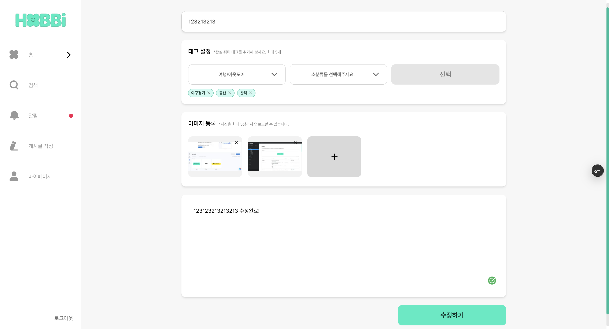
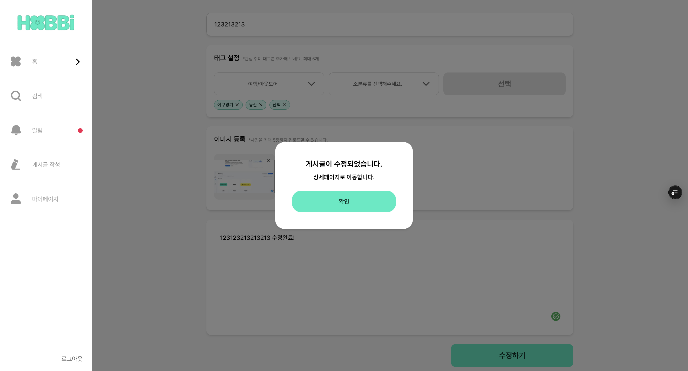
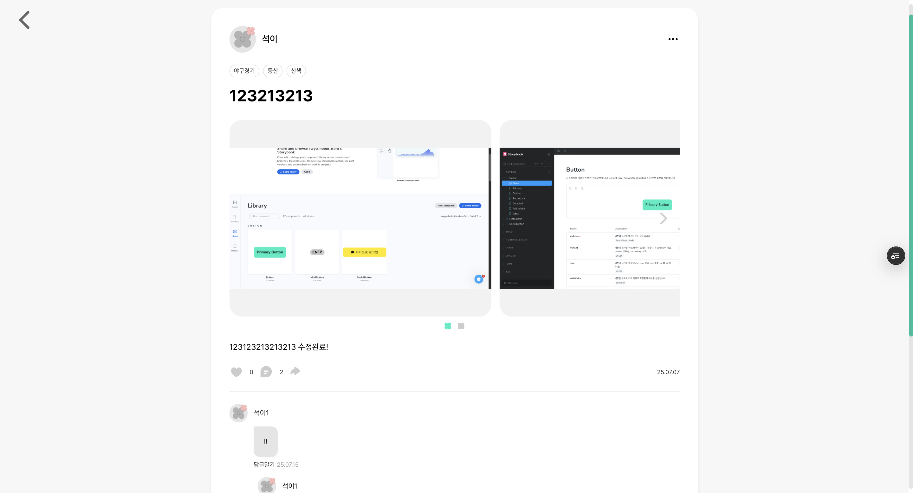
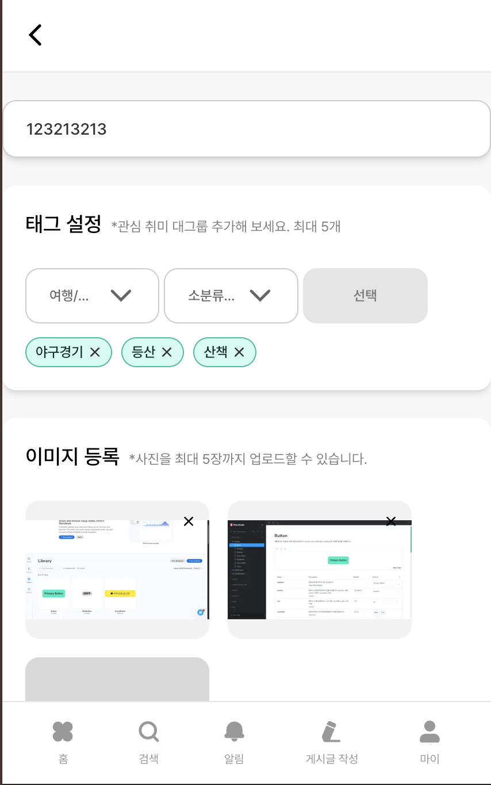
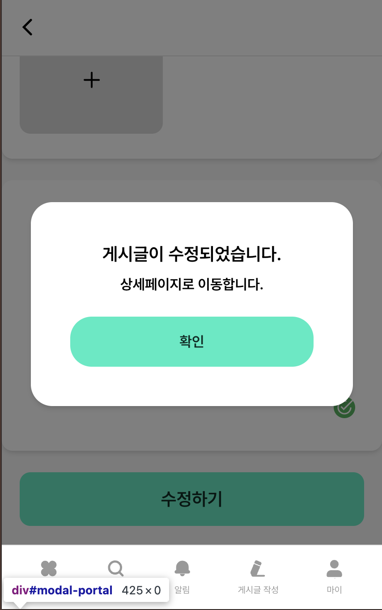

# 게시글 수정

게시글 수정에서는 dnd-kit을 사용했지만 아직 수정에 대해는 반영 되지 못하였습니다.(백엔드분과 소통 후 반영하도록 하겠습니다.)

**PC**

|             |             |
| ----------- | ----------- |
|  |  |



**모바일**

|             |             |
| ----------- | ----------- |
|  |  |

[게시글 작성](https://www.hyun-seok.com/30-hobbi-7/) 에서 Post Form은 같다(작성/수정 같이 되는 폼)

### 주요 기능

1. 게시글 상세 정보 조회 및 로딩
2. 게시글 수정 폼 표시(기존 데이터로 초기화)
3. 게시글 수정 기능(서버 업데이트 요청)
4. 성공/실패 시 적절한 피드백 제공
5. 수정 완료 후 상세 페이지로 자동 이동

### 데이터 흐름

1. URL 파라미터에서 게시글 ID 추출
2. 게시글 상세 정보 API 호출
3. 조회된 데이터로 PostForm 컴포넌트 초기화
4. 폼 제출 시 수정 API 호출
5. 성공 시 상세페이지로 이동, 실패 시 에러 모달

```tsx
const { id } = useParams();
```

- URL 파라미터에서 게시글 ID 추출

```tsx
const router = useRouter();
```

- 페이지 이동 및 뒤로가기에 사용

```tsx
const { openModal } = useModalStore();
```

- 성공/실패 메시지 표시에 사용

```tsx
const [post, setPost] = useState<PostDetail | null>(null);
```

- 게시글 상세 정보 상태
- API에서 조회한 게시글 데이터를 저장
- `null` 일 경우 게시글을 찾을 수 없음을 의미

```tsx
const [isLoading, setIsLoading] = useState(true);
```

- 로딩 상태

```tsx
useEffect(() => {
  const fetchPostDetail = async () => {
    try {
      setIsLoading(true);
      // ===== 게시글 상세 정보 API 호출 =====
      const data = await postService.getPostDetail(Number(id));
      setPost(data);
    } catch (error) {
      // ===== 에러 처리 =====
      console.error('게시글 로드 실패:', error);
      openModal({
        title: '오류',
        message: '게시글을 불러오는데 실패했습니다.',
        confirmText: '확인',
        onConfirm: () => router.back(), // 에러 시 이전 페이지로 이동
      });
    } finally {
      // ===== 로딩 상태 해제 =====
      setIsLoading(false);
    }
  };

  fetchPostDetail();
}, [id, router, openModal]);
```

- 게시글 상세 정보 조회
- 처리 과정
  1. 로딩 상태를 true로 설정
  2. 게시글 상세 정보 API 호출
  3. 성공 시 게시글 데이터 상태 업데이트
  4. 실새 시 에러 모달 표시 및 뒤로가기
  5. 완료 시 로딩 상태를 false로 설정

```tsx
  getPostDetail: async (postId: number) => {
    return fetchApi<PostDetail>(`/post/${postId}`, {
      method: 'GET',
    });
  },
```

- 회원용 게시글 상세 조회
- 로그인한 사용자가 게시글의 상세 정보를 조회

```tsx
const handleSubmit = async (formData: FormData) => {
  try {
    // ===== 게시글 수정 API 호출 =====
    await postService.updatePost(Number(id), formData);

    // ===== 성공 처리 =====
    openModal({
      title: '게시글이 수정되었습니다.',
      message: '상세페이지로 이동합니다.',
      confirmText: '확인',
      onConfirm: () => {
        // 모달 확인 버튼 클릭 시 수정된 게시글 상세 페이지로 이동
        router.push(`/posts/${id}`);
      },
    });
  } catch (error) {
    // ===== 에러 처리 =====
    console.error('게시글 수정 중 오류:', error);
    openModal({
      title: '오류',
      message: '게시글 수정 중 오류가 발생했습니다.',
      confirmText: '확인',
    });
  }
};
```

- 게시글 수정 제출 핸들러
- PostForm 컴포넌트에서 전달받은 FormData를 처리
- 처리 과정
  1. 게시글 수정 API 호출
  2. 성공 시 성공 모달 표시 및 상세 페이지 이동
  3. 실패 시 에러 모달 표시

```tsx
  updatePost: async (
    postId: number,
    formData: FormData,
  ): Promise<PostResponse> => {
    return fetchApi(`/post/${postId}`, {
      method: 'PUT',
      body: formData,
    });
  },
```

- 게시글 수정
- 기존 게시글의 내용을 수정, 이미지와 텍스트 모두 수정 가능

```toc

```
