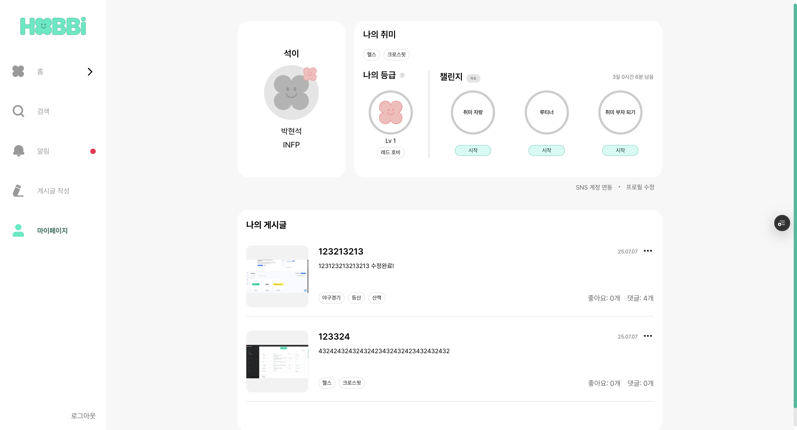
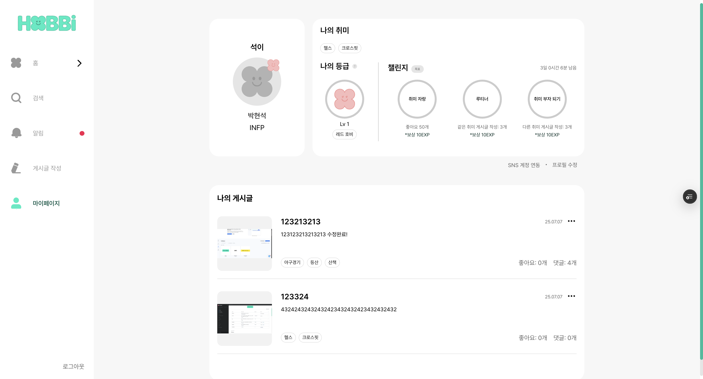
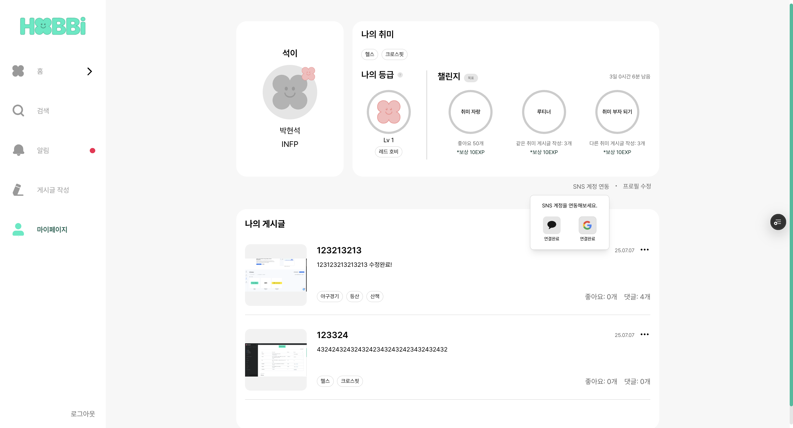
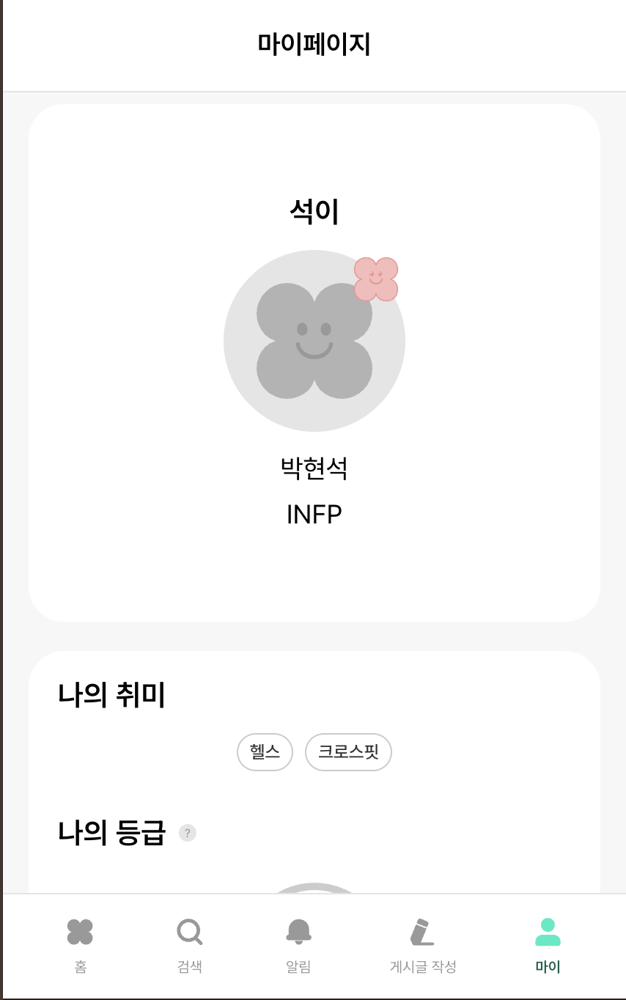
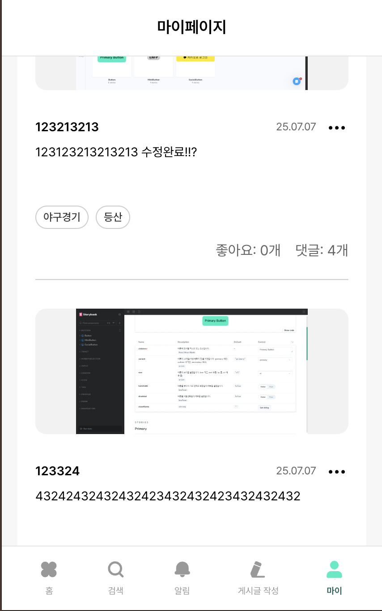

# 마이페이지(소셜 연동, 챌린지 부분)

소셜 연동은 [로그인, 소셜 로그인(kakao, google)](https://www.hyun-seok.com/25-hobbi-2/) 에 기록을 해두었고, 챌린지 부분 같은 경우에는 취미 자랑, 루티너, 취미 부자 되기로 일단 3가지로 딱 정해져있어서, Zustand로 상태를 관리를 하였습니다.

**PC**

|             |             |
| ----------- | ----------- |
|  |  |



**모바일**

|             |             |
| ----------- | ----------- |
|  |  |



사용자의 개인 정보, 취미, 등급, 게시글을 관리하는 페이지

### 주요 기능

1. 사용자 프로필 정보 표시
2. 사용자 취미 태그 관리
3. 사용자 등급 및 챌린지 현황 표시
4. 사용자 게시글 목록 표시
5. SNS 계정 연동 관리
6. 프로필 수정 페이지 이동

```tsx
const router = useRouter();
```

- 프로필 수정 페이지로 이동할 때 사용.

```tsx
const [showSnsMenu, setShowSnsMenu] = useState(false);
```

- SNS 연동 드롭다운 메뉴 표시 상태

```tsx
const [socialStatus, setSocialStatus] = useState<{
  kakao: boolean;
  google: boolean;
}>({
  kakao: false,
  google: false,
});
```

- SNS 연동 상태
- 구조
  - kakao
  - google

```tsx
const snsMenuRef = useRef<HTMLDivElement>(null);
```

- SNS 연동 드롭다운 메뉴의 DOM 요소를 참조

```tsx
const { data, status, error, refetch } = useQuery({
  queryKey: ['myPageData'],
  queryFn: async () => {
    const [userProfileData, userPostData, userRankData] = await Promise.all([
      userService.getMyPageInfo(),
      userService.getMyPosts(),
      userService.getUserRank(),
    ]);
    return { userProfileData, userPostData, userRankData };
  },
});
```

- React Query를 사용하여 마이페이지에 필요한 모든 데이터를 병렬로 가져옵니다.
- 데이터
  - userProfileData : 사용자 프로필 정보
  - userPostData : 사용자 게시글 목록
  - userRankData : 사용자 등급 및 챌린지 정보

```tsx
  getMyPageInfo: async (): Promise<MyPageInfo> => {
    return fetchApi<MyPageInfo>('/my-page', {
      method: 'GET',
    });
  },
```

- 마이페이지 정보 조회

```tsx
  getMyPosts: async (
    lastPostId?: number,
    pageSize: number = 15,
  ): Promise<MyPostsResponse> => {
    const params = new URLSearchParams();
    if (lastPostId) params.append('lastPostId', lastPostId.toString());
    params.append('pageSize', pageSize.toString());

    return fetchApi<MyPostsResponse>(`/my-page/myposts?${params}`, {
      method: 'GET',
    });
  },
```

- 내 게시글 목록 조회
- 무한 스크롤 지원

```tsx
  getUserRank: async (): Promise<Rank> => {
    return fetchApi<Rank>('/user-rank/me', {
      method: 'GET',
    });
  },
```

- 사용자 등급 조회

```tsx
const handleEditProfile = () => {
  router.push('/my_page/edit');
};
```

- 프로필 수정 페이지 이동 핸들러

```tsx
const handleSnsMenuClick = async () => {
  try {
    const status = await userService.getLoginStatus();
    setSocialStatus(status);
    setShowSnsMenu(!showSnsMenu);
  } catch (error) {
    console.error('소셜 연동 상태 조회 실패:', error);
    setShowSnsMenu(!showSnsMenu);
  }
};
```

- SNS 연동 메뉴 클릭 핸들러
- 사용자가 "SNS 계정 연동" 버튼을 클릭했을 때 호출됩니다.
- 처리 과정
  1. 현재 SNS 연동 상태를 서버에서 조회
  2. 연동 상태를 로컬 상태에 업데이트
  3. 드롭다운 메뉴 표시/숨김 토글
  4. 에러 발생 시에도 메뉴는 토글

```tsx
  getLoginStatus: async (): Promise<{ kakao: boolean; google: boolean }> => {
    return fetchApi('/oauth/status', {
      method: 'GET',
    });
  },
};
```

- 소셜 로그인 연동 정보 조회

```tsx
useEffect(() => {
  const handleClickOutside = (event: MouseEvent) => {
    if (snsMenuRef.current && !snsMenuRef.current.contains(event.target as Node)) {
      setShowSnsMenu(false);
    }
  };

  document.addEventListener('mousedown', handleClickOutside);
  return () => {
    document.removeEventListener('mousedown', handleClickOutside);
  };
}, []);
```

- 외부 클릭 감지 및 메뉴 닫기
- 처리 과정
  1. mousedown 이벤트 리스너 등록
  2. 클릭된 요소가 메뉴 외부인지 확인
  3. 외부 클릭 시 메뉴 닫기
  4. 컴포넌트 언마운트 시 이벤트 리스너 제거

## Challenge (Zustand 스토어)

### 주요 기능

1. 챌린지 목록 관리 (3가지 챌린지)
2. 챌린지 진행률 추적
3. 챌린지 상태 관리(시작/진행/완료)
4. 서버와의 챌린지 데이터 동기화
5. 주간 리셋 타이머 관리

```tsx
function getTimeUntilNextMonday(): number {
  const now = new Date();
  const dayOfWeek = now.getDay(); // 0 = 일요일, 1 = 월요일, ...

  // ===== 다음 월요일까지의 일수 계산 =====
  const daysUntilMonday = dayOfWeek === 0 ? 1 : 8 - dayOfWeek;

  // ===== 다음 월요일 자정 설정 =====
  const nextMonday = new Date(now);
  nextMonday.setDate(now.getDate() + daysUntilMonday);
  nextMonday.setHours(0, 0, 0, 0); // 자정(00:00:00)으로 설정

  // ===== 남은 시간(초) 계산 =====
  return Math.floor((nextMonday.getTime() - now.getTime()) / 1000);
}
```

- 챌린지 리셋 시간을 계산하기 위한 유틸리티 함수
- 계산 로직
  1. 현재 요일 확인 (0 = 일요일, 1 = 월요일, ..., 6 = 토요일)
  2. 다음 월요일까지의 일수 계산
  3. 다음 월요일 자정(00:00) 설정
  4. 현재 시간과의 차이를 초 단위로 반환
- 계산 예시
  - 오늘이 월요일(1) → 다음 월요일까지 7일
  - 오늘이 화요일(2) → 다음 월요일까지 6일

챌린지 관련 상태와 액션들을 정의

```tsx
interface ChallengeStore {
  challenges: Challenge[];
  remainingTime: number;
  startChallenge: (id: string) => void;
  updateProgress: (id: string, current: number) => void;
  completeChallenge: (id: string) => void;
  updateRemainingTime: () => void;
  fetchChallenges: () => Promise<void>;
}
```

- 상태
  - `challenges` : 챌린지 목록
  - `remainingTime` : 챌린지 리셋까지 남은 시간(초)
- 액션
  - `startChallenge` : 챌린지 시작
  - `updateProgress` : 챌린지 진행률 업데이트
  - `completeChallenge` : 챌린지 완료
  - `updateRemainingTime` : 남은 시간 업데이트
  - `fetchChallenges` : 서버에서 챌린지 데이터 조회

```tsx
const initialChallenges: Challenge[] = [
  {
    id: '1',
    title: '취미 자랑',
    current: 0,
    total: 50,
    description: '좋아요 50개',
    reward: '보상 10EXP',
    status: 'NOT_STARTED',
  },
  {
    id: '2',
    title: '루티너',
    current: 0,
    total: 3,
    description: '같은 취미 게시글 작성: 3개',
    reward: '보상 10EXP',
    status: 'NOT_STARTED',
  },
  {
    id: '3',
    title: '취미 부자 되기',
    current: 0,
    total: 3,
    description: '다른 취미 게시글 작성: 3개',
    reward: '보상 10EXP',
    status: 'NOT_STARTED',
  },
];
```

- 초기 챌린지 데이터
- 챌린지 종류
  - 취미 자랑 : 좋아요 50개 달성 (보상 10EXP)
  - 루티너 : 같은 취미 게시글 3개 작성 (보상 10EXP)
  - 취미 부자 되기 : 다른 취미 게시글 3개 작성 (보상 10EXP)
- 각 챌린지 구조
  - id : 고유 식별자
  - title : 챌린지 제목
  - current : 현재 진행 수치
  - total : 목표 수치
  - description : 챌린지 설명
  - reward : 보상 정보
  - status : 챌린지 상태(`NOT_STARTED`, `IN_PROGRESS`, `COMPLETED`)

```tsx
challenges: initialChallenges,
```

- 챌린지 목록
- 초기에는 기본 챌린지 데이터로 시작하고, 서버에서 데이터를 조회한 후 업데이트됩니다.

```tsx
remainingTime: getTimeUntilNextMonday(),
```

- 챌린지 리셋까지 남은 시간
- 다음 월요일 자정까지의 시간을 초 단위로 저장합니다.
- 실시간으로 업데이트되어 사용자에게 남은 시간을 표시

```tsx
  fetchChallenges: async () => {
    try {
      const response = await challengeService.getChallenges();

      set((state) => ({
        challenges: state.challenges.map((challenge) => {
          // ===== API 응답에서 해당 챌린지 데이터 찾기 =====
          const apiChallenge =
            response[`challenge${challenge.id}` as keyof typeof response];

          // ===== API 데이터가 없으면 기존 챌린지 유지 =====
          if (!apiChallenge) return challenge;

          // ===== API 데이터로 챌린지 업데이트 =====
          return {
            ...challenge,
            current: apiChallenge.point, // 진행률 업데이트
            status: apiChallenge.achieved
              ? 'COMPLETED' // 달성 완료
              : apiChallenge.started
                ? 'IN_PROGRESS' // 진행 중
                : 'NOT_STARTED', // 시작하지 않음
          };
        }),
      }));
    } catch (error) {
      console.error('챌린지 조회 실패:', error);
    }
  },

```

- 서버에서 챌린지 데이터 조회
- 처리 과정
  1. `challengeService.getChallenges()` API 호출
  2. 응답 데이터를 로컬 챌린지와 매핑
  3. 진행률(`current`)과 상태(`status`) 업데이트
  4. 에러 발생 시 콘솔에 로그 출력
- 데이터 매핑
  - API 응답의 `point` → `current`(진행률)
  - API 응답의 `achieved` → `COMPLETED` 상태
  - API 응답의 `started` → `IN_PROGRESS`
  - 기본값 → `NOT_STARTED` 상태

```tsx
  getChallenges: async (): Promise<ChallengeApiResponse> => {
    return fetchApi('/challenge', {
      method: 'GET',
    });
  },
```

- 챌린지 조회 api

```tsx
  startChallenge: (id) =>
    set((state) => ({
      challenges: state.challenges.map((challenge) =>
        challenge.id === id
          ? { ...challenge, status: 'IN_PROGRESS' }
          : challenge,
      ),
    })),
```

- 챌린지 시작
- 처리 과정
  1. 지정된 ID의 챌린지를 찾음
  2. 상태를 ‘IN_PROGRESS’로 변경
  3. 다른 챌린지는 그대로 유지

```tsx
  updateProgress: (id, current) =>
    set((state) => ({
      challenges: state.challenges.map((challenge) => {
        if (challenge.id === id) {
          // ===== 목표 달성 여부 확인 =====
          const isCompleted = current >= challenge.total;

          return {
            ...challenge,
            current,
            status: isCompleted ? 'COMPLETED' : 'IN_PROGRESS',
          };
        }
        return challenge;
      }),
    })),
```

- 챌린지 진행률 업데이트
- 처리 과정
  1. 지정된 ID의 챌린지를 찾음
  2. 현재 진행률을 업데이트
  3. 목표 달성 여부 확인
  4. 달성 시 상태를 ‘COMPLETED’로 변경
  5. 미달성 시 상태를 ‘IN_PROGRESS’로 유지
- 자동 완료 로직
  - `current` ≥ `total`: 자동으로 COMPLETED 상태
  - `current` < `total`: IN_PROGRESS 상태 유지

```tsx
  completeChallenge: (id) =>
    set((state) => ({
      challenges: state.challenges.map((challenge) =>
        challenge.id === id ? { ...challenge, status: 'COMPLETED' } : challenge,
      ),
    })),
```

- 챌린지 완료
- 처리 과정
  1. 지정된 ID의 챌린지를 찾음
  2. 상태를 ‘COMPLETED’로 변경
  3. 다른 챌린지는 그대로 유지

```tsx
  updateRemainingTime: () =>
    set(() => ({
      remainingTime: getTimeUntilNextMonday(),
    })),
}));
```

- 남은 시간업데이트
- 처리 과정
  1. `getTimeUntilNextMonday()` 함수 호출
  2. 다음 월요일 자정까지의 시간 계산
  3. `remainingTime` 상태 업데이트

## User Rank

마이페이지에서 사용자의 등급 정보와 챌린지 현황을 표시하는 종합적인 컴포넌트

### 주요 기능

1. 사용자 등급 정보 표시(레벨, 경험치, 등급)
2. 레벨 진행률 바 표시
3. 챌린지 목록 및 진행 상황 표시
4. 챌린지 리셋 타이머 표시
5. 툴팁을 통한 상세 정보 제공
6. 반응형 디자인

### 데이터 관리

- 사용자 등급 정보 : API를 통한 서버 데이터 조회
- 챌린지 정보 : Zustand 스토어를 통한 상태 관리
- 타이머 : 실시간 업데이트

### 챌린지 종류

- 취미 자랑 : 게시글 좋아요 50개 (보상 : 10EXP)
- 루티너 : 같은 취미 게시글 3개 (보상 : 10EXP)
- 추미 부자 되기 : 다른 취미 게시글 3개 (보상 : 10EXP)

```tsx
const { challenges, remainingTime, updateRemainingTime, fetchChallenges } = useChallengeStore();
```

- challenges : 모든 챌린지 목록
- remainingTime : 챌린지 리셋까지 남은 시간
- updateRemainingTime : 타이머 업데이트 함수
- fetchChallenges : 챌린지 데이터 조회 함수

```tsx
const [userRank, setUserRank] = useState<Rank | null>(null);
```

- 사용자 등급 정보 상태

```tsx
useEffect(() => {
  const timer = setInterval(updateRemainingTime, 1000);
  return () => clearInterval(timer);
}, [updateRemainingTime]);
```

- 타이머 업데이트 설정
- 챌린지 리셋까지 남은 시간을 1초마다 업데이트

```tsx
useEffect(() => {
  fetchChallenges();
}, [fetchChallenges]);
```

- 챌린지 데이터 로드
- 동작 방식
  1. `fetchChallenges` 함수 호출
  2. 서버에서 챌린지 데이터 조회
  3. Zustand 스토어에 데이터 저장

```tsx
useEffect(() => {
  const fetchRank = async () => {
    try {
      const data = await userService.getUserRank();
      setUserRank(data);
    } catch (err) {
      console.error('등급 정보 조회 실패:', err);
    }
  };

  fetchRank();
}, []);
```

- 사용자 등급 정보 조회
- 처리 과정
  1. `userService.getUserRank()` API 호출
  2. 성공 시 `userRank` 상태 업데이트
  3. 실패 시 콘솔에 에러 로그 출력

```tsx
  getUserRank: async (): Promise<Rank> => {
    return fetchApi<Rank>('/user-rank/me', {
      method: 'GET',
    });
  },
```

- 사용자 등급 조회

```tsx
const currentLevel = userRank.currentExp >= userRank.requiredExp ? userRank.level + 1 : userRank.level;
```

- 현재 레벨 계산
- 계산 로직
  - 현재 경험치 ≥ 목표 경험치 : 다음 레벨 표시
  - 현재 경험치 < 목표 경험치 : 현재 레벨 표시
- 예시
  - 현재 경험치 : 150, 목표 : 100 → 레벨 2 표시
  - 현재 경험치 : 80, 목표 : 100 → 레벨 1 표시

## Challenge Item

개별 챌린지를 표시하고 관리하는 컴포넌트

### 주요 기능

1. 챌린지 진행률 원형 프로그레스 바 표시
2. 팰린지 상태에 따른 버튼 표시 (시작/완료)
3. 챌린지 설명 및 보상 정보 표시
4. 챌린지 시작/완료 API 호출
5. 반응형 디자인

### 챌린지 상태

- `NOT_STARTED` : 시작하지 않은 챌린지 (시작 버튼 표시)
- `IN_PROGRESS` : 진행 중인 챌린지 (설명 및 보상 표시)
- `COMPLETED` : 완료된 챌린지 (완료 버튼 표시)

```tsx
/*
 * @param id - 챌린지 고유 식별자 (문자열)
 * @param className - 추가 CSS 클래스 (선택적)
 */
interface ChallengeItemProps {
  id: string;
  className?: string;
}
```

- props 인터페이스

```tsx
const { challenges, startChallenge, completeChallenge } = useChallengeStore();
```

- challenges : 모든 챌린지 목록
- startChallenge : 챌린지 시작 함수
- completeChallenge : 챌린지 완료 함수

```tsx
const challenge = challenges.find((c) => c.id === id);
```

- id를 기준으로 challenges 배열에서 해당 챌린지를 찾습니다.

```tsx
const { title, current, total, description, reward, status } = challenge;
```

- 챌린지 데이터에서 필요한 속성들을 추출
- title : 챌린지 제목
- current : 현재 진행 수치
- total : 목표 수치
- description : 챌린지 설명
- reward : 보상 정보
- status : 챌린지 상태(`NOT_STARTED`, `IN_PROGRESS`, `COMPLETED`)

```tsx
const percentage = (current / total) * 100;
```

- 챌린지 진행률 계산
- 예시
  - current : 3, total : 10 ⇒ 30%
  - current : 0, total : 5 ⇒ 0%

```tsx
const handleStart = async () => {
  try {
    await challengeService.startChallenge(Number(id));
    startChallenge(id);
  } catch (error) {
    console.error('챌린지 시작 실패:', error);
  }
};
```

- 챌린지 시작 함수
- 처리 과정
  1. API 서비스를 통해 서버에 챌린지 시작 요청
  2. 성공 시 로컬 상태 업데이트(`startChallenge`)
  3. 실패 시 콘솔에 에러 로그 출력

```tsx
  startChallenge: async (challengeNumber: number): Promise<void> => {
    return fetchApi(`/challenge/start/${challengeNumber}`, {
      method: 'POST',
    });
  },
```

- 챌린지 시작
- `challengeNumber` - 시작할 챌린지 번호 (나중에 번호 말고 명칭으로 바뀔 예정)

```tsx
const handleComplete = () => {
  completeChallenge(id);
};
```

- 챌린지 완료 함수
- 처리 과정
  1. 로컬 상태 업데이트(`completeChallenge`)
  2. 서버 API 호출 없이 즉시 완료 처리

```toc

```
