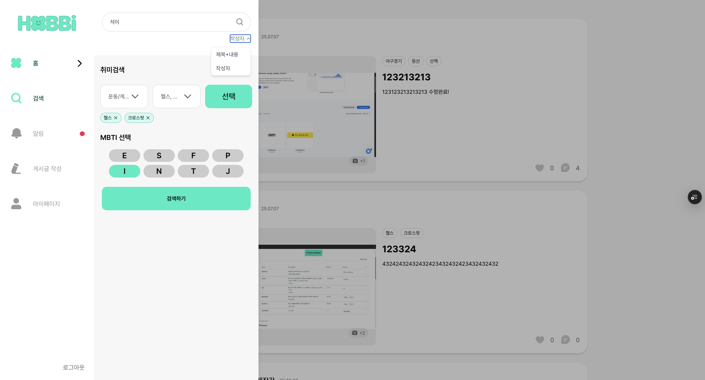

# 검색 페이지

검색 페이지 같은 경우 비인가이기도 해서 한 분이 파이썬으로 작업을 진행했지만, 지금은 나가셔서 JAVA로 변경중입니다.

|             |             |
| ----------- | ----------- |
|  |  |

## Search Content

검색 페이지에서 검색 결과를 표시하고 관리하는 컴포넌트

### 주요 기능

1. URL 검색 파라미터 기반 검색 결과 조회
2. 무한 스크롤을 통한 검색 결과 페이지네이션
3. 검색 조건 태그 표시 및 개별 삭제
4. 검색 결과 로딩 상태 및 에러 처리
5. 검색 결과 없음 상태 처리

### 검색 조건

- `keyword_text` : 제목 + 본문 검색 키워드
- `keyword_user` : 작성자 검색 키워드
- `mbti` : MBTI 필터 (다중 선택 가능)
- `hobby_tags` : 취미 태그 필터 (다중 선택 가능)

### 데이터 흐름

1. URL 검색 파라미터 파싱
2. 검색 조건에 따른 API 호출
3. 무한 스크롤로 추가 결과 로드
4. 검색 조건 변경 시 자동 재검색

```tsx
const router = useRouter();
```

- 검색 조건 변경 시 URL 업데이트에 사용

```tsx
const searchParams = useSearchParams();
```

- 현재 검색 조건을 URL에서 가져와서 사용

```tsx
const observerRef = useRef<HTMLDivElement>(null);
```

- 무한 스크롤을 위한 DOM 요소

```tsx
const handleDeleteSearchParam = (key: string, value?: string) => {
  const newSearchParams = new URLSearchParams(searchParams.toString());

  if (value) {
    // ===== 다중 값 중 특정 값만 제거 =====
    const values = newSearchParams.getAll(key);
    newSearchParams.delete(key);
    values.forEach((v) => {
      if (v !== value) newSearchParams.append(key, v);
    });
  } else {
    // ===== 전체 키 제거 =====
    newSearchParams.delete(key);
  }

  // 업데이트된 검색 조건으로 URL 이동
  router.push(`/posts/search?${newSearchParams.toString()}`);
};
```

- 검색 조건 태그를 클릭했을 때 해당 조건을 제거하고 URL을 업데이트
- 처리 과정
  1. 현재 URL 검색 파라미터 복사
  2. 특정 값이 지정된 경우 해당 값만 제거
  3. 값이 지정되지 않은 경우 전체 키 제거
  4. 업데이트된 URL로 페이지 이동
- `key` - 제거할 검색 조건 키 (keyword_text, keyword_user, mbti, hobby_tags)
- `value` - 제거할 특정 값(다중 값이 있는 경우에만 사용)
- 단일 값 제거
  ```tsx
  handleDeleteSearchParam('keyword_text');
  ```
- 다중 값 중 특정 값만 제거
  ```tsx
  handleDeleteSearchParam('mbti', 'INTJ');
  ```

```tsx
const {
  data, // 조회된 검색 결과 데이터 (페이지별로 그룹화)
  fetchNextPage, // 다음 페이지 데이터 요청 함수
  hasNextPage, // 다음 페이지 존재 여부
  isFetchingNextPage, // 다음 페이지 로딩 중 여부
  isLoading, // 초기 로딩 상태
  isError, // 에러 상태
} = useInfiniteQuery({
  queryKey: ['search', searchParams.toString()],
  queryFn: async ({ pageParam }: { pageParam: PageParam }) => {
    // ===== URL 검색 파라미터 파싱 =====
    const keywordText = searchParams.get('keyword_text') || '';
    const keywordUser = searchParams.get('keyword_user') || '';
    const mbti = searchParams.getAll('mbti') || [];
    const hobbyTags = searchParams.getAll('hobby_tags') || [];

    // ===== 검색 API 호출 =====
    return await searchService.getSearchPosts({
      keyword_text: keywordText,
      keyword_user: keywordUser,
      mbti,
      hobby_tags: hobbyTags,
      cursor_created_at: pageParam?.createdAt ?? null,
      cursor_id: pageParam?.postId ?? null,
      limit: 15,
    });
  },
  initialPageParam: undefined as PageParam,
  getNextPageParam: (lastPage: SearchPostResponse): PageParam => {
    // ===== 다음 페이지 파라미터 결정 로직 =====
    if (!lastPage.has_more) return undefined;
    return {
      createdAt: lastPage.next_cursor_created_at,
      postId: lastPage.next_cursor_post_id,
    };
  },
});
```

- 무한 스크롤을 위한 검색 결과 조회 쿼리
- 쿼리 키 : `[’search’, ‘searchParams.toString()’]`
  - `searchParams`가 변경될 때마다 자동으로 재실행
  - 검색 조건별로 캐시 분리
- 기능
  - URL 검색 파라미터 기반 검색 결과 조회
  - 페이지별 데이터 로드
  - 다음 페이지 파라미터 자동 관리
  - 캐시된 데이터 재사용

```tsx
useEffect(() => {
  const observer = new IntersectionObserver(
    (entries) => {
      if (entries[0].isIntersecting && hasNextPage && !isFetchingNextPage) {
        fetchNextPage();
      }
    },
    { threshold: 0.1 }, // 관찰 대상이 10% 이상 보일 때 콜백 실행
  );

  if (observerRef.current) {
    observer.observe(observerRef.current);
  }

  return () => observer.disconnect();
}, [fetchNextPage, hasNextPage, isFetchingNextPage]);
```

- 무한 스크롤을 위한 스크롤 위치 감지

```toc

```
