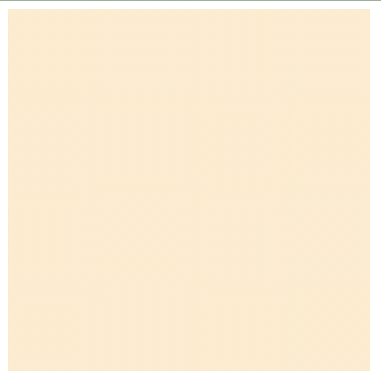
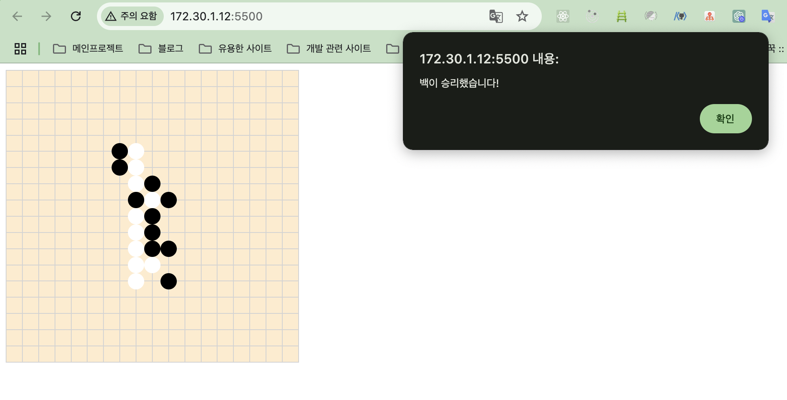

## Why?

순수 자바스크립트로 포트폴리오를 만들어 보고 싶어서 고민하다가 내가 진짜 만들어보고 싶었던 게 뭘까 고민하다가, 오목을 좋아하니깐 오목을 만들어보자 해서 만들어 보도록 하겠습니다.

사실 고스트 바둑왕을 좋아해서 바둑을 만들고 싶었지만, 바둑에 대한 규칙을 모르기 때문에 고스트 오목왕으로 let's go~

## HTML, CSS




일단 기본 틀을 만듭니다.

## JAVASCRIPT


#### 위치가 중복될 경우


#### 게임 승리시



## 다음에 해야 할 것

- 백돌일 때 33 규칙 넣기
- 버그 찾아서 고치기
- (흑돌, 백돌 각각의)스탑워치 놓기
- WebRCT 이용해서 실시간으로 채팅이나, 게임방 만들기

[출처](https://yermi.tistory.com/entry/Toy-Project-%EC%9D%B4%EB%B2%88%EC%97%90%EB%8A%94-%EC%9B%B9-%ED%8E%98%EC%9D%B4%EC%A7%80-%EC%98%A4%EB%AA%A9%EC%9D%B4%EB%8B%A41%F0%9F%8E%B2-JavaScript%EC%99%80-CSS%EB%A1%9C-%EB%B0%94%EB%91%91%ED%8C%90-%EB%A7%8C%EB%93%A4%EA%B8%B0)

```toc

```
