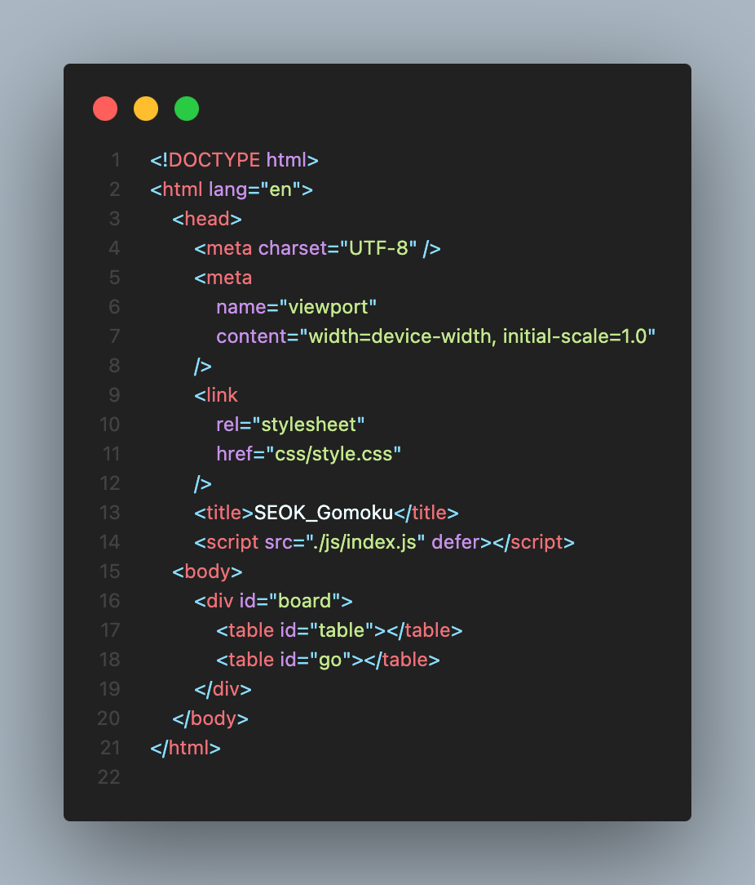
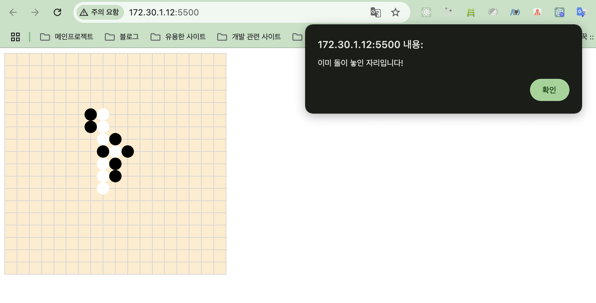
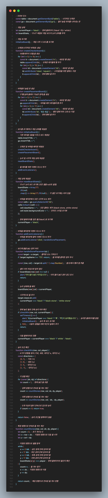

## Why?

순수 자바스크립트로 포트폴리오를 만들어 보고 싶어서 고민하다가 내가 진짜 만들어보고 싶었던 게 뭘까 고민하다가, 오목을 좋아하니깐 오목을 만들어보자 해서 만들어 보도록 하겠습니다.

사실 고스트 바둑왕을 좋아해서 바둑을 만들고 싶었지만, 바둑에 대한 규칙을 모르기 때문에 고스트 오목왕으로 let's go~

## 1. HTML, CSS

```html
<!DOCTYPE html>
<html lang="en">
    <head>
        <meta charset="UTF-8" />
        <meta
            name="viewport"
            content="width=device-width, initial-scale=1.0"
        />
        <link
            rel="stylesheet"
            href="css/style.css"
        />
        <title>SEOK_Gomoku</title>
        <script src="./js/index.js" defer></script>
    <body>
        <div id="board">
            <table id="table"></table>
            <table id="go"></table>
        </div>
    </body>
</html>
```

```css
#table {
  position: absolute;
  background-color: blanchedalmond;
  width: 360px;
  height: 360px;
  border-collapse: collapse;
  border-spacing: 0;
}
#go {
  position: absolute;
  margin: 10px;
  width: 340px;
  height: 340px;
  border-collapse: collapse;
}
.black-stone {
  background-color: black;
  border-radius: 50%;
}
.white-stone {
  background-color: white;
  border-radius: 50%;
}
.square {
  border: thin solid lightgray;
  padding: 0;
}
```



일단 기본 틀을 만듭니다.

## 2. JAVASCRIPT

```javascript
// DOM 요소
const table = document.getElementById('table'); // 시각적인 오목판
const go = document.getElementById('go'); // 돌이 놓일 위치를 나타내는 판
// 게임 상태
let currentPlayer = 'black'; // 현재 플레이어 ('black' 또는 'white')
let boardState; // 17x17 배열로 게임 보드의 논리 상태를 추적
// 게임 초기화
initializeBoard(); // 게임 시작 시 보드를 초기화
// 오목판(시각적인 바둑판) 생성
function createCheckerboard() {
  // 18행(테두리 포함)을 생성
  for (let i = 0; i < 18; i++) {
    const tr = document.createElement('tr'); // 새로운 행 생성
    table.appendChild(tr); // 오목판 테이블에 행 추가
    for (let j = 0; j < 18; j++) {
      const td = document.createElement('td'); // 새로운 셀 생성
      td.setAttribute('class', 'square'); // 스타일링을 위한 클래스 지정
      tr.appendChild(td); // 현재 행에 셀 추가
    }
  }
}
// 바둑돌이 놓일 판 생성
function createPlacementBoard() {
  // 17행(실제 플레이 가능한 영역)을 생성
  for (let i = 0; i < 17; i++) {
    const tr = document.createElement('tr'); // 새로운 행 생성
    go.appendChild(tr); // 바둑돌 배치 테이블에 행 추가
    for (let j = 0; j < 17; j++) {
      const td = document.createElement('td'); // 새로운 셀 생성
      td.setAttribute('id', `${i}-${j}`); // 행과 열에 따라 고유 ID 지정
      tr.appendChild(td); // 현재 행에 셀 추가
    }
  }
}
// 보드를 초기화하고 게임 상태를 재설정
function initializeBoard() {
  // 기존 테이블 내용을 지우고 보드 재생성
  table.innerHTML = '';
  go.innerHTML = '';
  // 오목판 및 바둑돌 배치판 재생성
  createCheckerboard();
  createPlacementBoard();
  // 논리 및 시각적 게임 상태 재설정
  resetBoardState();
  // 돌 배치를 위한 이벤트 리스너 추가
  addEventListeners();
}
// 게임 상태 재설정
function resetBoardState() {
  // 17x17 논리 보드 초기화 (모든 셀을 null로 설정)
  boardState = Array(17)
    .fill(null)
    .map(() => Array(17).fill(null)); // 각 셀은 초기에는 비어 있음
  // 바둑돌 배치판에서 모든 시각적 요소 제거
  const cells = go.querySelectorAll('td');
  cells.forEach((cell) => {
    cell.className = ''; // 모든 클래스 제거 (black-stone, white-stone)
    cell.style.backgroundColor = ''; // 인라인 스타일 초기화
  });
  // 현재 플레이어를 검은 돌('black')로 초기화
  currentPlayer = 'black';
}
// 바둑돌 배치판에 이벤트 리스너 추가
function addEventListeners() {
  // 바둑돌 배치판에 클릭 이벤트 리스너 추가
  go.addEventListener('click', handleStonePlacement);
}
// 보드에 돌을 놓는 동작 처리
function handleStonePlacement(e) {
  const target = e.target; // 클릭된 요소 가져오기
  if (target.tagName !== 'TD') return; // 셀 외부를 클릭한 경우 무시
  const [row, col] = target.id.split('-').map(Number); // 셀 ID에서 행과 열 추출
  // 셀이 이미 차있으면 동작 중단
  if (boardState[row][col] !== null) {
    alert('이미 돌이 놓인 자리입니다!'); // 이미 돌이 놓인 경우 경고 표시
    return;
  }
  // 논리 상태에 돌 배치
  boardState[row][col] = currentPlayer;
  // 시각적으로 돌 추가
  target.classList.add(currentPlayer === 'black' ? 'black-stone' : 'white-stone');
  // 현재 놓인 돌로 인해 승리 여부 확인
  if (checkWin(row, col, currentPlayer)) {
    setTimeout(() => {
      alert(`${currentPlayer === 'black' ? '흑' : '백'}이 승리했습니다!`); // 승리한 플레이어를 알림
      initializeBoard(); // 승리 후 보드 초기화
    }, 100); // 사용자 경험을 위해 약간의 딜레이 추가
    return;
  }
  // 다음 플레이어로 전환
  currentPlayer = currentPlayer === 'black' ? 'white' : 'black';
}
// 승리 조건 확인
function checkWin(row, col, player) {
  // 4가지 방향을 정의 (가로, 세로, 대각선 ↘, 대각선 ↙)
  const directions = [
    [0, 1], // 가로 (→)
    [1, 0], // 세로 (↓)
    [1, 1], // 대각선 (↘)
    [1, -1], // 대각선 (↙)
  ];
  // 각 방향 확인
  for (const [dx, dy] of directions) {
    let count = 1; // 현재 놓인 돌 포함
    // 앞쪽 방향으로 연속된 돌 개수 계산
    count += countStones(row, col, dx, dy, player);
    // 뒤쪽 방향으로 연속된 돌 개수 계산
    count += countStones(row, col, -dx, -dy, player);
    // 5개 이상의 돌이 연속으로 있으면 승리
    if (count >= 5) return true;
  }
  return false; // 승리 조건을 충족하지 않음
}
// 특정 방향으로 연속된 돌 개수 계산
function countStones(row, col, dx, dy, player) {
  let count = 0; // 초기 개수는 0
  let x = row + dx; // 지정된 방향으로 다음 셀 시작
  let y = col + dy;
  // 지정된 방향으로 셀을 탐색
  while (
    x >= 0 && // 상단 경계 안에 있어야 함
    x < 17 && // 하단 경계 안에 있어야 함
    y >= 0 && // 좌측 경계 안에 있어야 함
    y < 17 && // 우측 경계 안에 있어야 함
    boardState[x][y] === player // 현재 플레이어의 돌인지 확인
  ) {
    count++; // 돌 개수 증가
    x += dx; // 지정된 방향으로 이동
    y += dy;
  }
  return count; // 해당 방향으로 연속된 돌 개수 반환
}
```

#### 위치가 중복될 경우



#### 게임 승리시



##  다음에 해야 할 것

- 흑돌일 때 33 규칙 넣기
- 버그 찾아서 고치기
- (흑돌, 백돌 각각의)스탑워치 놓기
- WebRCT 이용해서 실시간으로 채팅이나, 게임방 만들기

[출처](https://yermi.tistory.com/entry/Toy-Project-%EC%9D%B4%EB%B2%88%EC%97%90%EB%8A%94-%EC%9B%B9-%ED%8E%98%EC%9D%B4%EC%A7%80-%EC%98%A4%EB%AA%A9%EC%9D%B4%EB%8B%A41%F0%9F%8E%B2-JavaScript%EC%99%80-CSS%EB%A1%9C-%EB%B0%94%EB%91%91%ED%8C%90-%EB%A7%8C%EB%93%A4%EA%B8%B0)

```toc

```
