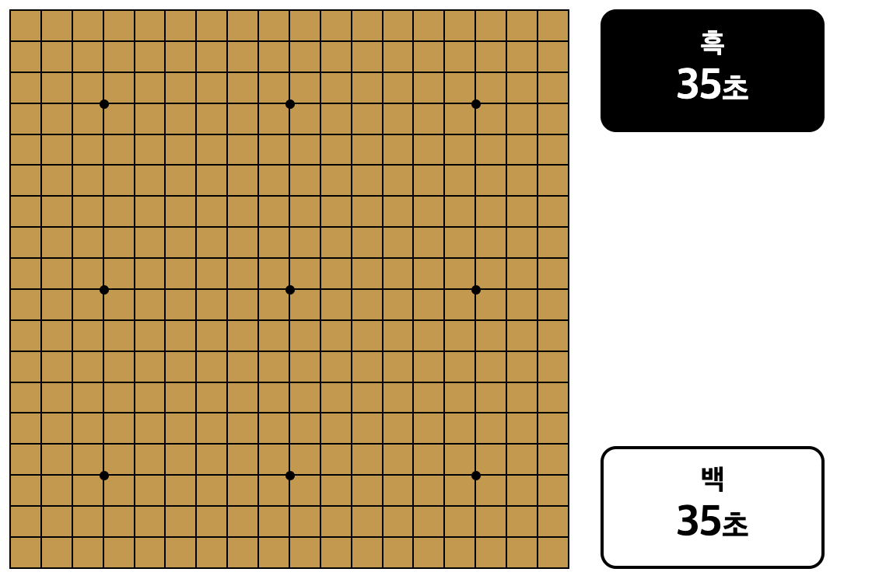
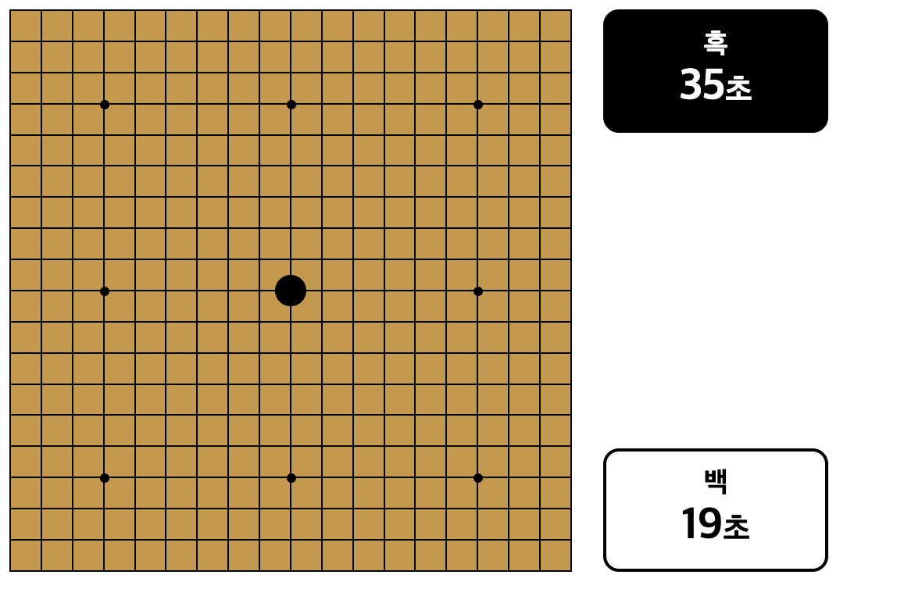
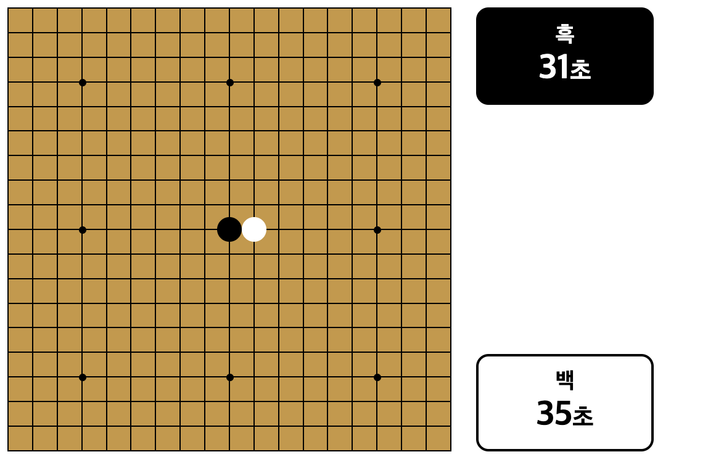

## 타이머 기능 구현

체스, 바둑, 오목 같은 경우 돌을 착수할 시 타이머로 시간을 정해 놓는 경우가 있다.

나는 몇 초로 지정하면 좋을까 하다가 넷마블 오목은 35초 시간을 제한을 걸어 두었기에 35초로 지정해놨다.

## 1. HTML

```html
<div id="game-container">
  <div id="board">
    <table id="table"></table>
    <table id="go"></table>
  </div>
  <div id="timers">
    <div class="timer" id="black-timer">
      <h3>흑</h3>
      <span id="black-time">35</span>초
    </div>
    <div class="timer" id="white-timer">
      <h3>백</h3>
      <span id="white-time">35</span>초
    </div>
  </div>
</div>
```

먼저 타이머 view를 보여주기 위해 타이머 html을 만든다.

## 2. CSS

```css
#game-container {
  display: flex;
  justify-content: flex-start;
  align-items: flex-start;
  gap: 20px;
  margin-top: 20px;
}

#board {
  position: relative; /* 테이블의 기준점 설정 */
  width: 360px;
  height: 360px;
}

#timers {
  display: flex;
  flex-direction: column;
  gap: 20px;
  justify-content: space-between;
  min-height: 360px;
}

#table {
  position: absolute;
  background-color: #ca973e;
  width: 100%;
  height: 100%;
  border-collapse: collapse;
  border-spacing: 0;
}

#go {
  position: absolute;
  margin: 10px;
  width: 340px;
  height: 340px;
  border-collapse: collapse;
}

#black-timer {
  background-color: black;
  color: white;
  padding: 10px;
  border-radius: 10px;
}

#white-timer {
  background-color: white;
  color: black;
  padding: 10px;
  border-radius: 10px;
}
.timer {
  text-align: center;
  font-size: 20px;
  font-weight: bold;
  border: 2px solid black;
  border-radius: 10px;
  padding: 10px;
  width: 120px;
}

.timer h3 {
  margin: 0;
  font-size: 18px;
}

.timer span {
  font-size: 28px;
}

.black-stone {
  background-color: black;
  border-radius: 50%;
}

.white-stone {
  background-color: white;
  border-radius: 50%;
}

.square {
  border: thin solid black;
  padding: 0;
  position: relative;
}

.star-point {
  position: absolute;
  top: -3px;
  left: -3px;
  width: 6px;
  height: 6px;
  background-color: black;
  border-radius: 50%;
}
```

타이머 위치를 내가 두고 싶은 곳으로 둔 다음 꾸며준다.

바둑판 색깔도 변경해 보았다

## 3. JAVASCRIPT

#### gameLogic.js

```javascript
// 게임 상태 변수
let blackTimer = 35; // 흑돌 플레이어의 남은 시간 (초 단위)
let whiteTimer = 35; // 백돌 플레이어의 남은 시간 (초 단위)
let timerInterval = null; // 현재 실행 중인 타이머의 ID
let timerRunning = false; // 타이머가 실행 중인지 확인하는 변수

// 타이머 시작 함수
export function startTimer() {
  clearInterval(timerInterval); // 이전 타이머가 있으면 정지

  // 현재 플레이어의 타이머 엘리먼트 선택 및 초기화
  const activeTimerElement =
    currentPlayer === 'black' ? document.getElementById('black-time') : document.getElementById('white-time');

  // 상대 플레이어의 타이머 엘리먼트 선택 및 초기화
  const inactiveTimerElement =
    currentPlayer === 'black' ? document.getElementById('white-time') : document.getElementById('black-time');

  if (currentPlayer === 'black') {
    whiteTimer = 35;
    inactiveTimerElement.textContent = whiteTimer; // 백돌 타이머 초기화 UI 업데이트
  } else {
    blackTimer = 35;
    inactiveTimerElement.textContent = blackTimer; // 흑돌 타이머 초기화 UI 업데이트
  }

  // 현재 플레이어의 타이머
  let currentTimer = currentPlayer === 'black' ? blackTimer : whiteTimer;

  // 타이머 실행 상태 설정
  timerRunning = true;

  // 1초마다 타이머 감소
  timerInterval = setInterval(() => {
    currentTimer--; // 1초 감소
    activeTimerElement.textContent = currentTimer; // UI 업데이트

    if (currentTimer <= 0) {
      // 타이머 종료 시
      clearInterval(timerInterval);
      timerRunning = false;
      alert(`${currentPlayer === 'black' ? 'Black' : 'White'} 타임아웃입니다.`);
      resetBoardState(); // 게임 초기화
      resetTimers(); // 타이머 초기화
    }
  }, 1000);

  // 현재 플레이어의 타이머 변수 업데이트
  if (currentPlayer === 'black') {
    blackTimer = currentTimer;
  } else {
    whiteTimer = currentTimer;
  }
}

// 타이머 초기화 함수
export function resetTimers() {
  blackTimer = 35;
  whiteTimer = 35;
  document.getElementById('black-time').textContent = blackTimer; // UI 업데이트
  document.getElementById('white-time').textContent = whiteTimer; // UI 업데이트
  clearInterval(timerInterval); // 타이머 정지
  timerRunning = false;
}
```

#### eventHandlers.js

```javascript
export function handleStonePlacement(e) {
  const target = e.target;
  if (target.tagName !== 'TD') return;

  const [row, col] = target.id.split('-').map(Number); // 클릭된 셀의 행, 열 좌표

  // // 이미 돌이 놓인 경우
  if (boardState[row][col] !== null) {
    alert('이미 돌이 놓인 자리입니다!');
    return;
  }

  // 흑돌의 경우 3-3 또는 4-4 규칙 위반 여부 확인
  if (currentPlayer === 'black' && isForbiddenMove(row, col)) {
    alert('이 동작은 3-3 또는 4-4 규칙을 위반합니다. 다른 위치를 선택하세요.');
    return;
  }

  // 보드 상태와 UI 업데이트
  boardState[row][col] = currentPlayer;
  target.classList.add(`${currentPlayer}-stone`); // 흑/백 돌 스타일 적용

  // 타이머가 실행 중이 아니면 시작
  if (!timerRunning) {
    startTimer();
  }

  // 승리 조건 확인
  if (checkWin(row, col, currentPlayer)) {
    clearInterval(timerInterval); // 타이머 정지
    setTimeout(() => {
      alert(`${currentPlayer === 'black' ? '흑' : '백'}이 승리했습니다!`);
      resetBoardState(); // 게임 초기화
      resetTimers(); // 타이머 초기화
    }, 100);
    return;
  }

  switchPlayer(); // 다음 플레이어로 전환
  startTimer(); // 새로운 플레이어의 타이머 시작
}
```

#### main.js

```javascript
// main.js
import { resetBoardState, resetTimers } from './gameLogic.js';
import { createCheckerboard, createPlacementBoard } from './view.js';
import { addEventListeners } from './eventHandlers.js';

const table = document.getElementById('table'); // 시각적인 오목판
const go = document.getElementById('go'); // 바둑돌이 놓일 위치를 표시하는 판

// 화점 위치
const starPoints = [
  [3, 3],
  [3, 9],
  [3, 15],
  [9, 3],
  [9, 9],
  [9, 15],
  [15, 3],
  [15, 9],
  [15, 15],
];

// 게임 초기화
initializeGame();

// 게임 초기화
function initializeGame() {
  table.innerHTML = '';
  go.innerHTML = '';
  resetBoardState();
  resetTimers();
  createCheckerboard(table, starPoints);
  createPlacementBoard(go);
  addEventListeners(go);
}
```

|             |             |             |
| ----------- | ----------- | ----------- |
|  |  |  |

## 다음에 해야 할 것

- ~~흑돌일 때 33 규칙 넣기~~
- ~~버그 찾아서 고치기~~
- ~~리팩토링하기~~
- ~~(흑돌, 백돌 각각의) 스탑워치 놓기~~
- WebRCT 이용해서 실시간으로 채팅이나, 게임방 만들기

```toc

```
